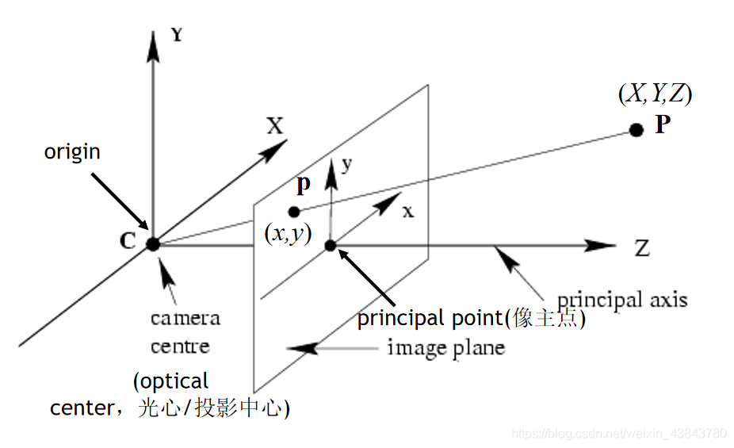

# 图像识别AR的流程和原理

## 相机标定

### 定义

- 摄像机标定(Camera calibration)简单来说是从世界坐标系转换为相机坐标系，再由相机坐标系转换为图像坐标系的过程，也就是求最终的投影矩阵P的过程。
- 相机参数的获取就是要获取内参矩阵K和畸变矩阵

### 坐标系

- 世界坐标系(world coordinate system)：用户定义的三维世界的坐标系，为了描述目标物在真实世界里的位置而被引入。单位为m。

- 相机坐标系(camera coordinate system)：在相机上建立的坐标系，为了从相机的角度描述物体位置而定义，作为沟通世界坐标系和图像/像素坐标系的中间一环。单位为m。

- 图像坐标系(image coordinate system)：为了描述成像过程中物体从相机坐标系到图像坐标系的投影透射关系而引入，方便进一步得到像素坐标系下的坐标。 单位为m。

### 坐标变换

- 从世界坐标系到相机坐标系：这一步是三维点到三维点的转换，包括R,t（相机外参）等参数；

  ​	

-  相机坐标系转换为图像坐标系：这一步是三维点到二维点的转换，包括K（相机内参）等参数；

  ​	

$$
\left(\begin{array}{c}
u \\
v \\
1
\end{array}\right)=\frac{1}{Z}\left(\begin{array}{ccc}
f_{x} & 0 & c_{x} \\
0 & f_{y} & c_{y} \\
0 & 0 & 1
\end{array}\right)\left(\begin{array}{l}
X \\
Y \\
Z
\end{array}\right) \triangleq \frac{1}{Z} \boldsymbol{K} \boldsymbol{P}
\\

K = \left(\begin{array}{ccc}
f_{x} & 0 & c_{x} \\
0 & f_{y} & c_{y} \\
0 & 0 & 1
\end{array}\right)
\\

Z \boldsymbol{P}_{u v}=Z\left[\begin{array}{c}
u \\
v \\
1
\end{array}\right]=\boldsymbol{K}\left(\boldsymbol{R} \boldsymbol{P}_{w}+\boldsymbol{t}\right)=\boldsymbol{K} \boldsymbol{T} \boldsymbol{P}_{w}
$$

​	

### 畸变参数

- 在几何光学和阴极射线管显示中，畸变是对直线投影的一种偏移。简单来说直线投影是场景内的一条直线投影到图片上也保持为一条直线。那畸变简单来说就是一条直线投影到图片上不能保持为一条直线了，这是一种光学畸变。畸变一般可以分为两大类，包括径向畸变和切向畸变。主要的一般径向畸变有时也会有轻微的切向畸变


### 标定流程

- 所用图片

  

- code

  ```c++
  // detector_params.yml
  %YAML:1.0
  nmarkers: 1024
  adaptiveThreshWinSizeMin: 3
  adaptiveThreshWinSizeMax: 23
  adaptiveThreshWinSizeStep: 10
  adaptiveThreshWinSize: 21
  adaptiveThreshConstant: 7
  minMarkerPerimeterRate: 0.03
  maxMarkerPerimeterRate: 4.0
  polygonalApproxAccuracyRate: 0.05
  minCornerDistanceRate: 0.05
  minDistanceToBorder: 3
  minMarkerDistance: 10.0
  minMarkerDistanceRate: 0.05
  cornerRefinementMethod: 0
  cornerRefinementWinSize: 5
  cornerRefinementMaxIterations: 30
  cornerRefinementMinAccuracy: 0.1
  markerBorderBits: 1
  perspectiveRemovePixelPerCell: 8
  perspectiveRemoveIgnoredMarginPerCell: 0.13
  maxErroneousBitsInBorderRate: 0.04
  minOtsuStdDev: 5.0
  errorCorrectionRate: 0.6
  
  // code
  #include <opencv2/highgui.hpp>
  #include <opencv2/calib3d.hpp>
  #include <opencv2/aruco/charuco.hpp>
  #include <opencv2/imgproc.hpp>
  #include <vector>
  #include <iostream>
  #include <ctime>
  #include <fstream>
  using namespace std;
  using namespace cv;
  
  namespace {
  const char* about =
          "Calibration using a ChArUco board\n"
          "  To capture a frame for calibration, press 'c',\n"
          "  If input comes from video, press any key for next frame\n"
          "  To finish capturing, press 'ESC' key and calibration starts.\n";
  const char* keys  =
          "{w        |       | Number of squares in X direction }"
          "{h        |       | Number of squares in Y direction }"
          "{sl       |       | Square side length (in meters) }"
          "{ml       |       | Marker side length (in meters) }"
          "{d        |       | dictionary: DICT_4X4_50=0, DICT_4X4_100=1, DICT_4X4_250=2,"
          "DICT_4X4_1000=3, DICT_5X5_50=4, DICT_5X5_100=5, DICT_5X5_250=6, DICT_5X5_1000=7, "
          "DICT_6X6_50=8, DICT_6X6_100=9, DICT_6X6_250=10, DICT_6X6_1000=11, DICT_7X7_50=12,"
          "DICT_7X7_100=13, DICT_7X7_250=14, DICT_7X7_1000=15, DICT_ARUCO_ORIGINAL = 16}"
          "{@outfile |<none> | Output file with calibrated camera parameters }"
          "{v        |       | Input from video file, if ommited, input comes from camera }"
          "{ci       | 0     | Camera id if input doesnt come from video (-v) }"
          "{dp       |       | File of marker detector parameters }"
          "{rs       | false | Apply refind strategy }"
          "{zt       | false | Assume zero tangential distortion }"
          "{a        |       | Fix aspect ratio (fx/fy) to this value }"
          "{pc       | false | Fix the principal point at the center }"
          "{sc       | false | Show detected chessboard corners after calibration }";
  }
  
  /**
   */
  static bool readDetectorParameters(string filename, Ptr<aruco::DetectorParameters> &params) {
      FileStorage fs(filename, FileStorage::READ);
  
      if(!fs.isOpened())
          return false;
      fs["adaptiveThreshWinSizeMin"] >> params->adaptiveThreshWinSizeMin;
      fs["adaptiveThreshWinSizeMax"] >> params->adaptiveThreshWinSizeMax;
      fs["adaptiveThreshWinSizeStep"] >> params->adaptiveThreshWinSizeStep;
      fs["adaptiveThreshConstant"] >> params->adaptiveThreshConstant;
      fs["minMarkerPerimeterRate"] >> params->minMarkerPerimeterRate;
      fs["maxMarkerPerimeterRate"] >> params->maxMarkerPerimeterRate;
      fs["polygonalApproxAccuracyRate"] >> params->polygonalApproxAccuracyRate;
      fs["minCornerDistanceRate"] >> params->minCornerDistanceRate;
      fs["minDistanceToBorder"] >> params->minDistanceToBorder;
      fs["minMarkerDistanceRate"] >> params->minMarkerDistanceRate;
      fs["cornerRefinementMethod"] >> params->cornerRefinementMethod;
      fs["cornerRefinementWinSize"] >> params->cornerRefinementWinSize;
      fs["cornerRefinementMaxIterations"] >> params->cornerRefinementMaxIterations;
      fs["cornerRefinementMinAccuracy"] >> params->cornerRefinementMinAccuracy;
      fs["markerBorderBits"] >> params->markerBorderBits;
      fs["perspectiveRemovePixelPerCell"] >> params->perspectiveRemovePixelPerCell;
      fs["perspectiveRemoveIgnoredMarginPerCell"] >> params->perspectiveRemoveIgnoredMarginPerCell;
      fs["maxErroneousBitsInBorderRate"] >> params->maxErroneousBitsInBorderRate;
      fs["minOtsuStdDev"] >> params->minOtsuStdDev;
      fs["errorCorrectionRate"] >> params->errorCorrectionRate;
      return true;
  }
  
  
  
  /**
   */
  static bool saveCameraParams(const string &filename, Size imageSize, float aspectRatio, int flags,
                               const Mat &cameraMatrix, const Mat &distCoeffs, double totalAvgErr) {
      FileStorage fs(filename, FileStorage::WRITE);
      if(!fs.isOpened())
          return false;
  
      time_t tt;
      time(&tt);
      struct tm *t2 = localtime(&tt);
      char buf[1024];
      strftime(buf, sizeof(buf) - 1, "%c", t2);
  
      fs << "calibration_time" << buf;
  
      fs << "image_width" << imageSize.width;
      fs << "image_height" << imageSize.height;
  
      if(flags & CALIB_FIX_ASPECT_RATIO) fs << "aspectRatio" << aspectRatio;
  
      if(flags != 0) {
          sprintf(buf, "flags: %s%s%s%s",
                  flags & CALIB_USE_INTRINSIC_GUESS ? "+use_intrinsic_guess" : "",
                  flags & CALIB_FIX_ASPECT_RATIO ? "+fix_aspectRatio" : "",
                  flags & CALIB_FIX_PRINCIPAL_POINT ? "+fix_principal_point" : "",
                  flags & CALIB_ZERO_TANGENT_DIST ? "+zero_tangent_dist" : "");
      }
  
      fs << "flags" << flags;
  
      fs << "camera_matrix" << cameraMatrix;
      fs << "distortion_coefficients" << distCoeffs;
  
      fs << "avg_reprojection_error" << totalAvgErr;
  
      return true;
  }
  
  bool isFileExists_ifstream(string& name) {
      ifstream f(name.c_str());
      return f.good();
  }
  
  /**
   */
  int main(int argc, char *argv[]) {
      CommandLineParser parser(argc, argv, keys);
      parser.about(about);
  
      if(argc < 7) {
          parser.printMessage();
          return 0;
      }
      string dppp = "/Users/cz/Documents/algorithm code/opencv_test/opencv_test/detector_params.yml";
      cout<<"file exists: "<<isFileExists_ifstream(dppp)<<endl;
      int squaresX = parser.get<int>("w");
      int squaresY = parser.get<int>("h");
      float squareLength = parser.get<float>("sl");
      float markerLength = parser.get<float>("ml");
      int dictionaryId = parser.get<int>("d");
      string outputFile = parser.get<string>(0);
      cout<<squaresX<<" "<<squaresY<<" "<<squareLength<<" "<<markerLength<<" "<<dictionaryId<<" "<<outputFile<<" "<<parser.get<string>("dp")<<endl;
  
      bool showChessboardCorners = parser.get<bool>("sc");
  
      int calibrationFlags = 0;
      float aspectRatio = 1;
      if(parser.has("a")) {
          calibrationFlags |= CALIB_FIX_ASPECT_RATIO;
          aspectRatio = parser.get<float>("a");
      }
      if(parser.get<bool>("zt")) calibrationFlags |= CALIB_ZERO_TANGENT_DIST;
      if(parser.get<bool>("pc")) calibrationFlags |= CALIB_FIX_PRINCIPAL_POINT;
  
      Ptr<aruco::DetectorParameters> detectorParams = aruco::DetectorParameters::create();
      if(parser.has("dp")) {
          bool readOk = readDetectorParameters(dppp, detectorParams);
          if(!readOk) {
              cerr << "Invalid detector parameters file" << endl;
              return 0;
          }
      }
  
      bool refindStrategy = parser.get<bool>("rs");
      int camId = parser.get<int>("ci");
      String video;
  
      if(parser.has("v")) {
          video = parser.get<String>("v");
      }
  
      if(!parser.check()) {
          parser.printErrors();
          return 0;
      }
  
      VideoCapture inputVideo;
      int waitTime;
      if(!video.empty()) {
          inputVideo.open(video);
          waitTime = 0;
      } else {
          inputVideo.open(camId);
          waitTime = 10;
      }
  
      Ptr<aruco::Dictionary> dictionary =
          aruco::getPredefinedDictionary(aruco::PREDEFINED_DICTIONARY_NAME(dictionaryId));
  
      // create charuco board object
      Ptr<aruco::CharucoBoard> charucoboard =
              aruco::CharucoBoard::create(squaresX, squaresY, squareLength, markerLength, dictionary);
      Ptr<aruco::Board> board = charucoboard.staticCast<aruco::Board>();
  
      // collect data from each frame
      vector< vector< vector< Point2f > > > allCorners;
      vector< vector< int > > allIds;
      vector< Mat > allImgs;
      Size imgSize;
  
      while(inputVideo.grab()) {
          Mat image, imageCopy;
          inputVideo.retrieve(image);
  
          vector< int > ids;
          vector< vector< Point2f > > corners, rejected;
  
          // detect markers
          aruco::detectMarkers(image, dictionary, corners, ids, detectorParams, rejected);
  
          // refind strategy to detect more markers
          if(refindStrategy) aruco::refineDetectedMarkers(image, board, corners, ids, rejected);
  
          // interpolate charuco corners
          Mat currentCharucoCorners, currentCharucoIds;
          if(ids.size() > 0)
              aruco::interpolateCornersCharuco(corners, ids, image, charucoboard, currentCharucoCorners,
                                               currentCharucoIds);
  
          // draw results
          image.copyTo(imageCopy);
          if(ids.size() > 0) aruco::drawDetectedMarkers(imageCopy, corners);
  
          if(currentCharucoCorners.total() > 0)
              aruco::drawDetectedCornersCharuco(imageCopy, currentCharucoCorners, currentCharucoIds);
  
          putText(imageCopy, "Press 'c' to add current frame. 'ESC' to finish and calibrate",
                  Point(10, 20), FONT_HERSHEY_SIMPLEX, 0.5, Scalar(255, 0, 0), 2);
  
          imshow("out", imageCopy);
          char key = (char)waitKey(waitTime);
          if(key == 27) break;
          if(key == 'c' && ids.size() > 0) {
              cout << "Frame captured" << endl;
              allCorners.push_back(corners);
              allIds.push_back(ids);
              allImgs.push_back(image);
              imgSize = image.size();
          }
      }
  
      if(allIds.size() < 1) {
          cerr << "Not enough captures for calibration" << endl;
          return 0;
      }
  
      Mat cameraMatrix, distCoeffs;
      vector< Mat > rvecs, tvecs;
      double repError;
  
      if(calibrationFlags & CALIB_FIX_ASPECT_RATIO) {
          cameraMatrix = Mat::eye(3, 3, CV_64F);
          cameraMatrix.at< double >(0, 0) = aspectRatio;
      }
  
      // prepare data for calibration
      vector< vector< Point2f > > allCornersConcatenated;
      vector< int > allIdsConcatenated;
      vector< int > markerCounterPerFrame;
      markerCounterPerFrame.reserve(allCorners.size());
      for(unsigned int i = 0; i < allCorners.size(); i++) {
          markerCounterPerFrame.push_back((int)allCorners[i].size());
          for(unsigned int j = 0; j < allCorners[i].size(); j++) {
              allCornersConcatenated.push_back(allCorners[i][j]);
              allIdsConcatenated.push_back(allIds[i][j]);
          }
      }
  
      // calibrate camera using aruco markers
      double arucoRepErr;
      arucoRepErr = aruco::calibrateCameraAruco(allCornersConcatenated, allIdsConcatenated,
                                                markerCounterPerFrame, board, imgSize, cameraMatrix,
                                                distCoeffs, noArray(), noArray(), calibrationFlags);
  
      // prepare data for charuco calibration
      int nFrames = (int)allCorners.size();
      vector< Mat > allCharucoCorners;
      vector< Mat > allCharucoIds;
      vector< Mat > filteredImages;
      allCharucoCorners.reserve(nFrames);
      allCharucoIds.reserve(nFrames);
  
      for(int i = 0; i < nFrames; i++) {
          // interpolate using camera parameters
          Mat currentCharucoCorners, currentCharucoIds;
          aruco::interpolateCornersCharuco(allCorners[i], allIds[i], allImgs[i], charucoboard,
                                           currentCharucoCorners, currentCharucoIds, cameraMatrix,
                                           distCoeffs);
  
          allCharucoCorners.push_back(currentCharucoCorners);
          allCharucoIds.push_back(currentCharucoIds);
          filteredImages.push_back(allImgs[i]);
      }
  
      if(allCharucoCorners.size() < 4) {
          cerr << "Not enough corners for calibration" << endl;
          return 0;
      }
  
      // calibrate camera using charuco
      repError =
          aruco::calibrateCameraCharuco(allCharucoCorners, allCharucoIds, charucoboard, imgSize,
                                        cameraMatrix, distCoeffs, rvecs, tvecs, calibrationFlags);
  
      bool saveOk =  saveCameraParams(outputFile, imgSize, aspectRatio, calibrationFlags,
                                      cameraMatrix, distCoeffs, repError);
      if(!saveOk) {
          cerr << "Cannot save output file" << endl;
          return 0;
      }
  
      cout << "Rep Error: " << repError << endl;
      cout << "Rep Error Aruco: " << arucoRepErr << endl;
      cout << "Calibration saved to " << outputFile << endl;
  
      // show interpolated charuco corners for debugging
      if(showChessboardCorners) {
          for(unsigned int frame = 0; frame < filteredImages.size(); frame++) {
              Mat imageCopy = filteredImages[frame].clone();
              if(allIds[frame].size() > 0) {
  
                  if(allCharucoCorners[frame].total() > 0) {
                      aruco::drawDetectedCornersCharuco( imageCopy, allCharucoCorners[frame],
                                                         allCharucoIds[frame]);
                  }
              }
  
              imshow("out", imageCopy);
              char key = (char)waitKey(0);
              if(key == 27) break;
          }
      }
  
      return 0;
  }
  
  ```
  
  

- 拍摄10几张不同角度的图片即可


## 图像AR实现流程

- 计算当前帧与参考图像的匹配点matches (SIFT ORB等算法)
- 在matches中筛选出距离最近的若干匹配点到good集合
- 若good集合中所包含的匹配点数量大于阈值则当前帧追踪成功，否则下一帧，跳1
- 根据匹配点坐标，计算单应矩阵M（单应矩阵是匹配点p1-p2的变换矩阵）
- 根据M和参考图像四角坐标计算透视变换后的四角坐标corners
- 根据参考图像的3D坐标（实际上就是Z=0）和它的投影坐标corners计算相机位姿R， t（PnP算法， 由3D-2D点对通过最小二乘计算相机位姿）
- 根据R t K 以及畸变矩阵描绘虚拟物体

