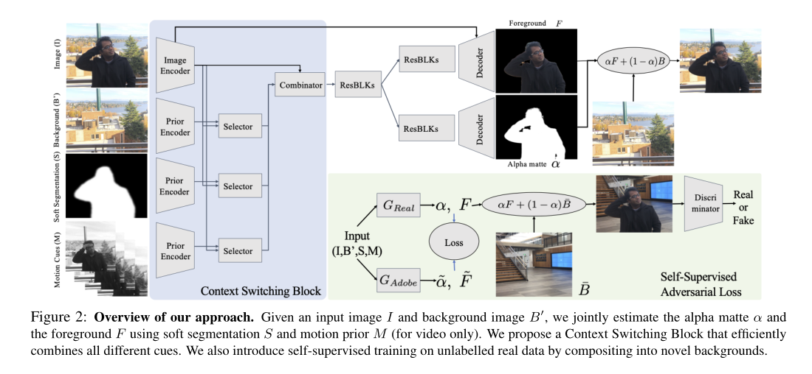

## 主要内容

- 提出不需要trimap或者绿幕的自动matting方法
- 一个新颖的matting网络
- 一个自监督对抗训练网络提升抠图效果

## 方法

### 输入
- 一张图片(背景+任务)和一张纯背景图片。拍摄这两张图片时，假设相机的移动幅度很小，利用单应性将背景与给定的输入图像对齐。
### 架构总览

### 人像分割
- 使用Deeplabv3+来生成用于人物抠图的分割mask，用作输入到natting网络的一部分

### Context Switching Block
  - 该网络将带有人物的图像 I、纯背景图像 B、人物S、相邻帧的时间堆栈 M（可选）的软分割作为输入，输出则是一个前景图 F 和一个前景蒙版α。
  - 首先训练一个该网络的副本。在Adobe Matting 数据集上训练一个深度蒙版网络$G_{Adobe}$,为了生成 S，研究者应用了人物分割、腐蚀（erode）、膨胀（dilate）以及高斯模糊。
  - 数据增强：训练数据是450张adobe matting数据集里抽取280张不透明的物体，包含前景F* 和matte α*，把这些前景和COCO数据集compose起来，随机裁剪，重新scale,水平翻转以达到数据增强的目的
  - 研究者提出的 CS 块在结合了数据增广后，显著缩短了真实图像与使用 Adobe数据集合成的图像之间的差距。然而，该方法在处理真实图像时仍然存在很多困难如背景被复制到蒙版中，图像分割失败，图像与背景之间没有对其等等

### 自监督学习方法
- 类似于teacher-student思路，使用训练好的$G_{Adobe}$，一个判别器Discriminator来训练$G_{real}$。把$G_{Adobe}$的输出作为pseudo ground-truth，得到对抗损失和matting损失
- 使用LS-GAN同时训练$G_{real}$和Discriminator,具体原理不清楚
- 所有网络模块的具体定义见论文第11页 B. Network Architectures

### 测试和评价
- 测试效果，见github
- 评价
  - 该方法抠图精度极高，可用于图片和视频前后景分离。要求事先输出一个纯背景图，分割效果完美。
  - 实际上，该方法可以看作是先进行了语义分割(使用deeplab v3进行了人物分割得到mask图)，将其作为输入一部分放进matting网络，然后再进行了精细抠图。所以，之前我们所考虑的使用语义分割或者人像分割也好，应该只是这项工作的一部分，可以推测如果只使用分割，前后景分离效果应该不能很好。
  - 缺陷
    - 依赖于分割得出的mask图，在测试中有一个图片把中国结也放入了前景，原因可能是这个中国结被deeplab v3认为是人像。
    - 依赖于实现拍的纯背景图，要求这个背景不能变化，但这在直播场景中应该不是致命的。
    - 速度瓶颈部分在于deeplab v3的庞大网络，如果将其换成轻量级的mobileNet等应该速度会有所改善