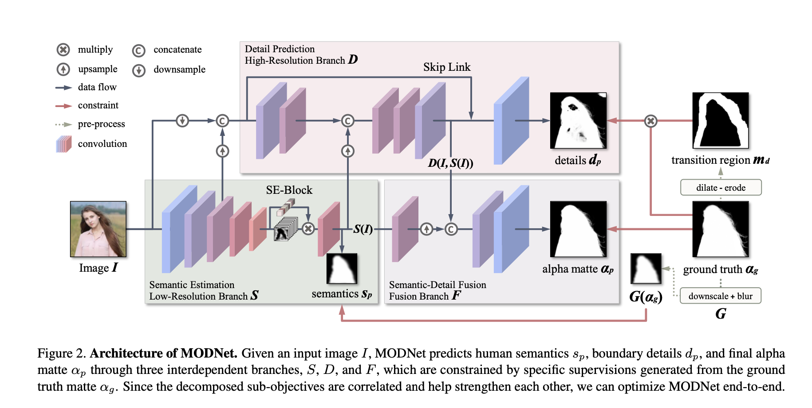
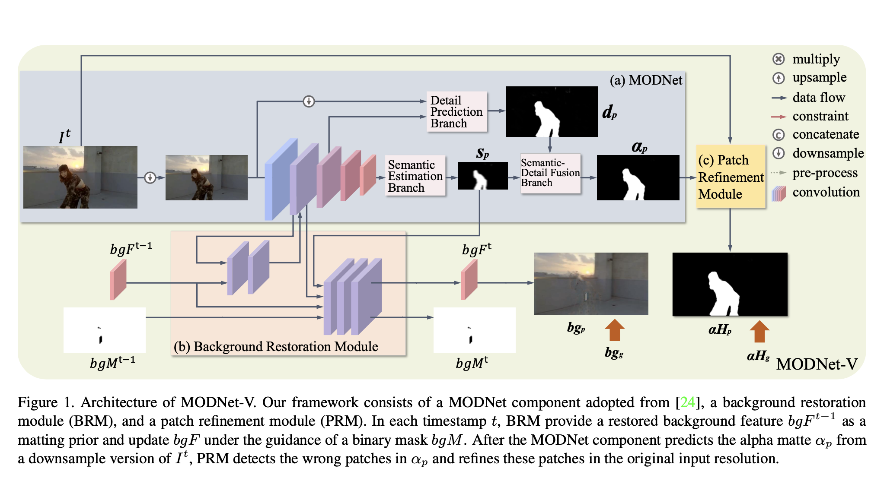
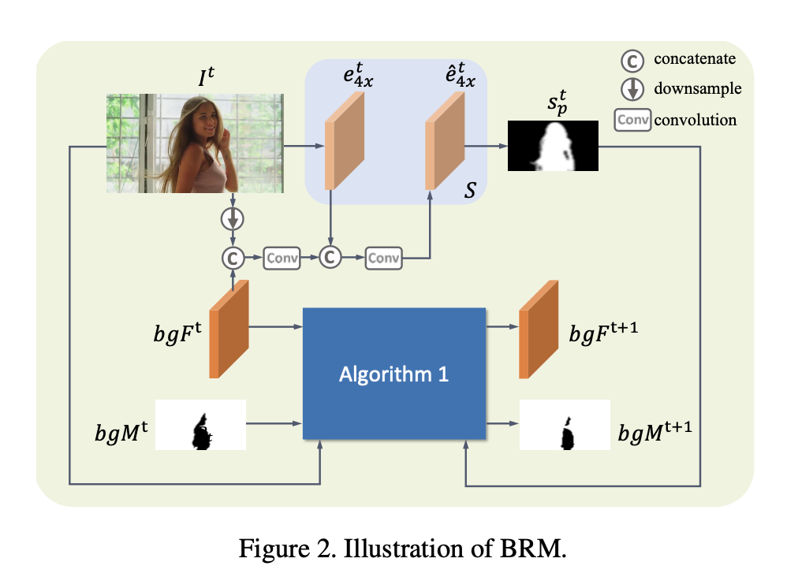
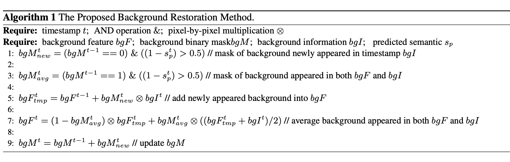
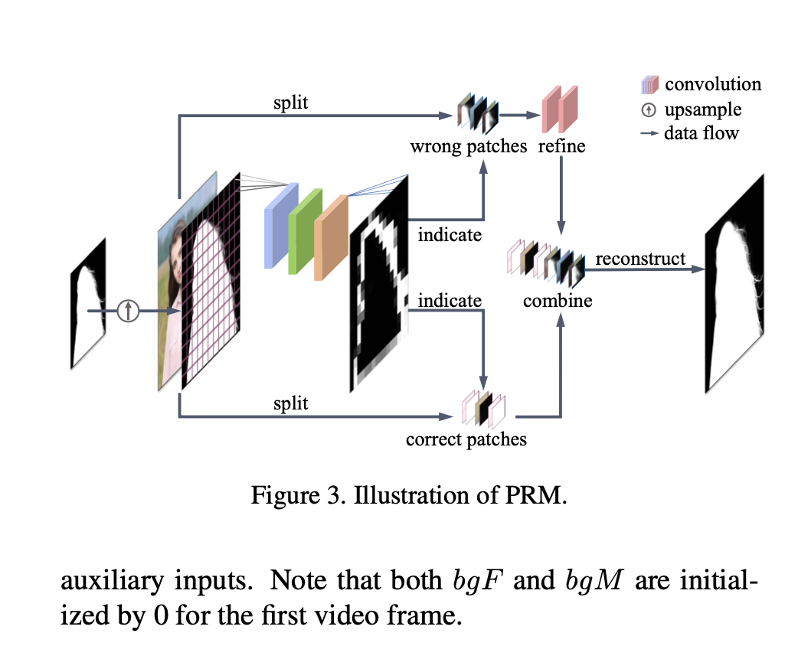

# MODNet-V: Improving Portrait Video Matting via Background Restoration

## Paper Information

- Authors：Jiayu Sun, et al.
- Instruction：Department of Computer Science, City University of Hong Kong
- Source：arxiv

##  Review of Background Removal
$$
I=\alpha F+(1-\alpha) B
$$

- Trimap-based matting. 
  - Trimap for every frame
    - Deep image matting
  - Trimap for the first frame and can propagate it to the rest of the video.
    - Deep video matting via spatio-temporal alignment and aggregation.
- Background-based matting
  - Background as prior information.
  - cannot handle dynamic backgrounds and large camera movements.
  - BMv1,v2
- Salient object detection, SOD
  - The portrait is always the most Salient Object .
  - LDF...
- Auxiliary-free matting.
  - Fully automatic matting without any auxiliary inputs 
  - MODNet, EspNet...
- Auxiliary-less matting.
  - Only use a little Auxiliary such as user-click.
  - user-click...
- Video matting
  - OFD in MODNet
  - BGM explored taking a few neighboring frames as additional input channels.
  - DVM propagate trimap annotations.
- Segmentation. 
  - Semantic segmentation is to predict a class label for every pixel.
  - DeepLabV3...

- Scene background modeling
  - predict an unreliable background model using the first few frames as their first step, and then gradually update background model by the analysis of the extracted foreground objects from the video sequences in an online process.
  - mixture of Gaussians

## Innovations

### Background restoration module (BRM)

- *Background features* to represent the restored background
- A binary mask to indicate the recovered background pixels. 

- By accumulating and completing the missing background content frame-by-frame, we may produce a background image for the next frame. 

### Patch refinement module (PRM) 

- introduce a new patch refinement module (PRM) to adapt MODNet-V to high-resolution videos

### Performance

- Tradeoff between model size, inference speed, and matting performance/stability.

## Method of MODNet

### Overview

$$
\alpha_{p}^{t}=f_{\bmod }\left(I^{t}\right)=\mathcal{F}\left(s_{p}^{t}, d_{p}^{t}\right)=\mathcal{F}\left(\mathcal{S}\left(I^{t}\right), \mathcal{D}\left(\mathcal{S}\left(I^{t}\right), I^{t}\right)\right)
$$

### Drawbacks

- Overlook temporal information between frames.
- Although OFD strategy is used, it can't obviously improve the expriment effects.

## Method of MODNet-V

### Overview

$$
s_{p}^{t}=\mathcal{S}\left(I^{t}, \mathcal{B}\left(I^{t}\right)\right)
$$

$$
\alpha_{p}^{t}=\mathcal{P}\left(\mathcal{F}\left(s_{p}^{t}, d_{p}^{t}\right)\right)
$$

$$
\alpha_{p}^{t}=\mathcal{P}\left(\mathcal{F}\left(\mathcal{S}\left(I^{t}, \mathcal{B}\left(I^{t}\right)\right), \mathcal{D}\left(\mathcal{S}\left(I^{t}, \mathcal{B}\left(I^{t}\right)\right), I^{t}\right)\right)\right)
$$

### Background Restoration Module (BRM)

-  A background feature bgF to store the background information
-  A binary mask bgM to indicate the pixels with restored background

$$
b g I^{t}=\left(1-s_{p}^{t}\right) \otimes e_{4 \times}^{t}
$$

### Patch Refinement Module (PRM)

- In the refinement stage, the image with original resolution is cropped into 8x8 patches, and the refinement model only processes the patches with a high error probability. 
  - First, the total number of patches is proportional to image resolution, which means patch selection and cropping will be more time-consuming under a high resolution. 
  - Second, as the image resolution increases, the information contained in each 8x8 region will greatly decrease. As a result, artifacts are likely to appear in the edges of refined patches.

- we proposed a new patch refinement module (PRM)
  -  PRM first downsamples it and predict an initial coarse alpha matte. PRM then upsamples the initial coarse alpha matte into the original image size and divides it into k × k patches
  - PRM applies an adaptive pooling layer and two convolutional layers to the initial coarse alpha matte to predict an flaw map (proposed by GCT) of size (k, k), where each pixel value corresponds to the flaw probability of each patch. Finally, PRM only refines the patch whose flaw probability is higher than a predefined threshold ξ. 
  -  for images with a resolution of 4k and below， we set k = 16 (the maximum patch size is only 256 × 256). For images with a resolution higher than 4k, we set k = 32. We set ξ = 0.01, 

## Loss Function

- we propose $L_{bg}$ as an explicit constraint to measure the difference between the ground truth background image $bg_g^t$ and the background image $bg_p^t$ predicted from $bg_F^t$

$$
\mathcal{L}_{b g}=\sum_{t=1}^{N} \gamma \sqrt{\left(b g_{p}^{t}-b g_{g}^{t}\right)^{2}+\epsilon^{2}}
$$

- calculate the constraint $L_{αH}$ between the ground truth high-resolution alpha matte $α_{Hg}$ and the predicted high-resolution alpha matte $α_{Hp}$ for PRM

$$
\mathcal{L}_{\alpha H}=\gamma \sqrt{\left(\alpha H_{p}-\alpha H_{g}\right)^{2}+\epsilon^{2}}
$$

## Discuss

- Only the newly added background points are considered, and the disappeared background points are not considered. 