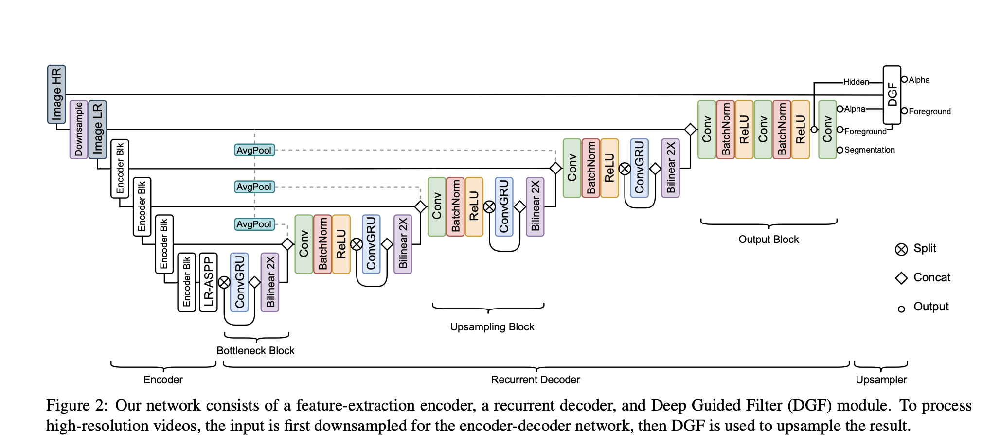

# Robust High-Resolution Video Matting with Temporal Guidance

## 基本信息

- 别名：BMV3
- arXiv. 2108.11515. 2021

## 综述

- Trimap-based matting. 
  - Trimap for every frame
    - Deep image matting
  - Trimap for the first frame and can propagate it to the rest of the video.
    - Deep video matting via spatio-temporal alignment and aggregation.
- Background-based matting
  - Background as prior information.
  - cannot handle dynamic backgrounds and large camera movements.
  - BMv1,v2
- Salient object detection, SOD
  - The portrait is always the most Salient Object .
  - LDF...
- Auxiliary-free matting.
  - Fully automatic matting with- out any auxiliary inputs 
  - MODNet, EspNet...
- Auxiliary-less matting.
  - Only use a little Auxiliary such as user-click.
  - user-click...
- Video matting
  - OFD in MODNet
  - BGM [34] explored taking a few neighboring frames as additional input channels.
  - DVM propagate trimap annotations.
- Segmentation. 
  - Semantic segmentation is to predict a class label for every pixel.
  - DeepLabV3...

## 主要贡献

- *uses a recurrent architecture to exploit temporal information in videos and achieves significant improvements in temporal coherence and matting quality.*

  - The foreground color becomes similar to a passing object in the background, the model can better guess the boundary by referring to the previous frames.
  - Having a better understanding of the background simplifies the matting task. Therefore, we propose a recurrent architecture to exploit the temporal information.

- *a novel training strategy that enforces our network on both matting and segmentation objectives.*

  - We argue that human matting tasks are closely related to human segmentation tasks. Simultaneously training with a segmentation objective can effectively regulate our model without additional adaptation steps.
  - 4 stage training.

  

  

## 重要组件

### ConvGRU

- Principal
  $$
  \begin{aligned}
  z_{t} &=\sigma\left(w_{z x} * x_{t}+w_{z h} * h_{t-1}+b_{z}\right) \\
  r_{t} &=\sigma\left(w_{r x} * x_{t}+w_{r h} * h_{t-1}+b_{r}\right) \\
  o_{t} &=\tanh \left(w_{o x} * x_{t}+w_{o h} *\left(r_{t} \odot h_{t-1}\right)+b_{o}\right) \\
  h_{t} &=z_{t} \odot h_{t-1}+\left(1-z_{t}\right) \odot o_{t}
  \end{aligned}
  $$

### 深度导向滤波器

- 引导滤波（导向滤波）是一种图像滤波技术，通过一张引导图，对初始图像p（输入图像）进行滤波处理，使得最后的输出图像大体上与初始图像P相似，但是纹理部分与引导图相似。其典型应用有两个：保边图像平滑，抠图。
- 引导滤波（导向滤波）不仅能实现双边滤波的边缘平滑，而且在检测到边缘附近有很好的表现，可应用在图像增强、HDR压缩、图像抠图及图像去雾等场景。
- 本文中的Deep Guided Filter (DGF)作为一个a learnable module 对最终的alpha起滤波作用。

## 方法

### 网络结构

### 训练方法

### 4 stage training

- Stage 1: We first train on VM at low-resolution without the DGF module for 15 epochs.
- Stage 2: We increase T to 50 frames, reduce the learning rate by half, and keep other settings from stage 1 
- Stage 3: We attach the DGF module and train on VM with high-resolution samples for 1 epoch. Since high res- olution consumes more GPU memory, the sequence length must be set to very short. To avoid our recurrent network overfitting to very short sequences, we train our network on both low-resolution long sequences and high-resolution short sequences. 
- Stage 4: We train on the combined dataset of D646 and AIM for 5 epochs. We increase the decoder learning rate to 5e−5 to let our network adapt and keep other settings from stage 3.

### segmentation training

- Segmentation: Our segmentation training is interleaved between every matting training iteration. We train the network on image segmentation data with T = 1 after every odd iteration, and on video segmentation data after every even ones. Segmentation training is applied to all stages. 
- T = 1, it forces the segmentation to be robust even in the absence of recurrent information.

### Loss

- L1 损失，用于平滑，包含alpha的L1和金字塔拉普拉斯的L1
- 时序一致性损失：当前帧的alpha关于时间戳t的导数二阶范式
- 前景的L1损失
- 前景的时序一致性损失
- 总的matting损失是以上加权和
- 分割损失是交叉熵损失

$$
\begin{gathered}
\mathcal{L}_{l 1}^{\alpha}=\left\|\alpha_{t}-\alpha_{t}^{*}\right\|_{1} \\
\mathcal{L}_{l a p}^{\alpha}=\sum_{s=1}^{5} \frac{2^{s-1}}{5}\left\|L_{p y r}^{s}\left(\alpha_{t}\right)-L_{p y r}^{s}\left(\alpha_{t}^{*}\right)\right\|_{1} \\
\mathcal{L}_{t c}^{\alpha}=\left\|\frac{\mathrm{d} \alpha_{t}}{\mathrm{~d} t}-\frac{\mathrm{d} \alpha_{t}^{*}}{\mathrm{~d} t}\right\|_{2}
\end{gathered}
$$

$$
\begin{gathered}
\mathcal{L}_{l 1}^{F}=\left\|\left(a_{t}^{*}>0\right) *\left(F_{t}-F_{t}^{*}\right)\right\|_{1} \\
\mathcal{L}_{t c}^{F}=\left\|\left(a_{t}^{*}>0\right) *\left(\frac{\mathrm{d} F_{t}}{\mathrm{~d} t}-\frac{\mathrm{d} F_{t}^{*}}{\mathrm{~d} t}\right)\right\|_{2}
\end{gathered}
$$

$$
\mathcal{L}^{M}=\mathcal{L}_{l 1}^{\alpha}+\mathcal{L}_{l a p}^{\alpha}+5 \mathcal{L}_{t c}^{\alpha}+\mathcal{L}_{l 1}^{F}+5 \mathcal{L}_{t c}^{F}
$$

$$
\mathcal{L}^{S}=S_{t}^{*}\left(-\log \left(S_{t}\right)\right)+\left(1-S_{t}^{*}\right)\left(-\log \left(1-S_{t}\right)\right)
$$

### 数据集

- VideoMatte240K
- Distinctions-646
- Adobe Image Matting (AIM) datasets
- video segmentation dataset YouTubeVIS and se- lect 2985 clips containing humans.
- use image segmentation datasets COCO  and SPD.

- Both video-based and image-based, to train a robust model.

- ---MODNet opensource benchmark PPM---

