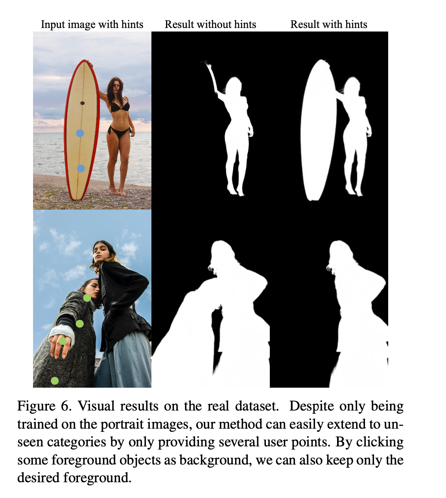
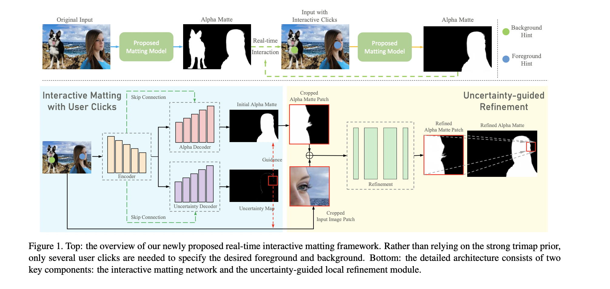
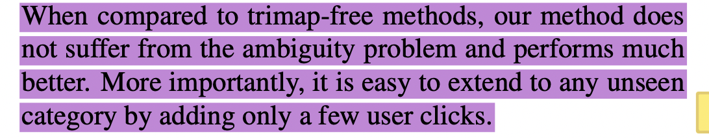

# Improved Image Matting via Real-time User Clicks and Uncertainty Estimation

## 论文信息
- 会议：CVPR 2021 
- 作者：Tianyi Wei, Dongdong Chen2, Wenbo Zhou, et al.
- 论文地址：https://arxiv.org/abs/2012.08323

## 创新点
### user click VS. trimap-based and trimap-free
- 基于trimap和无trimap的方法都有各自的优缺点。具体来说，基于trimap的方法可以实现最先进的性能，但它们需要用户提供绘制良好的trimap来指示前景、背景和过渡区域。trimap-free方法不需要任何用户，但它们的性能明显更差。这是因为，如果没有先验，这样的方法经常会含糊不清哪些是目标前景对象，特别是在一些复杂的情况下。
- 为了解决模糊问题，一个典型的解决方案是为一个感兴趣的类别收集一个大规模的有标签的数据集，这样网络就可以依靠语义来识别前景。
然而，数据标记很昂贵，而且它不能扩展到除特定以外的类别，例如下图第一个案例中的“surfboard”。此外，即使是某一特定类别，在某些情况下也不能满足用户的需求。例如第二种情况中，用户可能只想保留其中一个目标画像。

- 本文首次尝试使用简单的用户点击作为抠图先验,这种更简单的用户先验，它足以用最小的努力识别前景对象，使得用户体验大大提升。该方法精度优于trimap-free方法并能与trimap-based方法相比较。

### uncertainty estimation module
- 引入了一个新颖的不确定性估计模块，可以自动预测哪些局部需要polish，用户可以灵活选择改进哪些部分
- 引入一个uncertainty-guided local refinement network，通过之前阶段产生的uncertainty map作为提示，可以输出更多细节和消除artifacts。

## 整体架构
- 用户可以选择两种提示方式，当用户点击图像某处时并选择前景模式时，一个半径为r的圆形区域将会在与原图等大小的二维矩阵heatmap U中被赋值为1，选择背景模式则赋值为-1， 不做操作则为0.
- 将原图与用户提示heatmap U 输入encoder中，然后将结果送入两个decoder。alpha decoder负责产生一个原始的alpha matte；uncertainty decoder产生uncertainty map，从而得到alpha matting network对哪些区域是不够自信的，值较高的点周围k*k(default k = 64)的patch会被裁剪下来(原图和之前得到的alpha matte)送入 refinement模块得到refined alpha matte patch补到原始alpha matte之中。

## 损失函数
### Matting Network Loss
-  image space regression loss
$$\mathcal{L}_{r e g}=\frac{1}{|T|} \sum_{i \in T}\left|\alpha_{p}^{i}-\alpha_{g}^{i}\right|+\frac{1}{|S|} \sum_{j \in S}\left(\alpha_{p}^{j}-\alpha_{g}^{j}\right)^{2}$$

- gradient loss，有助于网络产生更加锐利的结果 shaper
$$
\mathcal{L}_{\text {grad }}=\frac{1}{|I|} \sum_{i \in \Omega}\left|\nabla\left(\alpha_{p}^{i}\right)-\nabla\left(\alpha_{g}^{i}\right)\right|
$$

### Uncertainty Estimation Module Loss
- 从概率论的对alpha matte prediction建模，可以将其看成是一种参数分布
$$
p(\alpha \mid I, U ; \mathcal{D})
$$
- 作者默认将其看为单变量拉普拉斯分布，其中$\mu$就是目标alpha matte $\alpha_p$, $\sigma$就是uncertainty decoder输出的$\sigma_p$
$$
f(x \mid \mu, \sigma)=\frac{1}{2 \sigma} e^{-\frac{|x-\mu|}{\sigma}}
$$
- 从而可以使用最大似然估计法来对该分布进行参数估计，体现在损失函数上就可以使用负对数来minimize
$$
\mathcal{L}_{u e}=-\log p(\alpha \mid I, U ; D)=\frac{1}{|\mathcal{N}|} \sum_{I \in \mathcal{D}}\left(\log \sigma_{p}+\frac{\left|x-\alpha_{p}\right|}{\sigma_{p}}\right)
$$

### Local Refinement Network Loss
- patch中大多数像素已经是正确的了，预测错误的像素占比很少，作者认为这些hard pixels需要更强的优化，故而提出了hard-sample mining目标函数，对top20%误差的像素进行额外损失加成
$$
\mathcal{L}_{\text {refine }}=\frac{1}{|C|} \sum_{i \in C}\left|\alpha_{p}^{i}-\alpha_{g}^{i}\right|+\lambda \frac{1}{|H|} \sum_{j \in H}\left|\alpha_{p}^{j}-\alpha_{g}^{j}\right|
$$

### 训练细节
- 首先单独训练matting network部分，待其收敛后，将其freeze后训练uncertainty estimation decoder.
  - 训练matting network时，为了让其适应用户点击行为，作者使用模拟用户交互的办法，对每张图片随机采样总数为m次点击操作，半径r=15,其中m满足参数为1/6的几何分布。
- 训练refine network时，先用matting network去预测数据集的alpha matte，然后计算误差绝对值，选取其中最具有挑战性的patches进作为训练样本

### 实例

- https://www.youtube.com/watch?v=pAXydeN-LpQ

## 一些疑惑
- matting阶段ground truth问题
  - 作者训练阶段生成的用户点击是随机在图片中点击的，每张图片点击次数m满足参数为1/6的几何分布，此时网络输入是(I,U)，输出是$\alpha_p$,其所对应的GT应该依赖于U（否则无法达到作者所说的能够使用U来控制输出前景，包括出现一些数据集中未出现的类以及擦去同类别目标画像中的一个），但又无法预先生成每个U所对应的GT，因为U是训练时随机生成的

