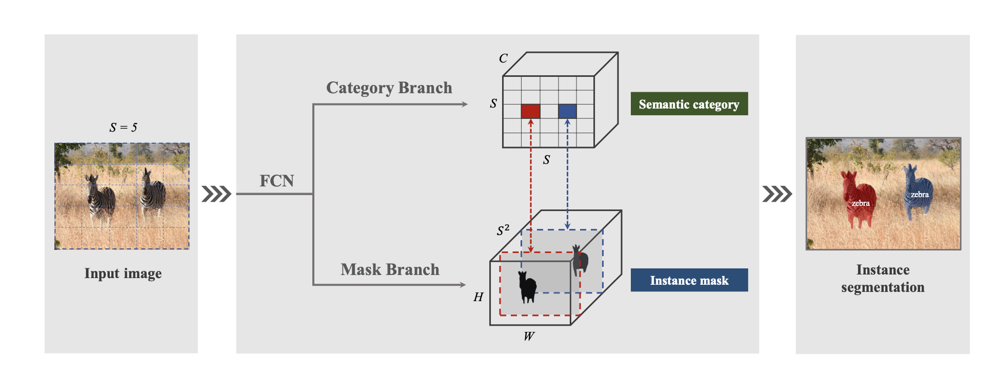
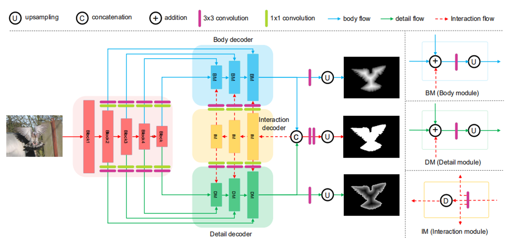
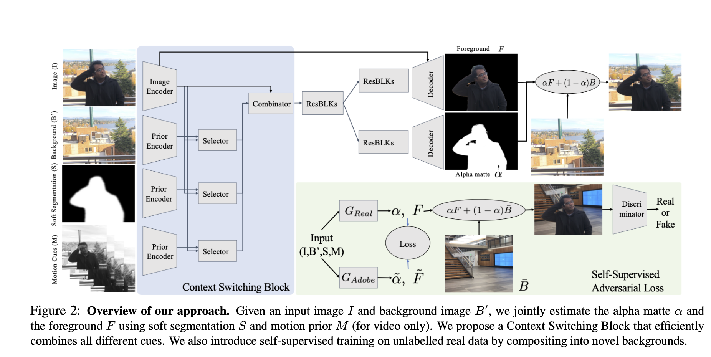
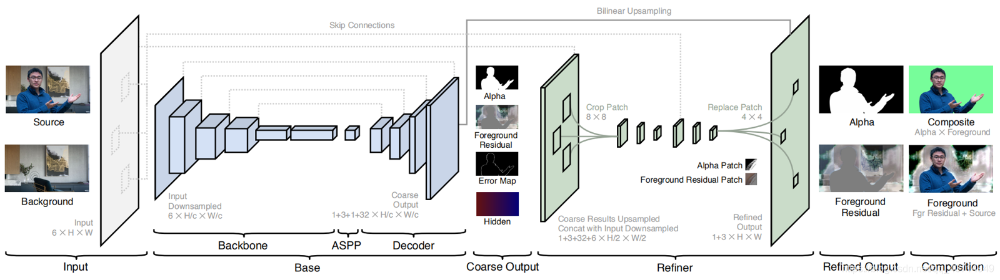
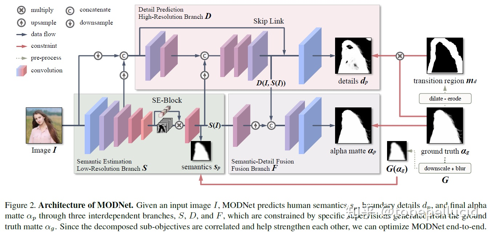

# 背景去除项目总结
[TOC]
## 方案梳理

### SOLO: Segmenting Objects by Locations
- 基本原理
  - 类似YOLO中的做法，首先将图片等分为 $S*S$ 个格子。网络输出为两个分支：分类分支和mask分支。分类分支的大小为$S*S*C$ ， $C$ 为类别数量。mask分支大小为 $H*W*S*S$ ， $S*S$ 为预测的最大实例个数，按照从上到下从左到右的方式与原图位置对应起来。当目标物体中心落入哪一个格子，分类分支对应位置以及mask分支对应通道负责该物体的预测。例如实例分配到格子 $(i, j)$ , 则mask分支上通道 $k = i*S+j$ 负责预测该目标的mask， 每个格子都只属于一个单独的实例。这就是论文对Locations的设计。
  
- 优势
  - 能够实现高分辨率视频（1920 * 1080）的实例分割
- 缺点
  - fps处于1.33～2.52之间，速度较慢
  - 运动场景的目标分割边缘效果较差
  - 不适用于视频中出现遮挡的情况
  - 半身场景视频分割效果优于全身场景

### CFBI：Collaborative Video Object Segmentation by Foreground-Background Integration
- 基本原理
  - 给定参考帧（第一帧）和前一帧的图像和目标分割，通过首帧信息和前一帧信息来辅助预测当前帧的mask
  
  - 网络：ResNet101-CFBI (backbone: ResNet101-DeepLabV3+)
  – FPS：3帧/s

- 优点
  - 精度比较好，边缘分割比较精细。
  - 静止画面或者运动比较少时比较稳定
- 缺点
  - 物体或者动作对主体的遮挡导致分割不稳定，甚至导致主体被擦除，且擦除后主体不能恢复
  - 物体消失后重新回到画面中，分割错误
  - 依赖于首帧mask,如果首帧分割不准会影响后续

- 尝试过的优化
  - 速度提升
    - 修改Global_Atrous_Rate参数：不降低精度的前提下，将分割速度提升到5fps – 6fps
    - 更换backbone，用轻量级的MobileNet代替（13fps），分割速度提升到8.5fps（1080P）
    - 擦除检测与恢复
      - 维护一个长度为L的滑动窗口，统计当前属于人的像素值相对于画面的占比，若平均值小于一个阈值则调用一个分割网络进行重新分割。

### LDF
- 基本原理
  - 解决问题：传统的显著性标签对显著性目标内部的像素都是同等对待的。像素越靠近边缘，越难预测，因为边缘处的像素分布很不均衡。
  - 思路：根据边缘与中心区域各自的特点进行处理，而不是平等的对待这些像素，特征交互网络（FIN）两个分支，分别提取主体图和细节图特征，引入了交互编码器网络显式地促进分支之间的信息交换。
  
  

- 优点
  - 边缘比较好
  - 速度快，FPS 23~24
- 缺点
  - 分割不稳定，前景有比较显著的物体时会有闪烁情况

### 绿幕算法
- Background Matting: The World is Your Green Screen
  - 输入使用了背景图，分割结果，连续帧（视频）作为先验信息；
  - 提出了Context Switching Block模块用于整合上面的数据；
  - 使用GAN。
  
- V2
  - 该方法中将整个pipeline划分为两个部分：base和refine部分，前一个部分在缩小分辨率的输入下生成粗略的结果输出，其主要用于提供大体的区域位置定位（coarse predcition）。
  - 后一个网络在该基础上通过patch selection选取固定数量的patch（这些区域主要趋向于选择头发/手等难分区域）进行refine，之后将patch更新之后的结果填充回原来的结果，从而得到其在高分辨率下的matting结果，且速度快。
  

### MODNet

- 基本原理
  - 模型分为三个基本模块，LRB模块主要用于语义估计，通过一个mobilenet v2提取图像特征，送入se-block利用通道注意力机制；HRB模块接受原始图像和LRB的不同尺寸特征图作为输入输出细节信息；语义信息和细节信息一起送入融合模块输出最后的alpha matte。
  - 模型使用子目标一致性（SOC）策略对模型进行接续训练，让模型得到的语义特征和细节特征以及融合特征一致性更强，来适应其他域的unknown data
  

- 实现的优化
  - 针对闪烁问题，实现了论文中提到的延迟一帧策略。并且针对该策略的画面撕裂问题，增加一个阈值检测得到有效消除。
  - 针对椅子以及其他像人的物体引起的误分割，实现了两种优化
    - 先通过yolo框住人体，其他部分直接消除背景，然后再进行分割
    - 最大联通分量策略，依据是会议条件下人像所形成的联通分量必然是最大联通分量，可以有效去除与主体非粘连的其他误分割块。对分割后的alpha建图，通过宽度优先搜索（深搜性能较低）确定图中的联通分量，保留最大的联通分量。缺点是对处理速度影响比较大。

- 正在实现的优化
  - 替换骨干网络为resent34并与整体结构进行适配，正在训练中
  
### ESPNet

- 基本原理
  - 先对图像用espnet进行粗分割，然后使用一个羽化网络块进行边缘精修。
- 实现的优化
  - 在新的训练集（开源的Human-centric Video Matting Challenge比赛数据集，会议场景）重新训练，增加OFD策略，得到的效果目前sota
- ESPNet和Modnet模型均导出了C++版本（libtorch,onnx），算法模块集成到app上，可以在视频会议中使用

### RVM

- 基本原理
  - 使用了convGRU和深度引导滤波，具体可以见RVM-notes。
- 实现的优化
  - 未实现优化
- 算法模块集成到app上，可以在视频会议中使用

### 未完待续...

## 后续计划
- 跟进调研最新的去背景相关算法，包括时序性、新型backbone等
- 针对应用场景的强化训练，在已有数据集上做背景替换的扩充，经过图像和谐化后改善违和感。

