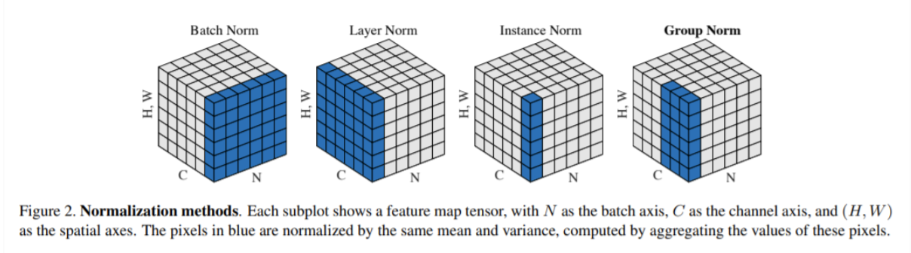

# Normalization Summary
$$
y=\gamma\left(\frac{x-\mu(x)}{\sigma(x)}\right)+\beta
$$

## Batch Normalization
- BN: Batch Normalization: Accelerating Deep Network Training by Reducing Internal Covariate Shift https://arxiv.org/pdf/1502.03167.pdf
- 2015年由Google提出，目前BN几乎成为CNN网络的标配。
- 解决内部协变量偏移（internal covariate shift）的问题：网络训练过程中，参数的变化会让下一层的输入数据分布发生变化，随着网络层数变深，分布变化会越来越大，偏移越严重，让模型训练变得难收敛。BN通过标准化操作，强行将网络输出均值和方差拉回到0和1的正态分布，再通过缩放和偏移操作保留原有特征特性以及防止数据集中在0附近，丢失了后续激活层中非线性特性。

- BN层的优势：加快了模型训练收敛速度，缓解了深层网络中“梯度弥散”的问题。
- GoogLeNet v2: 增加了BN效果变好
- 公式
  - 保留通道维度，对每一个通道的所有元素做均值和方差，BN跨样本
  $$
\begin{gathered}
u_{c}(x)=\frac{1}{N H W} \sum_{n=1}^{N} \sum_{h=1}^{H} \sum_{w=1}^{W} x_{n c h w} \\
\sigma_{c}(x)=\sqrt{\frac{1}{N H W} \sum_{n=1}^{N} \sum_{h=1}^{H} \sum_{w=1}^{W}\left(x_{n c h w}-\mu_{c}(x)\right)^{2}+\epsilon}
\end{gathered}
$$
- code
```python
# batch normalization
def test_BN():

    bn = nn.BatchNorm2d(num_features=3, eps=0, affine=False, track_running_stats=False)

    x = torch.randn(4, 3, 2, 2)*100 #x.shape:[4,3,2,2]
    official_bn = bn(x)
    # print("x=",x)
    # 把 channel 维度单独提出来，而把其它需要求均值和标准差的维度融合到一起

    # x1 = x.permute(1, 0, 2, 3).contiguous().view(3, -1)
    #  transpose、permute等维度变换操作后，tensor在内存中不再是连续存储的，
    #  而view操作要求tensor的内存连续存储，所以需要contiguous来返回一个contiguous copy
    x1 = x.transpose(0,1).contiguous().view(3,-1) # [c, n x h x w]
    # print("x1 = ",x1)
    # x1.mean(dim=1).shape: [3]
    mu = x1.mean(dim=1).view(1, 3, 1, 1) # [c, n x h x w] 对每个channel的所有元素求平均值=>[c,1]=>[1,c,1,1]

    # x1.std(dim=1).shape: [3]
    std = x1.std(dim=1, unbiased=False).view(1, 3, 1, 1) # [c, n x h x w] 对每个channel的所有元素求标准差 =>[c,1]=>[1,c,1,1]
    my_bn = (x - mu)/std # ([n,c,h,w] - [1,c,1,1]) / [1,c,1,1]  => [n,c,h,w]

    diff = abs(official_bn - my_bn).sum()
    # print(my_bn)

    print('diff={}'.format(diff))

```

## Layer Normaliztion
- Layer Normalization https://arxiv.org/pdf/1607.06450v1.pdf
- LN是针对layer维度进行标准化，LN 对每个样本的 C、H、W 维度上的数据求均值和标准差，保留 N 维度。也就是与batch无关，执行完有B个均值，B个方差。每个样本公用同样均值和方差。通常在NLP领域的任务，都会使用LN作为标准化层。
- 公式
$$
\begin{gathered}
u_{n}(x)=\frac{1}{C H W} \sum_{c=1}^{C} \sum_{h=1}^{H} \sum_{w=1}^{W} x_{n c h w} \\
\sigma_{n}(x)=\sqrt{\frac{1}{C H W} \sum_{c=1}^{C} \sum_{h=1}^{H} \sum_{w=1}^{W}\left(x_{n c h w}-\mu_{n}(x)\right)^{2}+\epsilon}
\end{gathered}
$$
- code
```python
# layer normalization
def test_LN():
    n ,c, h, w = 4,3,2,2
    x = torch.randn(n, c, h, w)*10000 #x.shape:[4,3,2,2]
    ln = nn.LayerNorm(normalized_shape=[c, h, w], eps=0, elementwise_affine=False)

    official_ln = ln(x)

    # 把 N 维度单独提出来，而把其它需要求均值和标准差的维度融合到一起
    x1 = x.contiguous().view(n, -1)

    # x1.mean(dim=1).shape: [n]
    mu = x1.mean(dim=1).view(n, 1, 1, 1)

    # unbiased=False, 求方差时不做无偏估计（除以 N-1 而不是 N），和原始论文一致 unbiased = False
    std = x1.std(dim=1, unbiased=False).view(n, 1, 1, 1)
    my_ln = (x - mu) / std

    diff = abs(official_ln - my_ln).sum()
    # print(my_ln)

    print('diff={}'.format(diff))

```

## Instance Normalization
- Instance Normalization: The Missing Ingredient for Fast Stylization https://arxiv.org/pdf/1607.08022.pdf
- Instance Normalization (IN) 最初用于图像的风格迁移。作者发现，在生成模型中， feature map 的各个 channel 的均值和方差会影响到最终生成图像的风格，因此可以先把图像在 channel 层面归一化，然后再用目标风格图片对应 channel 的均值和标准差“去归一化”，以期获得目标图片的风格。IN 操作也在单个样本内部进行，不依赖 batch。
- 公式
  $$
\begin{gathered}
u_{n c}(x)=\frac{1}{H W} \sum_{h=1}^{H} \sum_{w=1}^{W} x_{n c h w} \\
\sigma_{n c}(x)=\sqrt{\frac{1}{H W} \sum_{h=1}^{H} \sum_{w=1}^{W}\left(x_{n c h w}-\mu_{n c}(x)\right)^{2}+\epsilon}
\end{gathered}
$$
- code
```python
# Instance Normalization
def test_IN():
    n, c, h, w = 4, 3, 2, 2
    x = torch.rand(n, c, h, w) * 10000
    In = nn.InstanceNorm2d(num_features=c, eps=0, affine=False, track_running_stats=False)

    offcial_in = In(x)

    x1 = x.view(n*c, -1)
    mu = x1.mean(dim=1).view(n, c, 1, 1)
    std = x1.std(dim=1, unbiased=False).view(n, c, 1, 1)

    my_in = (x - mu) / std

    diff = abs(my_in - offcial_in).sum()
    print('diff={}'.format(diff))
```

## Group Normalization
- Group Normalization: https://arxiv.org/pdf/1803.08494.pdf
- 介于LN和IN之间，其首先将channel分为许多组（group），对每一组做归一化，先将feature的维度由N, C, H, 变成为N, G，C//G , H, W，归一化的维度为C//G , H, W
- 相当于对每一组进行LN。
- 公式
$$
\begin{gathered}
u_{n g}(x)=\frac{1}{(C / G) H W} \sum_{c=g C / G}^{(g+1) C / G} \sum_{h=1}^{H} \sum_{w=1}^{W} x_{n c h w} \\
\sigma_{n g}(x)=\sqrt{\frac{1}{(C / G) H W} \sum_{c=g C / G}^{(g+1) C / G} \sum_{h=1}^{H} \sum_{w=1}^{W}\left(x_{n c h w}-\mu_{n g}(x)\right)^{2}+\epsilon}
\end{gathered}
$$
- code
```python

def test_GN():
    n, c, h, w = 10, 20, 5, 5
    g = 4
    x = torch.rand(n, c, h, w) * 1
    # 分成 4 个 group
    gn = nn.GroupNorm(num_groups=g, num_channels=c, eps=0, affine=False)
    official_gn = gn(x)

    # 把同一个group的元素融合到一起
    # 分成 g 个 group

    x1 = x.view(n, g, -1)
    mu = x1.mean(dim=-1).reshape(n, g, -1)
    std = x1.std(dim=-1).reshape(n, g, -1)

    x1_norm = (x1 - mu) / std
    my_gn = x1_norm.reshape(n, c, h, w)

    diff = abs(my_gn - official_gn).sum()

    print('diff={}'.format(diff))

```

