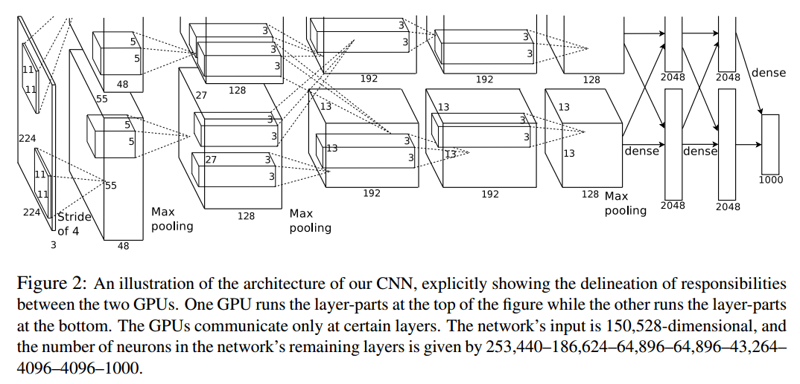

# AlexNet: ImageNet Classification with Deep Convolutional Neural Networks

## 主要内容

- 第一个典型的CNN是LeNet5网络结构，但是第一个引起大家注意的网络却是AlexNet
- 使用 ReLU 激活函数加速收敛。
- 使用 GPU 并行，加速训练。也为之后的分组卷积（group convolution）理论奠定基础。
- 提出局部响应归一化（Local Response Normalization, LRN）增加泛化特性 ，引用生物学概念侧抑制（lateral inhibitio），指的是被激活的神经元抑制相邻神经元。归一化（normalization）的目的是“抑制”，局部归一化就是借鉴了侧抑制的思想来实现局部抑制。(后人证明无效 )
- 使用交叠池化 (Overlapping Pooling) 防止过拟合
- 提出Dropout，数据增强等手段防止过拟合

## 网络架构


## 练手：AlexNet的实现-猫狗分类
```python
# ClassicalNet.py
import  torch
import  torch.nn as nn
import  torchvision
import numpy

class AlexNet(nn.Module):
    def __init__(self, num_classes=2):
        super(AlexNet, self).__init__()
        self.conv_block = nn.Sequential( # input 227 227
            # A sequential container. Modules will be added to it in the order they are passed in the constructor.
            # Alternatively, an ordered dict of modules can also be passed in.
            nn.Conv2d(in_channels=3, out_channels=96, kernel_size=11, stride=4),
            nn.BatchNorm2d(96),
            nn.ReLU(True),

            nn.MaxPool2d(kernel_size=3, stride=2),


            nn.Conv2d(in_channels=96, out_channels=256, kernel_size=5, padding=2),
            nn.BatchNorm2d(256),
            nn.ReLU(True),

            nn.MaxPool2d(kernel_size=3, stride=2),

            nn.Conv2d(in_channels=256, out_channels=384, kernel_size=3, stride=1, padding=1),
            nn.BatchNorm2d(384),
            nn.ReLU(True),

            nn.Conv2d(in_channels=384, out_channels=384, kernel_size=3, stride=1, padding=1),
            nn.BatchNorm2d(384),
            nn.ReLU(True),

            nn.Conv2d(in_channels=384, out_channels=256, kernel_size=3, stride=1, padding=1),
            nn.BatchNorm2d(256),
            nn.ReLU(True),

            nn.MaxPool2d(kernel_size=3, stride=2)

        )

        self.classfier_block = nn.Sequential(
            nn.Dropout(p=0.5), #p: probability of an element to be zeroed
            nn.Linear(in_features=6*6*256, out_features=4096),
            nn.ReLU(True),

            nn.Dropout(p=0.5),  # p: probability of an element to be zeroed
            nn.Linear(in_features=4096, out_features=4096),
            nn.ReLU(True),

            nn.Linear(in_features=4096, out_features=num_classes)
        )

    def forward(self, x):
        x = self.conv_block(x)
        x = x.view(x.size(0), 6*6*256)
        x = self.classfier_block(x)
        return x
## TrainingNet.py
from DNN import ClassicalNet
from torch import optim
import torch.nn
from torch.utils.data import DataLoader
import torchvision.transforms as transforms
import torchvision
BATCH_SIZE = 256
LR = 0.02
EPOCHS = 30
MODEL_PATH = './models/AlexNet.pth'
TRAIN_PATH = './dataset/cats_and_dogs/train'
DEVICE = torch.device('cuda' if torch.cuda.is_available() else 'cpu')
transform = transforms.Compose([
    transforms.Resize(size=(227, 227)),
    transforms.ToTensor(),#  The ToTensor transform should come before the Normalize transform, since the latter expects a tensor, but the Resize transform returns an image.
    transforms.Normalize(mean=[0.485, 0.456, 0.406], std=[0.229, 0.224, 0.225]),

    # 可以选做数据增强
    # transforms.RandomRotation(20),
    # transforms.RandomHorizontalFlip(),
])


# 读取训练集
train_dataset = torchvision.datasets.ImageFolder(root=TRAIN_PATH,
                                                 transform=transform)
train_loader = DataLoader(dataset=train_dataset,
                          batch_size=BATCH_SIZE,
                          shuffle=True)

print(train_dataset.class_to_idx)
print(train_dataset.imgs)


def train(model, device, train_loader, optimizer, epoch, criterion):
    model.train()  # train 模式 启用 BatchNormalization 和 Dropout

    for batch_idx, (img, label) in enumerate(train_loader):
        img, label = img.to(device), label.to(device)  # 把tensor送到相应设备上
        optimizer.zero_grad()  # 梯度清零
        output = model(img)  # 前向推理，自动调用model.forward
        # shape:   output [32,2] , label [32]
        loss = criterion(output, label)  # 计算指定损失函数 注意CrossEntropyLoss()的target输入是类别值，不是one-hot编码格式
        loss.backward()  # 有了loss之后反向传播
        optimizer.step()  # 更新参数
        print('loss = ', loss.item())
        # 记录数据


model = ClassicalNet.AlexNet().to(DEVICE)
criterion = torch.nn.CrossEntropyLoss()
optimizer = optim.Adam(model.parameters()) #使用adam优化器

for epoch in range(1, EPOCHS + 1):
    train(model, DEVICE, train_loader, optimizer, epoch,criterion)

print(model)

#torch.save(model.state_dict(), MODEL_PATH) #只存字典，直接输入model的话会保存整个模型


## TestNet.py
import torch
from DNN import ClassicalNet
import torchvision
from torch.utils.data import DataLoader

import torchvision.transforms as transforms
BATCH_SIZE = 32
MODEL_PATH = r'./models/AlexNet.pth'
DEVICE = torch.device('cuda' if torch.cuda.is_available() else 'cpu')
TEST_PATH = r'../../dataset/cats_and_dogs/val'
transform = transforms.Compose([
    transforms.Resize(size=(227, 227)),
    transforms.ToTensor(),#  The ToTensor transform should come before the Normalize transform, since the latter expects a tensor, but the Resize transform returns an image.
    transforms.Normalize(mean=[0.485, 0.456, 0.406], std=[0.229, 0.224, 0.225]),

    # 可以选做数据增强
    # transforms.RandomRotation(20),
    # transforms.RandomHorizontalFlip(),
])


test_dataset = torchvision.datasets.ImageFolder(root=TEST_PATH,
                                                 transform=transform)
test_loader = DataLoader(dataset=test_dataset,
                          batch_size=BATCH_SIZE,
                          shuffle=True)

def test(model, device, test_loader):
    model.eval()# eval 模式 关闭 BatchNormalization 和 Dropout
    correct = 0
    with torch.no_grad(): #关闭梯度计算
        for data, target in test_loader:
            data, target = data.to(device), target.to(device)
            output = model(data)
            print('out = ', output.cpu().numpy()) # numpy只能在cpu上工作
            pred = output.max(1, keepdim=True)[1] # 找到概率最大的下标
            print('pred = ', pred.cpu().numpy())
            correct += pred.eq(target.view_as(pred)).sum().item()

    print('Accuracy: {}/{} ({:.0f}%)\n'.format(
         correct, len(test_loader.dataset),
        100. * correct / len(test_loader.dataset)))


#注意这里必须送到DEVICE中去 原因是cpu和gpu上的tensor不一样
#否则报错Input type (torch.cuda.FloatTensor) and weight type (torch.FloatTensor) should be the same
model_load = ClassicalNet.AlexNet().to(DEVICE)
model_load.load_state_dict(torch.load(MODEL_PATH))
# model.train() ：启用 BatchNormalization 和 Dropout
# model.eval() ：不启用 BatchNormalization 和 Dropout
test(model_load, DEVICE, test_loader)


```