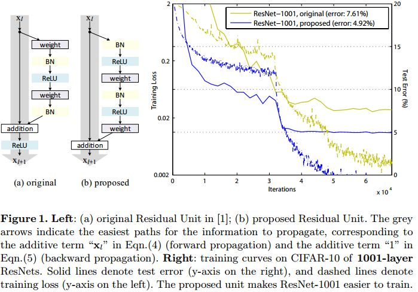

# BiT: Big Transfer
## 主要内容
- 概念
  - 在大规模数据集上预训练的模型，只需要预训练一次，很容易迁移到下游任务。
  - 不增加任何复杂度和元件，只是一些tricks。
- 优点
  - 即使下游任务的数据集很少也能达到很好效果
  - 只需要预训练一次，后续的微调代价很小，不需要大范围的超参数调整
- BN和WS
  - BN对Big Transfer是有害的，有两方面原因
    - 当batch比较小的时候
    - 它依赖于训练集的均值和标准差，所以在迁移任务上并不好
  - GN： Group Normalization，在 BN论文笔记中已经讲过。
  - WS：Weight Standardization
    - 为了像BN一样加速训练过程，又能够摆脱对于large batch size的限制，WS（Weight standarization）横空出世。
    - 常见的normalization方式（e.g. BN,LN,IN,GN）都是从激活函数的输入来考虑，以不同的方式对激活函数的输入进行标准化；WS则想，我们这么费心费力地去处理卷积后的结果来加速训练，那为什么不直接去处理这个卷积的weight呢。最后实验表明，确实直接向weight下手对速度的影响更加直观。同时，直接处理weight，也很好地规避了对batch size的依赖。
    $$
\begin{aligned}
\hat{\boldsymbol{W}} &=\left[\hat{\boldsymbol{W}}_{i, j} \mid \hat{\boldsymbol{W}}_{i, j}=\frac{\boldsymbol{W}_{i, j}-\mu_{\boldsymbol{W}_{i, \cdot}}}{\sigma_{\boldsymbol{W}_{i, \cdot}+\epsilon}}\right] \\
\boldsymbol{y} &=\hat{\boldsymbol{W}} * \boldsymbol{x}
\end{aligned}
$$
where
$$
\mu_{\boldsymbol{W}_{i, .}}=\frac{1}{I} \sum_{j=1}^{I} \boldsymbol{W}_{i, j}, \quad \sigma_{\boldsymbol{W}_{i, .}}=\sqrt{\frac{1}{I} \sum_{i=1}^{I}\left(\boldsymbol{W}_{i, j}-\mu_{\boldsymbol{W}_{i, .}}\right)^{2}}
$$
  - 使用GN和WS在小batch训练表现良好，在迁移任务上也表现很好
- BiT-HyperRule
  - 选择对于调整最重要的超参数，发现training schedule length, resolution, and whether to use MixUp regularization 比较重要
- MixUp
  - mixup：BEYOND EMPIRICAL RISK MINIMIZATION，（ICLR2018）
  - 混合标签
  $\tilde{x}=\lambda x_{i}+(1-\lambda) x_{j}, \quad$ where $x_{i}, x_{j}$ are raw input vectors
$\tilde{y}=\lambda y_{i}+(1-\lambda) y_{j}, \quad$ where $y_{i}, y_{j}$ are one-hot label encodings
- ResNetv2
  - 主要改进方案有两个：将激活层放到旁路，将旁路结构从conv-bn-relu改为bn-relu-conv。
  
- 类型
    - BiT-S：ILSVRC-2012，1.3M图片，1000个类别，每张图仅有一个类别。
    - BiT-M：ImageNet-21k，14.2M图片，21000个类别，每张图可能有多个类别。
    - BiT-L：JFT-300M，300M图片，18291个类别，平均每张图有1.26个类别。
    - 预训练模型；ResNet-50x1、ResNet-101x1、ResNet-50x3、ResNet-101x3、ResNet-152x4，ResNet-后面的数是resnet的深度（层数）*宽度（通道数）

## 实验
- 模型规模与数据集规模关系
  - pre-train时，模型规模要与数据集规模正相关，即大模型在大的数据集上pre-train得到的模型效果更好。在BiT-L数据集上pre-train得到的大模型，在fine-tune的任务上效果最好
- 在不同任务上，pre-trian的效果
  - 使用BiT-L数据集pre-train的模型，在不同数据集上fine-tune，得到的结果都优于目前的SOTA
  - 大的数据集pre-train得到的模型，参数迁移效果更好。
## 应用
- 华录杯 吸烟打电话检测 BiT-M-R101x1 模型
- 软件杯 林业害虫识别 BiT-M-R101x1 模型 
