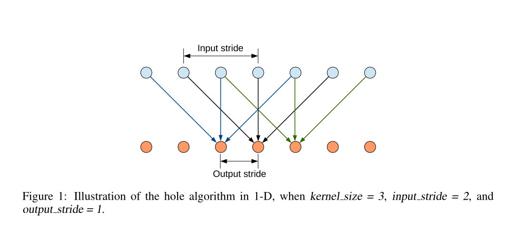
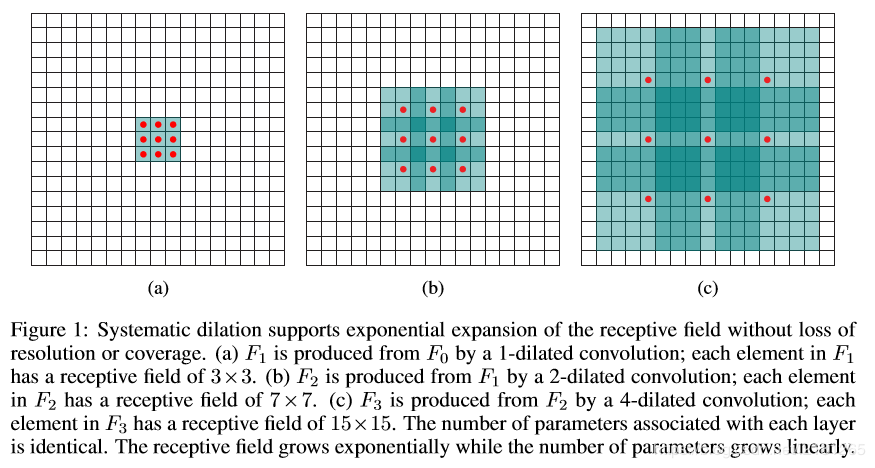
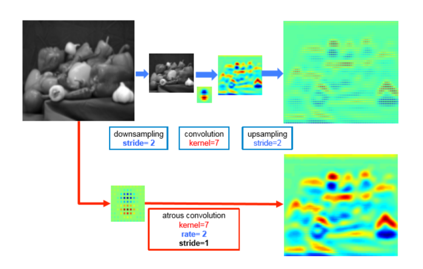
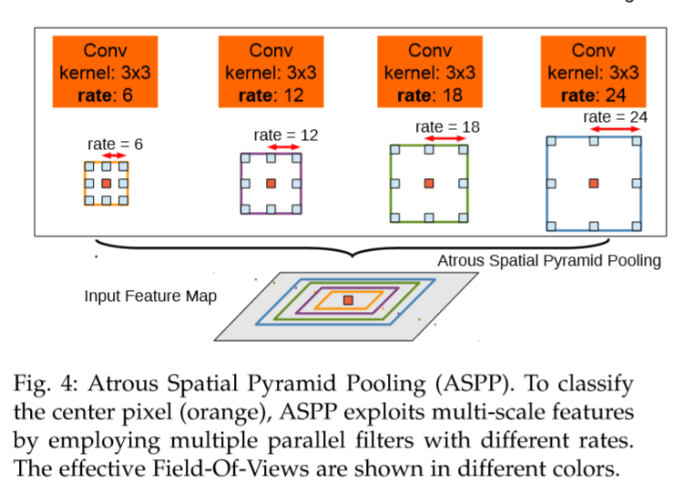
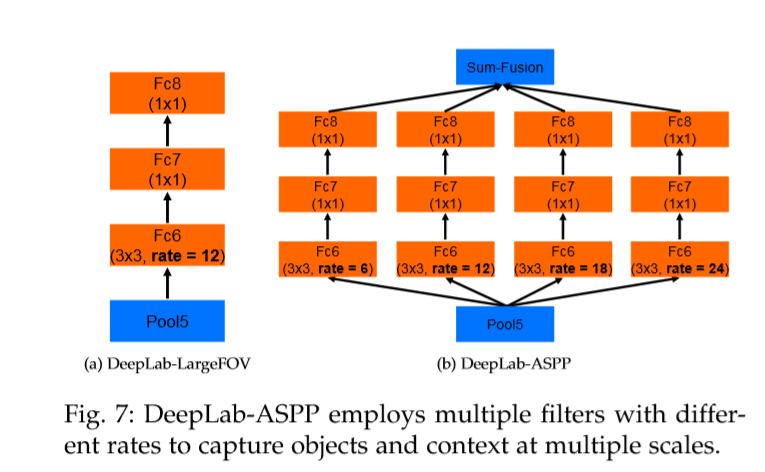
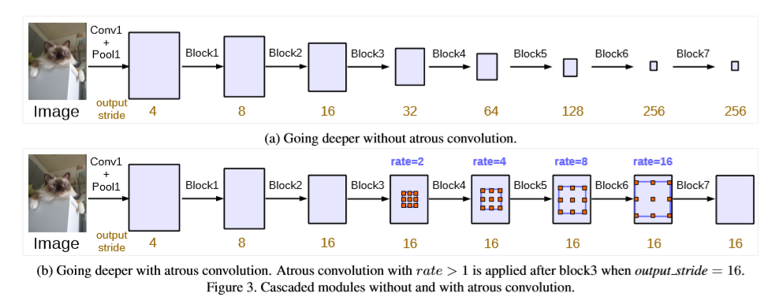
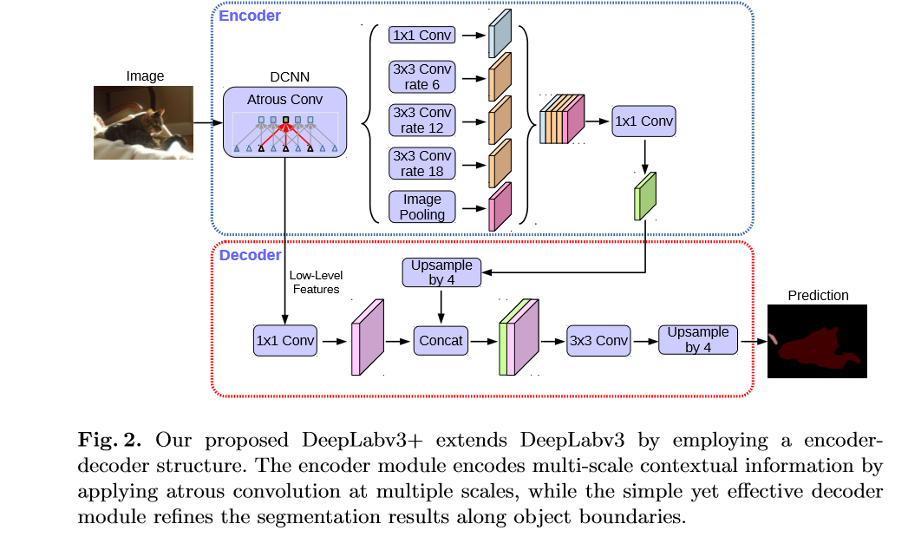
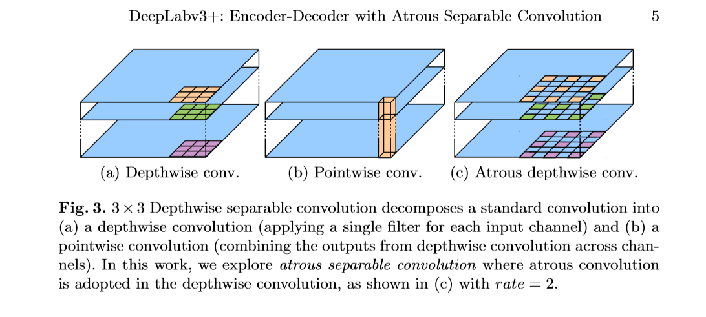

## Deeplab v1

### 基本信息

- 年份：2015 ICLR
- 作者：Liang-ChiehChen, et al.
- 内容简介：结合DCNN CFR 做的语义分割

### 主要内容
- 语义分割两个障碍
  - DCNN的图像转化的平移不变性（invariance），是源于重复的池化和下采样的组合。平移不变性增强了对数据分层的抽象能力，但是对语义分割、姿态估计不友好，因为这些任务倾向于精确的定位而不是抽象的空间关系。
    - 通过使用全连通条件随机场(CRF)，提高了模型捕捉细节的能力。条件随机场在语义分割中得到了广泛的应用，它将多路分类器计算的类分数与像素和边缘之间的局部交互所获取的低层信息相结合。
  - 空间下采样： 重复的最大池化和下采样带来分辨率下降的问题，会丢失细节。在这不断的下采样过程中,必然会损失掉很多空间信息,所以最后得到的小分辨率feature maps对于小目标来说,是不容检测出来的,尤其是边缘细节。
    - DeepLab只采用8倍下采样，维持高分辨率的特征图。同时，为了得到更大的感受野获得高层语义信息，采用atrous算法扩展感受野，获得更多上下文信息。

- 空洞卷积
  - 空洞卷积是在标准的卷积上注入空洞，以此增加receptive field，多了一个称为dilation rate即kernel间隔数量的超参数。空洞卷积能够放大滤波器的感受野，rate引入r-1个0，将感受野从k扩大到k+(k-1)(r-1)，而不增加参数和计算量。
    
    
- CFR 条件随机场 
  - 没看懂

## Deeplab v2

### 基本信息

- 年份： 2017
- 作者：Liang-Chieh Chen, et al.
- 内容简介
  - Atrous Convolution 代替原来上采样的方法，比之前得到更高像素的score map，在不增加参数数量或计算量的情况下，有效地扩大感受野，以获得更多的上下文信息
  - ASPP(atrous spatial pyramid pooling) ：基于空间空洞金字塔池化的多尺度分割方法，即多尺度特征提取，在多个尺度上捕获对象和图像特征和语境；
  - 全连接的CRF，利用低层的细节信息对分类的局部特征(边缘)进行优化。

### 主要内容

- ASPP:受spatial pyramid pooling(SPP)启发，得到ASPP结构(Multiscale Image Representations using Atrous Spatial Pyramid Pooling)

    
    

- Deeplab-ASPP
  
    

### Deeplab v3
- 年份：2017
- 作者：Liang-Chieh Chen, et al.
- 内容简介
  - 改进了ASPP模块：由不同采样率的空洞卷积和BN层组成，尝试以级联或并行的方式布局模块。
  - 讨论了一个重要问题：使用大采样率的3×3的空洞卷积，因为图像边界响应无法捕捉远距离信息，会退化为1×1的卷积, 建议将图像级特征融合到ASPP模块中
  - 去掉了CRF

### 主要内容

- 多尺度目标的解决办法
  - Image Pyramid: 将输入图片放缩成不同比例，分别应用在DCNN上，将预测结果融合得到最终输出
  - Encoder-Decoder: 利用Encoder阶段的多尺度特征，运用到Decoder阶段上恢复空间分辨率(代表工作有FCN、SegNet、PSPNet等工作)
  - Atrous Convolution
  - Spatial Pyramid Pooling: 空间金字塔池化具有不同采样率和多种视野的卷积核，能够以多尺度捕捉对象
  
    

- ASPP模块
  - 级联ResNet的block4，对比有无空洞卷积的效果
  
    

  - 改进ASPP，并联和GAP 全局平均池化（池化之后怎么通过concat和1X1卷积得到ratio = 16的特征图的没搞清楚）
  
    

## deeplab v3+ 

### 主要架构
- DeepLabv3 as encoder
- Modified Aligned Xception as backbone(decoder)
- 精度很高

### 深度可分离卷积

## U-Net SegNet PSPnet
