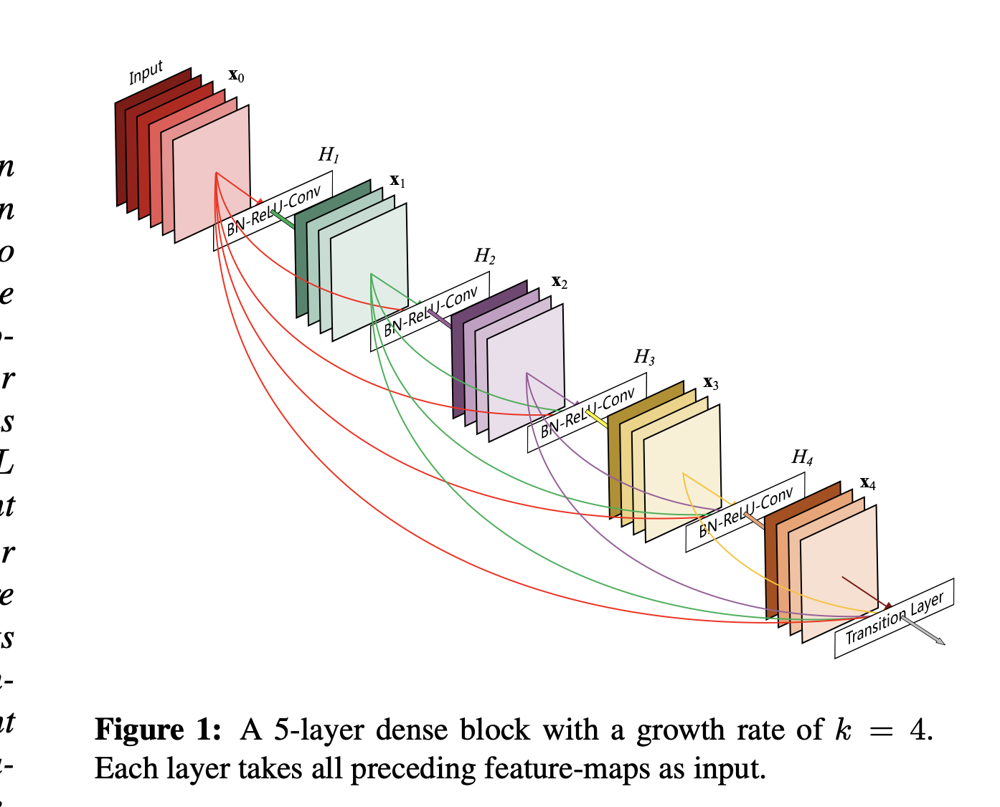
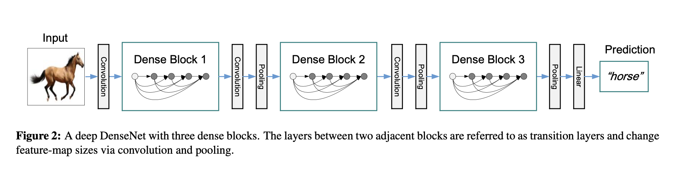
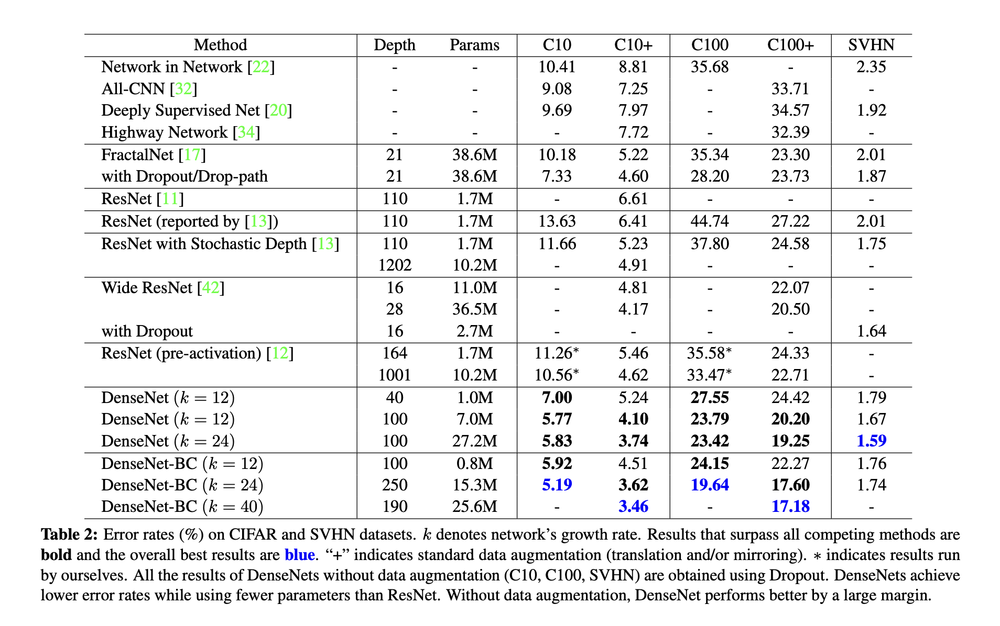

# DenseNet: Densely Connected Convolutional Networks
## Info
- CVPR2017 best paper
## 主要思想
- densenet： 对前每一层都加一个单独的 shortcut，使得任意两层网络都可以直接“沟通”。
- 从feature 来考虑，feature重用发挥到极致。每一层 feature 被用到时，都可以被看作做了新的 normalization即便去掉BN， 深层DenseNet也可以保证较好的收敛率。
- 从perceptual field来看，浅层和深层的 field 可以更自由的组合，会使得模型的结果更加 robust。
- 从wide-network 来看， DenseNet 看以被看作一个真正的宽网络，在训练时会有比 ResNet 更稳定的梯度，收敛速度自然更好（paper的实验）。

## 结构
- 1个dense block的结构
  
  
- 整体网络结构
  
  
## 缺点
- 跳跃连接太多，显存占用和计算量太大

## 实验对比

  