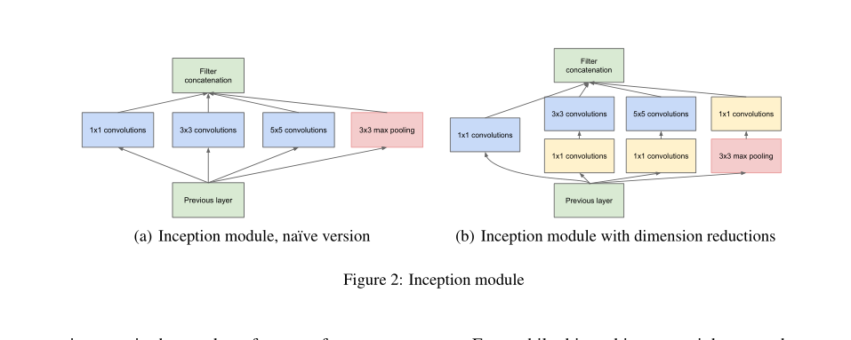
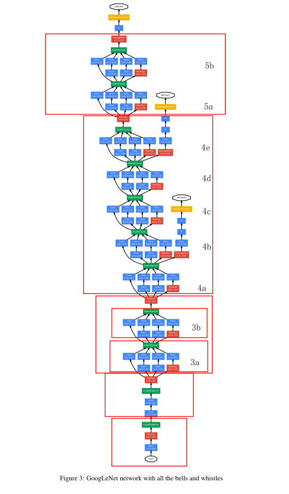
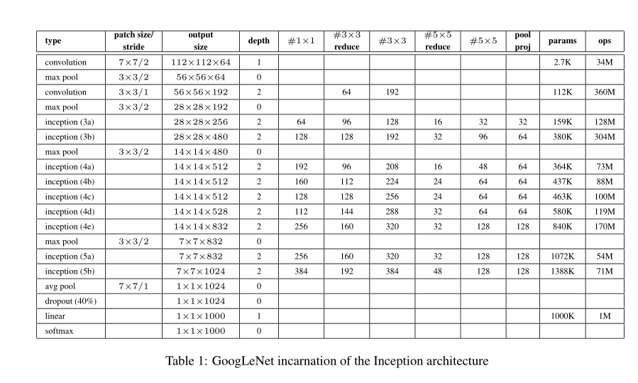
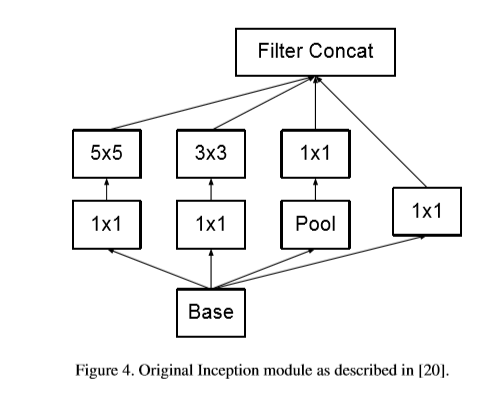
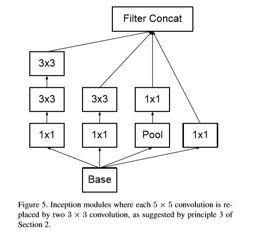
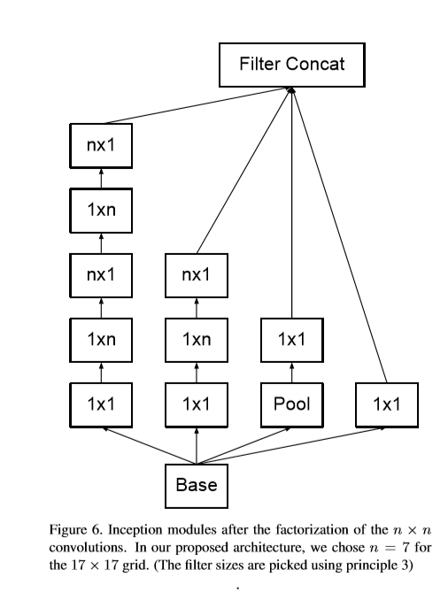
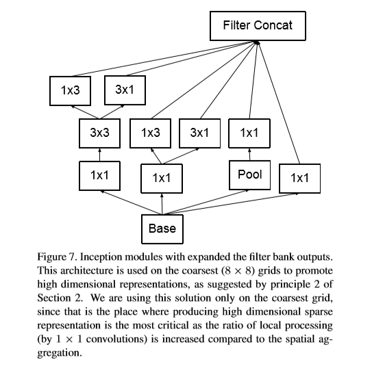
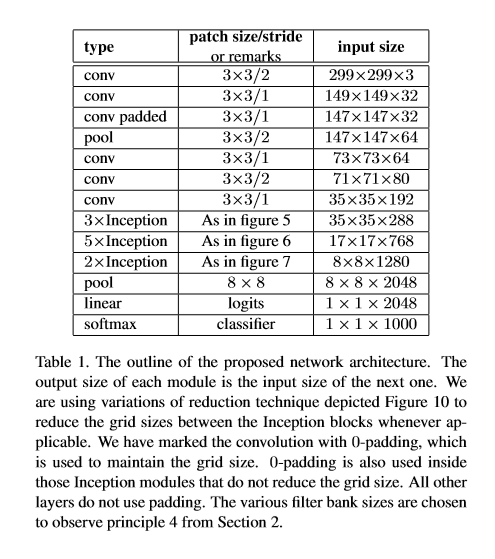

# Inception系列

## Inception V1: Going Deeper with Convolutions

### 主要内容
- 一般来说，提升网络性能最直接的办法就是增加网络深度和宽度，深度指网络层次数量、宽度指神经元数量。但这种方式存在以下问题：
  - 参数太多，如果训练数据集有限，很容易产生过拟合；
  - 网络越大、参数越多，计算复杂度越大，难以应用；
  - 网络越深，容易出现梯度弥散问题（梯度越往后穿越容易消失），难以优化模型。

- ILSVRC 2014 取得了最好的成绩的 GoogLeNet，及其核心结构——Inception
- approximating the expected optimal sparse structure
by readily available dense building blocks is a viable method for improving neural networks for
computer vision. 
  - 为了解决overfitting和计算成本这两个问题，稀疏深层网络比全连接更有效
但是，非均匀稀疏结构的运算并不是很有效率，尽管计算量减少了100倍但是查找和cache缺失却占了主要地位。另外，均匀结构和大量filters以及batch更能够有效利用密集计算。
  - Inception结构的主要思想是基于找出卷积网络中的最优局部稀疏结构如何被现成的密集组件逼近和覆盖。
- 提出Inception module with dimension reduction，在不损失模型特征表示能力的前提下，尽量减少 filters 的数量，达到降低模型复杂度的目的。
  - 1X1卷积先降维，再使用3X3卷积，减少参数量和计算量
  - Inception Module 的4个分支在最后通过一个聚合操作合并。
  

- GoogLeNet 整体架构

  

  

### 1X1卷积优势

- 减少参数量，减少计算量
  - 假设输入feature map的维度是256维，要求输出维度也是256维，有以下两种操作：
    - 256维的输入直接经过一个3X3X256的卷积层，输出一个256维的feature map，那么参数量为：（3X3X256）X256 = 589824
    - 256维的输入先经过一个1X1X256X64的卷积层，再经过一个3X3X64的卷积层， 最后经过一个1X1X256的卷积层，输出256维，参数量为：（1X1X256X64）+（3X3X64X64）+（1X1X64X256） = 69532 可以看到，参数量减少了大约8.5倍
- 实现跨通道的信息交互和信息整合
  - 使用1X1卷积核，其实就是对不同的channel间的信息做线性组合的一个变换过程。比如输入为3X3X3的feature map，后面添加一个1X1X3X64个的卷积核，就变成了3X3X64的feature map，原来的3个channels就可以理解为跨通道线性组合变成了64channels，这就是通道间的信息交互。
- 增加非线性
  - 1X1卷积核，在获得相同感受野（reception feild）、保持feature map尺度不变的情况下，使用1X1卷积核的网络更深，而每一层网络后都会用Relu函数增加非线性，这样就增加了一层非线性特性。

### 辅助分类器

- 为了避免梯度消失，网络额外增加了2个辅助的softmax用于向前传导梯度（辅助分类器）。辅助分类器是将中间某一层的输出用作分类，并按一个较小的权重（0.3）加到最终分类结果中，这样相当于做了模型融合，同时给网络增加了反向传播的梯度信号，也提供了额外的正则化，对于整个网络的训练很有裨益。而在推理过程时，这两个额外的softmax会被去掉。

### 全局平均池化
- 网络的最后采用全局平均池化代替全连接层，该想法来自NIN。但是，实际在最后还是加了一个全连接层，主要是为了方便对输出进行灵活调整。网络中虽然用全局平均池化替代了全连接层，但是网络模型还是用到了dropout，来减少过拟合现象。

## Inception V2-: BN-Inception
- BN-Inception网络实际是在Batch Normalization论文中顺带提出的，旨在表现BN的强大。
- 在每个激活层前增加BN层
- 将Inception Module中的5×5卷积替换为2个3×3
- 在Inception 3a和3b之后增加Inception 3c
- 部分Inception Module中的Pooling层改为average pooling
- 取消Inception Module之间衔接的pooling层，而将下采样操作交给Inception 3c和4e，令stride为2
- 有了batch_normal并不是完整的inception V2，官方定义这个叫做V1的加强版，后来google又出了一篇新论文把5*5的卷积改成了两个3*3的卷积串联，它说一个5*5的卷积看起来像是一个5*5的全连接，所以干脆用两个3*3的卷积，第一层是卷积，第二层相当于全连接，这样可以增加网络的深度，并且减少了很多参数

## Inception V2/V3: Rethinking the Inception Architecture for Computer Vision
### General Design Principles
- 原则1：避免表征瓶颈。由于图片数据是在网络中正向传播的，经过一层又一层的滤波器提取特征。因为在高层是想要提取局部特征，所以一般来说，从输入到输出，特征图像会越来越小，同时在这个越来越小的过程中会当然会丢失掉一些重要的信息，如果减小的太快或者是最终特征图像太小就难免造成表征瓶颈。 此原则在GoogLeNet中遵守，在Inception v2中继续遵守。

- 原则2：特征越多，收敛越快。这里的特征多不是说特征图像多，而是说相互独立的特征多，特征分解的彻底。比如：人脸特征分解成人脸、人左眼、人右眼、鼻子、嘴巴、眉毛等等独立特征会比单纯的一张大脸特征收敛的快。（赫布原理）

- 原则3、大卷积核的卷积之前可以先降维，这个操作并不会造成太多的损失。例如：在33卷积核55卷积之前用1*1卷积进行压缩降维是可行的。因为具有强相关性的一组数据在降维过程中信息损失很少，而每一个feature map的同一个位置的像素对应的原输入的位置是相同的，所以这些像素是高度相关的。

- 原则4、均衡网络的宽度和深度。即两者同时适当提升，不要顾此失彼。

### 主要内容

- Reduce representational bottleneck
  - 当卷积没有显著改变输入的尺寸时，神经网络表现得更好。减少维度太多可能会导致信息丢失，这被称为representational bottleneck.

- Using smart factorization methods
  - 方式一：V1中5X5卷积换成两个3X3卷积，感受野不变，计算量减少2.78倍
    
    
  - 方式二：不对称卷积，任意nxn卷积均可由1xn和nx1卷积替代,使用1XN+NX1卷积代替NXN卷积：factorize convolutions of filter size nxn to a combination of 1xn and nx1 convolutions. For example, a 3x3 convolution is equivalent to first performing a 1x3 convolution, and then performing a 3x1 convolution on its output.
    

- 辅助分类器的改进
  - 在GoogLeNet里面用了两个辅助分类器（4a和4b两个模块后面），但是事后实验证明，第一个没什么用，在v2，v3里面去掉了。

- 扩展模块的宽度而不是深度以去除representational bottleneck.
  
    

### 基本架构
- 其中5，6，7三个图如上所示

## Inception-v4, Inception-ResNet and the Impact of Residual Connections on Learning
- 提出了Inception-v4版本以及结合了残差结构的Inception-ResNet-v1和Inception-ResNet-v2