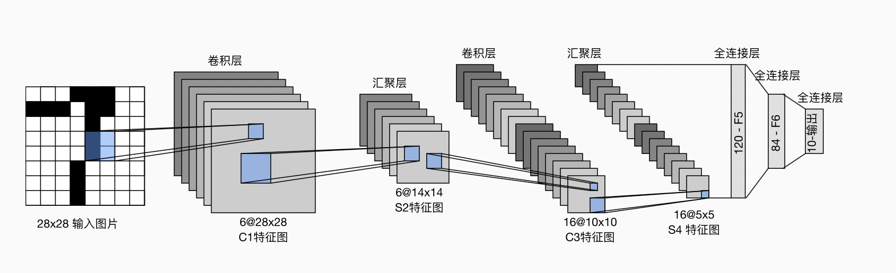

# LeNet: Gradient-based learning applied to document recognition

## 主要内容

- CNN开山之作,Yann LeCun等人使用反向传播算法训练的卷积神经网络结合到读取“手写”数字上，并成功应用于识别美国邮政服务提供的手写邮政编码数字.
- LeNet5 的架构基于这样的观点：（尤其是）图像的特征分布在整张图像上，以及带有可学习参数的卷积是一种用少量参数在多个位置上提取相似特征的有效方式。


## 网络架构


## 模型代码复现
```python
import torch
from torch import nn
from d2l import torch as d2l

net = nn.Sequential(
    nn.Conv2d(1, 6, kernel_size=5, padding=2), nn.Sigmoid(),
    nn.AvgPool2d(kernel_size=2, stride=2),
    nn.Conv2d(6, 16, kernel_size=5), nn.Sigmoid(),
    nn.AvgPool2d(kernel_size=2, stride=2),
    nn.Flatten(),
    nn.Linear(16 * 5 * 5, 120), nn.Sigmoid(),
    nn.Linear(120, 84), nn.Sigmoid(),
    nn.Linear(84, 10))

```