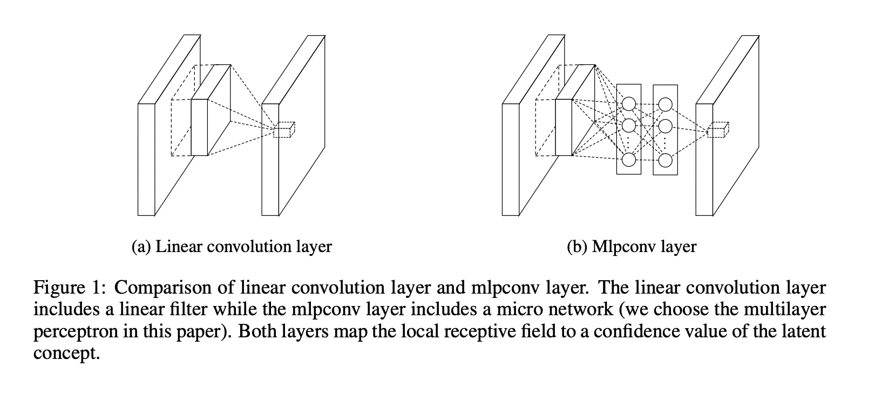
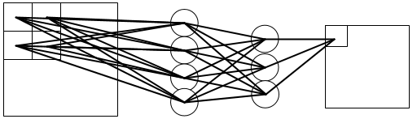
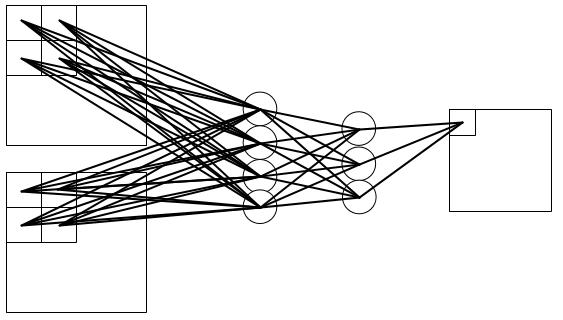
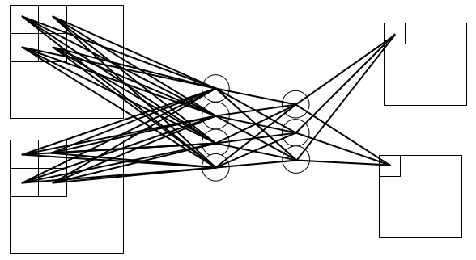
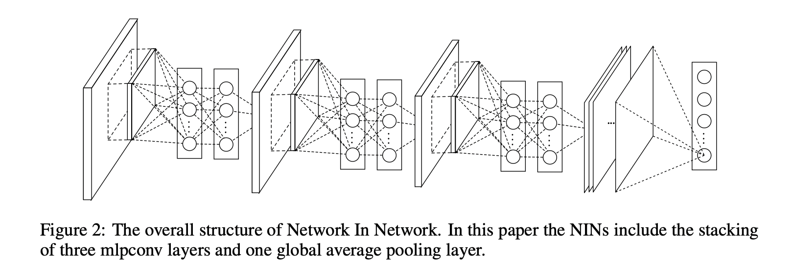

# NIN: Network In Network
## Info
- 2014 ICLR

## 传统CNN
- CNN由卷积层与池化层交替组成，卷积层通过使用非线性激活函数（ReLU、sigmoid、tanh等）的线性组合形成feature map。
- 实际上CNN中的卷积操作（也可看做两个向量的内积）是一种广义线性模型。如果所要提取的特征是线性的或者低度非线性的，这种卷积操作得到的特征是比较符合预期的，但是如果所要提取的特征是高度非线性的，用CNN中的Filter方法想要获取到符合我们预期的特征就比较困难了，这个时候传统CNN会尝试使用超完备的滤波器来提取各种潜在的特征，即初始化大量的滤波器提取尽可能多的特征，将我们期望的特征也覆盖到。
- 这样导致的一个结果就是：网络结果复杂，参数空间巨大。

## MLP-conv
- 提出了mlpconv代替普通的卷积操作，从而来提升抽象能力

- 左图是普通卷积，中间卷积核进行滑动卷积从输入得到输出的映射关系很清楚
- 右图是MLP-conv，在卷积核后面跟了个小网络即MLP，这也是NIN名字的由来。这两层MLP可以用1X1的卷积层来实现，本质上是注意力机制。
- 计算法
  - Here n is the number of layers in the multilayer perceptron.
  $$
\begin{aligned}
f_{i, j, k_{1}}^{1} &=\max \left(w_{k_{1}}^{1}{ }^{T} x_{i, j}+b_{k_{1}}, 0\right) \\
& \vdots \\
f_{i, j, k_{n}}^{n} &=\max \left(w_{k_{n}}^{n} f_{i, j}^{n-1}+b_{k_{n}}, 0\right)
\end{aligned}
$$

  
  
  
## Global Average Pooling
- 利用全局均值池化来替代原来的全连接层（fully connected layers），即对每个特征图一整张图片进行全局均值池化，则每张特征图得到一个输出。例如CIFAR-100分类任务，直接将最后一层MLPconv输出通道设为100，对每个feature map（共100个）进行平局池化得到100维的输出向量，对应100种图像分类。这样采用均值池化，去除了构建全连接层的大量参数，大大减小网络规模，有效避免过拟合。

## 网络结构
- 3块MLP-conv和一个GAP层
 
## NIN优点
- 更好的局部抽象能力；
- 更小的参数空间；
- 更小的全局Over-fitting。