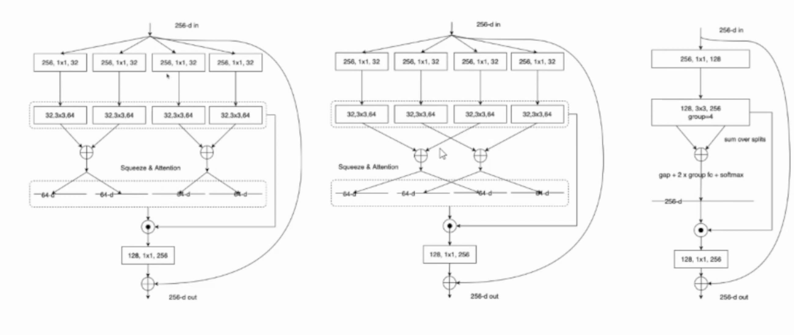

# ResNeSt: Split-Attention Networks

## 灵感来源
- GoogleNet 采用了Multi-path机制，其中每个网络块均由不同的卷积kernels组成。
- ResNeXt在ResNet bottle模块中采用组卷积，将multi-path结构转换为模块化操作。
  
- SE-Net 通过自适应地重新校准通道特征响应来引入通道注意力（channel-attention）机制。
    
- SK-Net 通过两个网络分支引入特征图注意力
（feature-map attention）。
  - split操作实际上是使用两种不同尺寸的卷积核得到两组特征图
  - 两组特征图通过fuse模块得到各自的通道注意力向量与各自相乘得到加权平均。
  
- 沿用VGG这种模块化结构，网络设计非常简化。
- 我组合模块就叫拼凑，大佬组合模块就是集大成者。

## 主要模块
- 分成k个基数cardinal
- 每个cardinal代表着不同方式的特征表示
- 每个基数内部又分为r个split，这r个split做的是类似于SK-Net的注意力机制，相当于每种特征表示内部，子特征的权重又是不一样的。

  

  

## Modularization and  Acceleration

- Radix-major implementation
  
- 右边模块化实现，依据的原理是shuffle等价性。这里其实不是很明白到底是怎么模块化加速的。
  

## 实验结果
- 对分割任务迁移得也很好，说明分类模型作为其他任务的backbone也是很有意义的。
  
  

## 项目应用
- 华录杯吸烟打电话检测算法大赛 Rank 9.