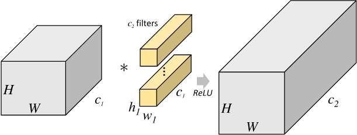
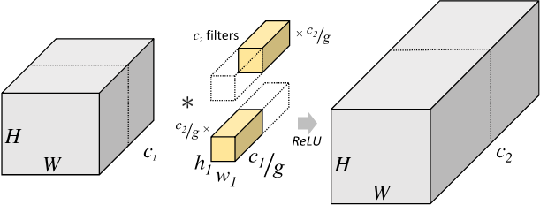
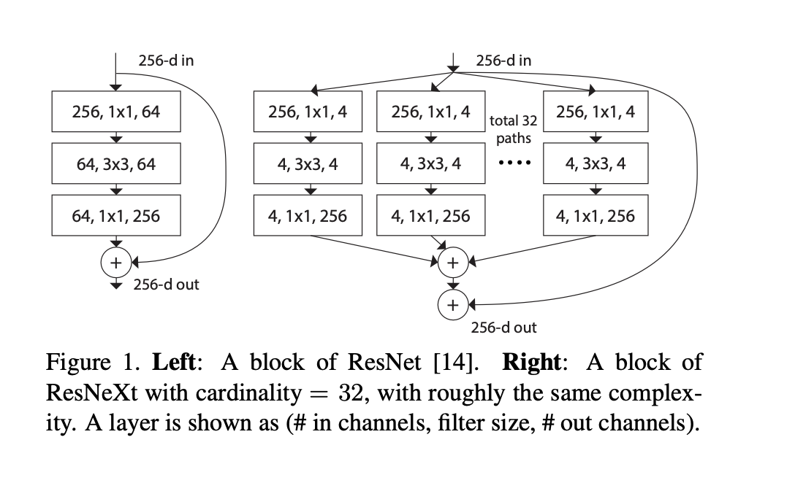
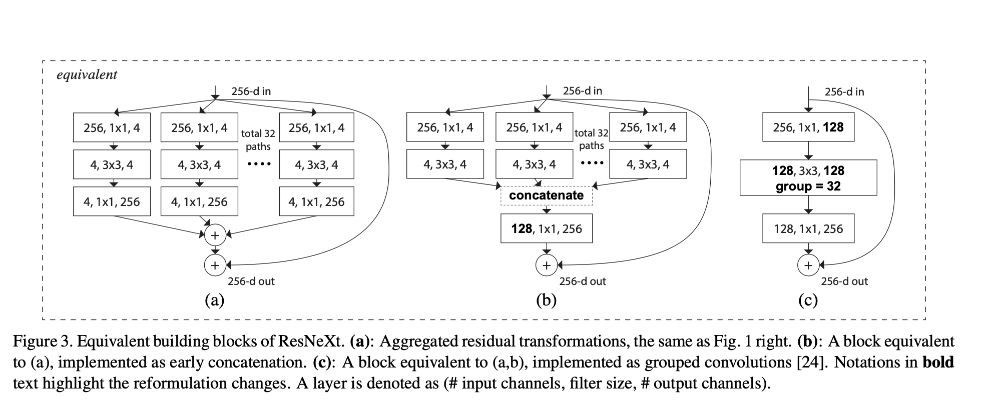
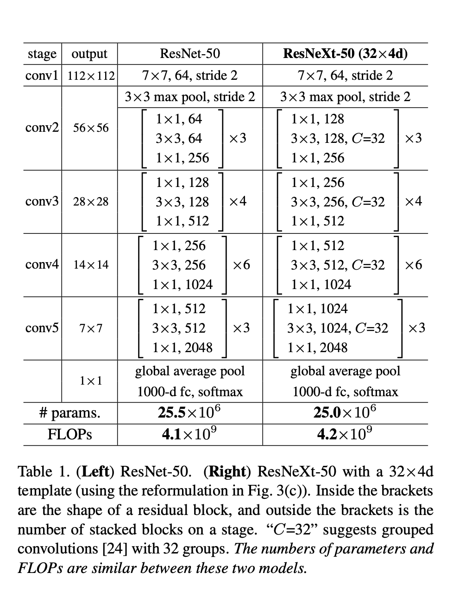
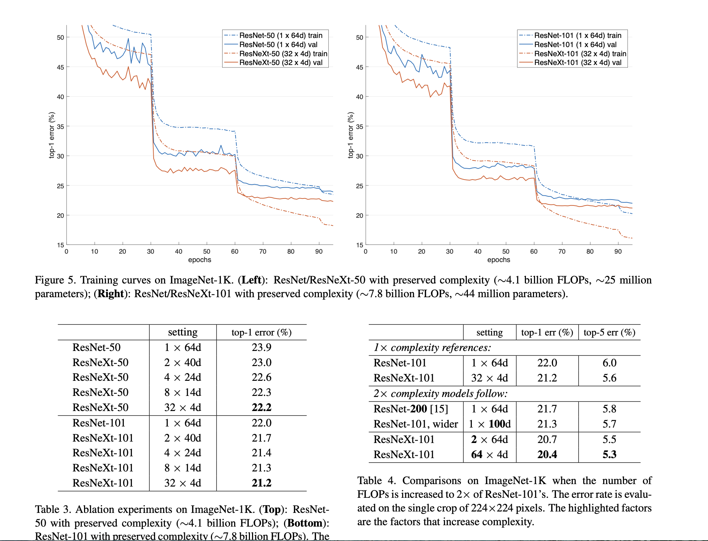

# ResNeXt: Aggregated Residual Transformations for Deep Neural Networks
## INFO
- ResNeXt, are the foundations of our entry to the ILSVRC 2016 classification task in which we secured 2nd place.

## 分组卷积（Group Convolution）
- 分组卷积（Group Convolution）最早出现在AlexNet中。受限于当时的硬件资源，在AlexNet网络训练时，难以把整个网络全部放在一个GPU中进行训练，因此，作者将卷积运算分给多个GPU分别进行计算，最终把多个GPU的结果进行融合。因此分组卷积的概念应运而生。
- 普通卷积和分组卷积的方式

- 普通卷积参数量
$$
h_{1} \times w_{1} \times C_{1} \times C_{2}
$$
- 分组卷积参数量,g是组数
$$
h_{1} \times w_{1} \times \frac{C_{1}}{g} \times \frac{C_{2}}{g} \times g=h_{1} \times w_{1} \times C_{1} \times C_{2} \times \frac{1}{g}
$$

## 思路
- 主要思想
  - 吸收了ResNet的shortcut connections的思想加深了网络的depth
  - 吸收了Inception的split-transform-merge策略扩展了网络的cardinality
  - 吸收了VGG简练的设计原则，克服了Inception各种卷积核参数过于复杂，难以控制的缺点

- 基本块：ResNet VS. ResNeXt
  - cardinatlity是基数的意思，本文提出网络具有深度宽度还有基数这个维度的衡量
  
  

- 等价基本块
  - 作者归纳了这3种split-transform-merge模式，认为它们是等价的，最后采用了第三种方式构建基本块从而构造了ResNeXt,便于模块化实现。
  
## 网络结构
 

 ## 实验结果
 - ResNeXt（32x4d）表示32路组卷积，每路的结果通道是4，对于resnet来说当然是1x64d了
 