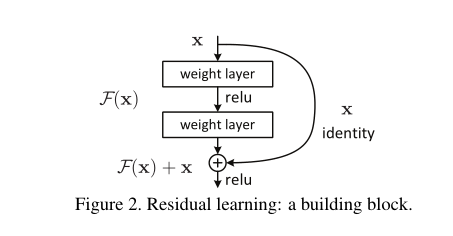
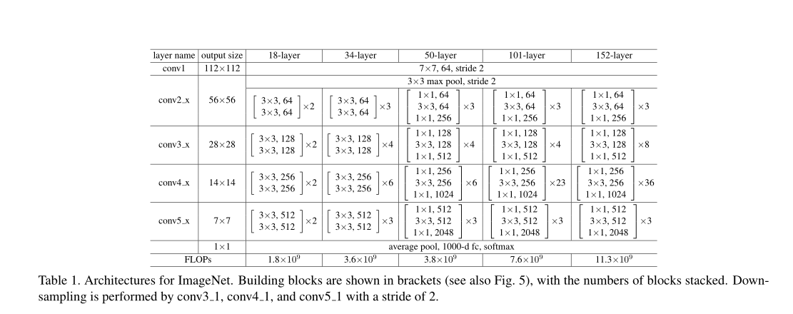
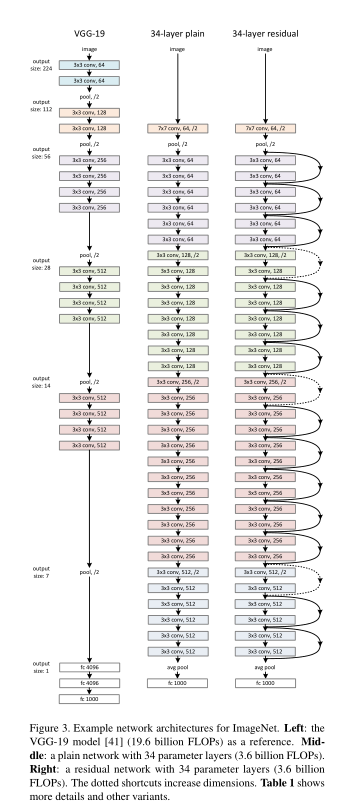

# ResNet

## 主要内容

- The depth of representations is of central importance
for many visual recognition tasks. 
  - 网络不能简单地增加深度
    - 可能导致梯度消失/爆炸
      - 解决办法有BN和正则化

  - 深度超过一定值后，会发生退化问题。
    - 这个不能解释为overfitting，因为overfit应该表现为在训练集上表现更好才对。
    - 退化问题说明了深度网络不能被很好地优化。

- we address the degradation problem by
introducing a deep residual learning framework.
  - 通过在卷积层之间添加shortcut，更有利于恒等映射的学习。
  - 如果深层网络的后面那些层是恒等映射，那么模型就退化为一个浅层网络。那现在要解决的就是学习恒等映射函数了。 但是直接让一些层去拟合一个潜在的恒等映射函数H(x) = x，比较困难，这可能就是深层网络难以训练的原因。但是，如果把网络设计为H(x) = F(x) + x,如下图。我们可以转换为学习一个残差函数F(x) = H(x) - x. 只要F(x)=0，就构成了一个恒等映射H(x) = x. 而且，拟合残差肯定更加容易。

    

- 作者在实验中发现18层的plain网络和Resnet精度差不多，但是后者收敛得更快。说明残差结构参数能够更容易被优化

## 网络架构

- 当输出特征图通道数增加时，方案一是在shortcut路的x增加新通道，补充0；方案二是通过投影shortcut（使用1X1卷积）增加通道数
- 两端窄中间粗的深度瓶颈结构能减少训练时间，此时采用恒等映射shortcut而不是投影式shortcut至关重要，因为能减少时间复杂度和模型大小
- 网络细节

  
  
