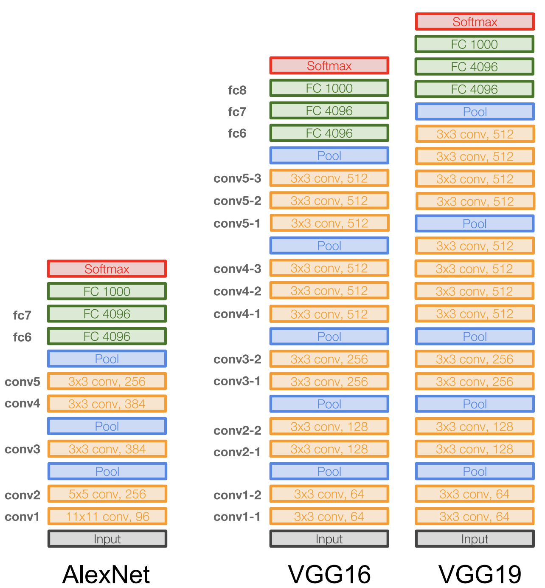

# VGG：Very Deep Convolutional Networks for Large-Scale Image Recognition

## 论文信息
- International Conference on Learning Representations (ICLR), 2015
- Homepage: https://www.robots.ox.ac.uk/~vgg/research/very_deep/

## 主要思想

- 该网络是在ILSVRC 2014上的相关工作，主要工作是证明了增加网络的深度能够在一定程度上影响网络最终的性能。VGG有两种结构，分别是VGG16和VGG19，两者并没有本质上的区别，只是网络深度不一样。通过堆叠VGG块，可以扩展网络深度。
- 作者通过做实验发现LRN层对模型的分类正确率没有提高，因此在整个VGG模型中不使用AlexNet提出的LRN层。
- VGG16相比AlexNet的一个改进是采用连续的几个3x3的卷积核代替AlexNet中的较大卷积核（11x11，7x7，5x5）。用3个3x3的卷积核来卷积得到像素对应的感受野大小与一个7x7卷积核得到的感受野大小是一样的。但是，参数量却是差了近一倍（3x3x3=27，7x7=49）。
- 对于给定的感受野（与输出有关的输入图片的局部大小），采用堆积的小卷积核是优于采用大的卷积核，
- 因为多层非线性层可以增加网络深度来保证学习更复杂的模式，而且代价还比较小（参数更少）

- 在VGG中，使用了3个3x3卷积核来代替7x7卷积核，使用了2个3x3卷积核来代替5*5卷积核，这样做的主要目的是在保证具有相同感知野的条件下，提升了网络的深度，在一定程度上提升了神经网络的效果。

- 优点

    - VGGNet的结构非常简洁，整个网络都使用了同样大小的卷积核尺寸（3x3）和最大池化尺寸（2x2）
    - 几个小滤波器（3x3）卷积层的组合比一个大滤波器（5x5或7x7）卷积层好
    - 验证了通过不断加深网络结构可以提升性能
    
- 缺点
    - VGG耗费更多计算资源，并且使用了更多的参数，导致更多的内存占用。其中绝大多数的参数都是来自于全连接层。
    
## 网络模型
