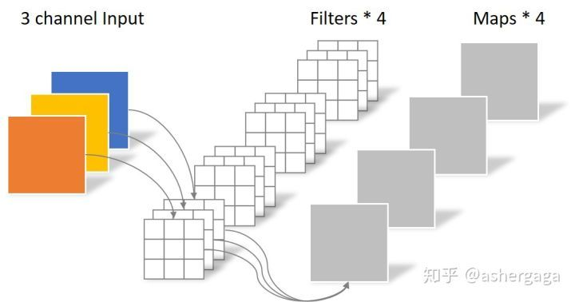
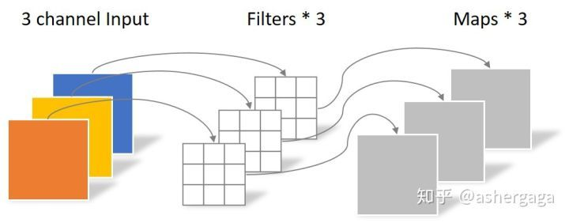
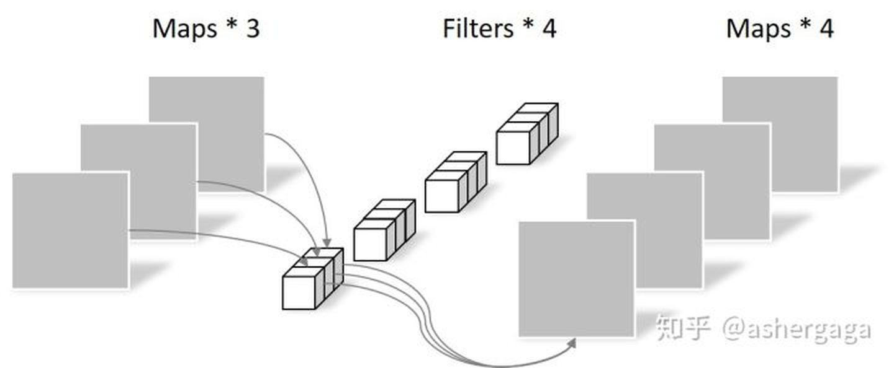
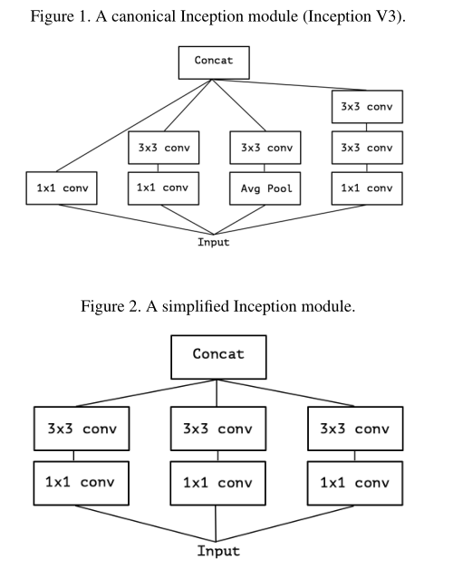
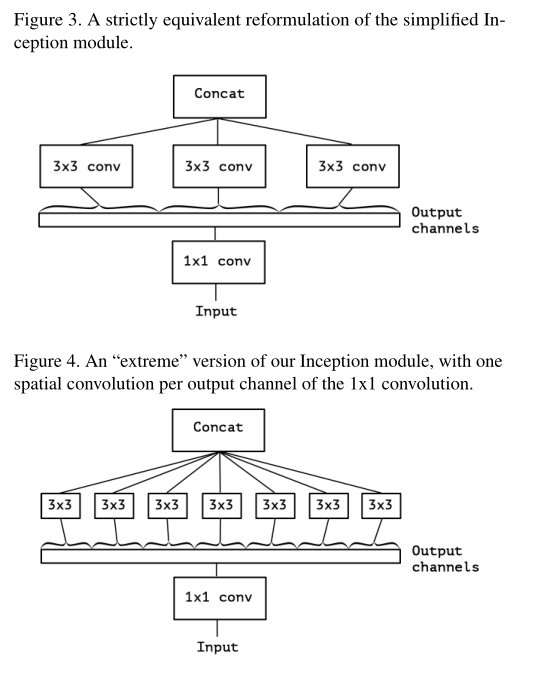
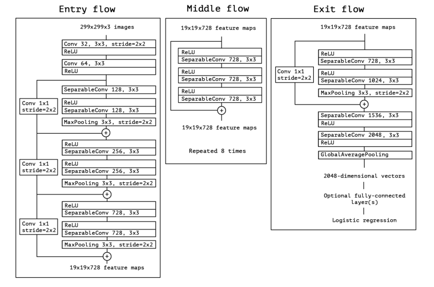

# Xception

## 主要内容
- 提出了一种新的深度卷积神经网络架构，灵感来自于Inception，其中Inception模块被深度可分离的卷积所取代
  - We present an interpretation of Inception modules in con-
  volutional neural networks as being an intermediate step
  in-between regular convolution and the depthwise separable
  convolution operation (a depthwise convolution followed by
  a pointwise convolution). In this light, a depthwise separable
  convolution can be understood as an Inception module with
  a maximally large number of towers. This observation leads
  us to propose a novel deep convolutional neural network
  architecture inspired by Inception, where Inception modules
  have been replaced with depthwise separable convolutions.

- 空间相关性和通道相关性是解耦的，故而不需要cross-channel映射,基于此产生了深度可分离卷积
  - In effect, the fundamental hy-
  pothesis behind Inception is that cross-channel correlations
  and spatial correlations are sufficiently decoupled that it is
  preferable not to map them jointly.

- 普通卷积

- 深度卷积
  - 一组卷积核中的每一片都与输入特征的对应通道卷积，类似于两本书比厚度一样
  
- 点卷积
  - 就是普通卷积，只不过尺寸是1X1，不改变大小只改变通道数。
  

## 核心结构

- Inception V3

    

- 由Inception V3的Inception模块提出等价结构以及extreme version
  - 深度可分离卷积Depthwise separable convolution一般是先进行channel-wise spatial conv在进行1X1卷积，并且不带非线性函数。然而Inception模块是相反的，先进行1X1卷积再进行channels wise conv，并且使用relu函数。

    

- In short, the Xception architecture is a linear stack of
depthwise separable convolution layers with residual con-
nections. 
    - SeparalbeConv函数是由depthwise卷积和 pointwise卷积组成，因此可用于升维和降维；
    - $\bigoplus$ add操作，即两个Feature Map进行单位加
    - 参数量： 22,855,952 比inception v3稍微少一点
    

