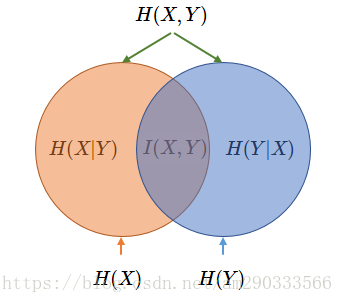

[TOC]

# 信息学基础

##  香农信息量

- $f(p)$表示事件x的信息量，事件发生的概率为p，有如下性质
  1. f是关于p的减函数，一个事件发生的概率越大则其所含的信息越少
  2. 令$f(0) = + \infin, f(1) = 0, \enspace f(p) \geq 0  \enspace for \enspace \forall p \in [0, 1] $成立
  3. 若干独立事件同时发生所含信息量等于各自发生的信息量之和$$f(p(x_1, x_2, ..., x_i)) = \sum_{i=1}^{n}f(p(x_i))$$

- 公式推导

  - 对x求导

  $$
  \begin{aligned}
  &f^{\prime}(x)=\lim _{\Delta x \rightarrow 0} \frac{f(x+\Delta x)-f(x)}{\Delta x} \\
  &=\lim _{\Delta x \rightarrow 0} \frac{f\left(\frac{x+\Delta x}{x}\right)+f(x)-f(x)}{\Delta x} \\
  &=\lim _{\Delta x \rightarrow 0} \frac{f\left(1+\frac{\Delta x}{x}\right)}{\Delta x} \\
  &=\frac{1}{x} \lim _{\Delta x \rightarrow 0} \frac{f\left(1+\frac{\triangle x}{x}\right)}{\frac{\Delta x}{x}}\\
  &=\frac{1}{x} \lim _{\Delta x \rightarrow 0} f^{\prime}(1) \\
  &f(x)=\int f^{\prime}(x)dx=f^{\prime}(1) \ln |x|+c \quad x \in[0,1]
  \end{aligned}
  $$

  - 由条件b可知$c = 0, f^{'}(1) < 0$,故而它是x的对数且系数小于零
  - $f(p) = -log_2{p}$

- 从编码的角度看，如果把底数换成2，就是完全表示事件所需要的比特数。如果已经知道一个事件出现的概率，至少需要多少的比特数才能完整描绘这个事件（无论外部其他事件的概率怎么变化）

### 信息熵公式

- 信息熵可以作为一个系统复杂程度的度量，如果系统越复杂，出现不同情况的种类越多，那么他的信息熵是比较大的。如果一个系统越简单，出现情况种类很少（极端情况为1种情况，那么对应概率为1，那么对应的信息熵为0），此时的信息熵较小。
- 香农用信息熵的概念来描述信源的不确定度，变量的不确定性越大，熵也就越大，把它搞清楚所需要的信息量也就越大。
- 热物理学证明，在一个封闭的系统中，熵总是增大，直至最大。若要使系统的熵减少（使系统更加[有序化](https://baike.baidu.com/item/有序化)），则必须有外部[能量](https://baike.baidu.com/item/能量)的干预。
- 连续型：$$ H(p) = H(X) = E_{x\sim p(x)}(- \log p(x)) = -\int p(x) \log p(x)dx $$
- 离散型：$$ H(p) = H(X) = E_{x\sim p(x)}(- \log p(x)) = -\sum_{i=1}^n p(x) \log p(x) $$
- 从编码角度看，类似于整个样本集所需要的编码长度的期望

## 两随机变量系统中熵的相关概念

### 互信息

- 两个离散随机变量 X和 Y 的互信息 (Mutual Information) 定义为
  $$
  I(X, Y)=\sum_{y \in Y} \sum_{x \in X} p(x, y) \log \left(\frac{p(x, y)}{p(x) p(y)}\right)
  $$

- 其中对数项经过分解之后,可以直观地知道两事件的互信息，为各自事件单独发生所代表的信息量之和，减去两事件同时发生所代表的信息量，之后剩余的信息量，这表明了两事件单独发生给出的信息量之和是有重复的，互信息度量了这种重复的信息量大小，最后再求概率和表示了两事件互信息量的期望，当两个事件完全独立时，互信息为0。
  $$
  \begin{aligned}
  \log \left(\frac{p(x, y)}{p(x) p(y)}\right) &=\log (p(x, y)-(\log p(x)+\log p(y))\\
  &=(-\log p(x))+(-\log p(y))-(-\log p(x, y))
  \end{aligned}
  $$

### 联合熵

- 两个离散随机变量 X  和 Y 的联合熵 (Joint Entropy) 表征了两事件同时发生系统的不确定度。
  $$
  H(X, Y)=-\sum_{y \in Y} \sum_{x \in X} p(x, y) \log p(x, y)
  $$

### 条件熵

- 条件熵 (Conditional Entropy) $ H(Y|X)$ 表示在已知随机变量 X 的条件下随机变量 Y 的不确定性。

- $$
  H(Y \mid X)=\sum_{x \in X} p(x) H(Y \mid x)=-\sum_{x \in X} p(x) \sum_{y \in Y} p(y \mid x) \log p(y \mid x)
  $$

### 互信息、联合熵、条件熵之间的关系

- $$
  \begin{aligned}
  I(X, Y) &=\sum_{y \in Y} \sum_{x \in X} p(x, y) \log \frac{p(x, y)}{p(x) p(y)} \\
  &=\sum_{x \in X} \sum_{y \in Y} p(x, y)(\log p(x, y)-\log p(x)-\log p(y)) \\
  &=\sum_{x \in X} \sum_{y \in Y} p(x, y) \log p(x, y)-\sum_{x \in X} \sum_{y \in Y} p(x, y) \log p(x)-\sum_{x \in X} \sum_{y \in Y} p(x, y) \log p(y) \\
  &=\sum_{x \in X} \sum_{y \in Y} p(x, y) \log p(x, y)-\sum_{x \in X} p(x) \log p(x)-\sum_{x \in X} p(y) \log p(y) \\
  &=H(X)+H(Y)-H(X, Y)
  \end{aligned}
  $$

- $$
  \begin{aligned}
  H(Y \mid X) &=-\sum_{x \in X} p(x) \sum_{y \in Y} p(y \mid x) \log p(y \mid x) \\
  &=-\sum_{x \in X} \sum_{y \in Y} p(x, y) \log \frac{p(x, y)}{p(x)} \\
  &=-\sum_{x \in X} \sum_{y \in Y} p(x, y)(\log p(x, y)-\log p(x)) \\
  &=-\sum_{x \in X} \sum_{y \in Y} p(x, y) \log p(x, y)-\sum_{x \in X} \sum_{y \in Y} p(x, y) \log p(x) \\
  &=-\sum_{x \in X} \sum_{y \in Y} p(x, y) \log p(x, y)+\sum_{x \in X} p(x) \log p(x) \\
  &=H(X, Y)-H(X)
  \end{aligned}
  $$

- $$
  \begin{aligned}
  I(X, Y) &=H(X)+H(Y)-H(X, Y) \\
  &=H(Y)-H(Y \mid X) \\
  &=H(X)-H(X \mid Y) \\
  &=H(X, Y)-H(Y \mid X)-H(X \mid Y)
  \end{aligned}
  $$

## 两分布系统中熵的相关概念

### 交叉熵

- 考虑一种情况，对于一个样本集，存在两个概率分布 $ p(x)$ 和 $q(x)$，其中 $ p(x)$ 为真实分布， $ q(x)$ 为非真实分布。基于真实分布$ p(x)$ 我们可以计算这个样本集的信息熵也就是编码长度的期望为:

$$
H(p)=-\sum_{x} p(x) \log p(x)
$$

- 如果我们用非真实分布$ q(x)$ 来代表样本集的信息量的话，那么因为其中表示信息量的项来自于非真实分布 $ q(x)$ ，而对其期望值的计算采用的是真实分布 $ p(x)$ ，所以称其为交叉熵 (Cross Entropy)。
  $$
  H(p, q)=-\sum_{x} p(x) \log q(x)
  $$

- 交叉熵比原本真实的信息熵要大。直观来看，当我们对分布估计不准确时，总会引入额外的不必要信息期望（可以理解为引入了额外的偏差），再加上原本真实的信息期望，最终的信息期望值要比真实系统分布所需的信息期望值要大。

### 相对熵 KL散度 信息散度

- 相对熵 (Relative Entropy) 也称 KL 散度，设 $ p(x)$ 、 $ q(x)$ 是离散随机变量 X 的两个概率分布，则 p 对 q的相对熵为：
  $$
  D_{K L}(p \| q)=\sum_{x} p(x) \log \frac{p(x)}{q(x)}=E_{p(x)} \log \frac{p(x)}{q(x)}
  $$

- 相对熵是非负的，证明如下：
  $$
  \begin{aligned}
  D_{K L}(p \| q) &=\sum_{x} p(x) \log \frac{p(x)}{q(x)} \\
  &=-\sum_{x} p(x) \log \frac{q(x)}{p(x)} \\
  &=-E_{p(x)}\left(\log \frac{q(x)}{p(x)}\right) \\
  & \geq-\log E_{p(x)}\left(\frac{q(x)}{p(x)}\right) \\
  &=-\log \sum_{x} p(x) \frac{q(x)}{p(x)} \\
  &=-\log \sum_{x} q(x) \\
  &=- \log 1\\
  &= 0
  \end{aligned}
  $$

- 相对熵与交叉熵的关系
  $$
  \begin{aligned}
  D_{K L}(p \| q) &=\sum_{x} p(x) \log \frac{p(x)}{q(x)} \\
  &=-\sum_{x} p(x) \log q(x)-\left(-\sum_{x} p(x) \log p(x)\right) \\
  &=H(p, q)-H(p)
  \end{aligned}
  $$

- 相对熵表示的其实是当我们用一个非真实的分布表示系统时，其得到的信息量期望值相比采用真实分布表示时候多出的部分

- 在机器学习中，训练数据的分布已经固定下来，那么真实分布的熵 $H(p)$ 是一个定值。最小化相对熵 $D_{K L}(p \| q)$实际上等价于最小化交叉熵 $H(p, q)$。
  

