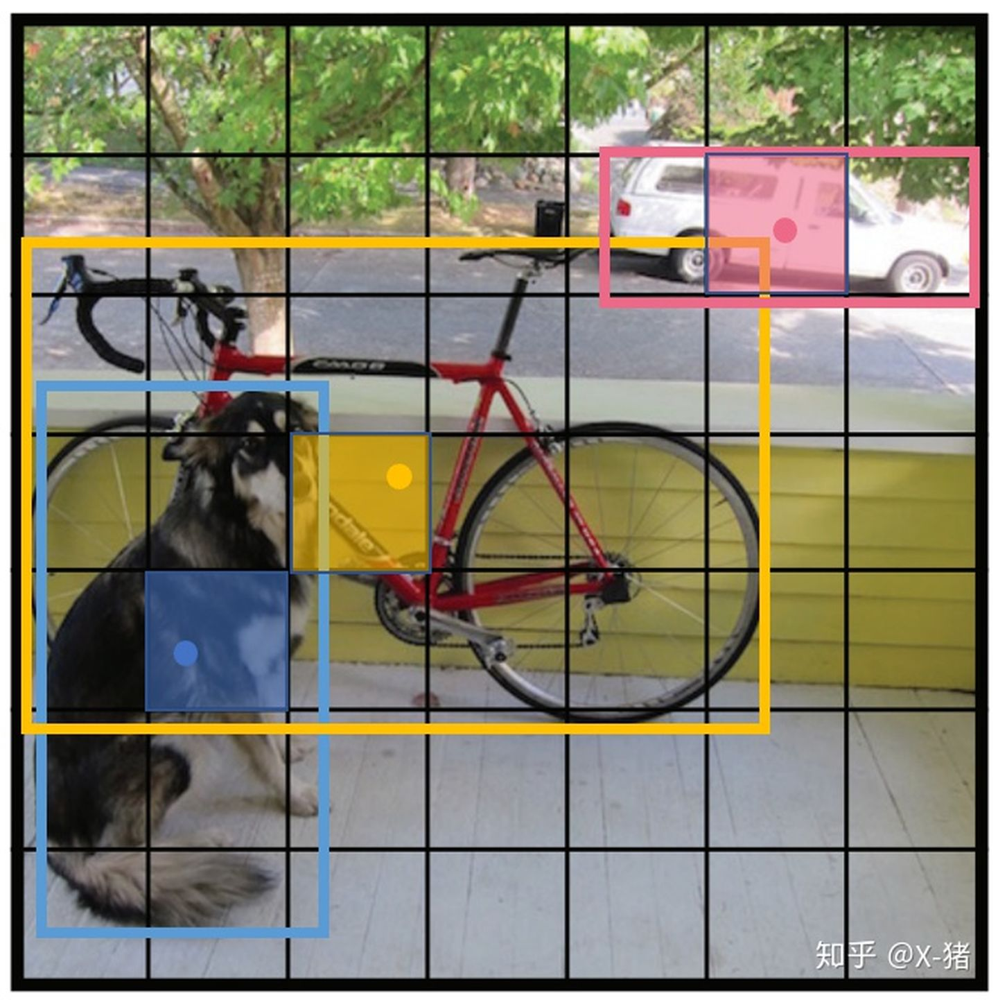

## yolov1
### 候选区与网格划分
- 滑动窗口
- RPN
- 网格划分SxS
  - 每个网格负责预测一个物体，bounding box通过回归来确定。
  - 每个网格预测两个bounding box，包含置信度，中心点坐标和宽高，故而整个网络的输出为SxSx(2*(1+4)+classes)
  
### 损失函数
$\lambda_{\text {coord }} \sum_{i=0}^{S^{2}} \sum_{j=0}^{B} \mathbb{1}_{i j}^{\text {obj }}\left[\left(x_{i}-\hat{x}_{i}\right)^{2}+\left(y_{i}-\hat{y}_{i}\right)^{2}\right]$
$$
\begin{aligned}+\lambda_{\text {coord }} \sum_{i=0}^{S^{2}} \sum_{j=0}^{B} \mathbb{1}_{i j}^{\text {obj }}\left[\left(\sqrt{w_{i}}-\sqrt{\hat{w}_{i}}\right)^{2}+\left(\sqrt{h_{i}}-\sqrt{\hat{h}_{i}}\right)^{2}\right] \\+\sum_{i=0}^{S^{2}} \sum_{j=0}^{B} \mathbb{1}_{i j}^{\text {obj }}\left(C_{i}-\hat{C}_{i}\right)^{2} \\+\lambda_{\text {noobj }} \sum_{i=0}^{S^{2}} \sum_{j=0}^{B} \mathbb{1}_{i j}^{\text {noobj }}\left(C_{i}-\hat{C}_{i}\right)^{2} \\ &+\sum_{i=0}^{S^{2}} \mathbb{1}_{i}^{\text {obj }} \sum_{c \in \text { classes }}\left(p_{i}(c)-\hat{p}_{i}(c)\right)^{2} \end{aligned}
$$
- trick 1
  - 根号，小物体能忍受的误差比大物体小，所以取根号能够使其尺寸接近些
- trick 2
  - 大量的负样本，因此需要一个权重来平衡

### NMS算法
- 多个网格可能会预测出同一个物体的检测框，非极大值抑制算法可以去除冗余框
- 原理：
  - 设定目标框的置信度阈值，常用的阈值是0.5左右

  - 根据置信度降序排列候选框列表

  - 选取置信度最高的框A添加到输出列表，并将其从候选框列表中删除

  - 计算A与候选框列表中的所有框的IoU值，删除大于阈值的候选框

  - 重复上述过程，直到候选框列表为空，返回输出列表

### 缺点
- 预测的框不准确：准确度不足。
- 很多目标找不到：recall不足。

## yolo v2
### batch normalization（批归一化）
- 批归一化有助于解决反向传播过程中的梯度消失和梯度爆炸问题，降低对一些超参数（比如学习率、网络参数的大小范围、激活函数的选择）的敏感性，并且每个batch分别进行归一化的时候，起到了一定的正则化效果（YOLO2不再使用dropout），从而能够获得更好的收敛速度和收敛效果。

### 使用高分辨率图像微调分类模型
- YOLO v1使用ImageNet的图像分类样本采用 224*224 作为输入，来训练CNN卷积层。然后在训练对象检测时，检测用的图像样本采用更高分辨率的 448*448 的图像作为输入。但这样切换对模型性能有一定影响。

- YOLO2在采用 224*224 图像进行分类模型预训练后，再采用 448*448 的高分辨率样本对分类模型进行微调（10个epoch），使网络特征逐渐适应 448*448 的分辨率。然后再使用 448*448 的检测样本进行训练，缓解了分辨率突然切换造成的影响。

### 采用先验框 anchor box
- 借鉴Faster RCNN的做法，YOLO2也尝试采用先验框（anchor）。在每个grid预先设定一组不同大小和宽高比的边框，来覆盖整个图像的不同位置和多种尺度，这些先验框作为预定义的候选区在神经网络中将检测其中是否存在对象，以及微调边框的位置。

- 之前先验框都是手工设定的，YOLO2尝试统计出更符合样本中对象尺寸的先验框，这样就可以减少网络微调先验框到实际位置的难度。YOLO2的做法是对训练集中标注的边框进行聚类分析，以寻找尽可能匹配样本的边框尺寸。最后得到5类先验框。

### 约束预测边框的位置
- cx,cy是当前网格左上角到图像左上角的距离，要先将网格大小归一化，即令一个网格的宽=1，高=1。 pw,ph 是先验框的宽和高。 σ是sigmoid函数。 t{x,y,w,h,0} 是要学习的参数，分别用于预测边框的中心和宽高，以及置信度。预测值计算公式如下：
    $b_{x}=\sigma\left(t_{x}\right)+c_{x}$
    $b_{y}=\sigma\left(t_{y}\right)+c_{y}$
    $b_{w}=p_{w} e^{t_{w}}$
    $b_{h}=p_{h} e^{t_{h}}$
    $\operatorname{Pr}($ object $) * I O U(b$, object $)=\sigma\left(t_{o}\right)$
- 由于σ函数将 $t_x, t_y$ 约束在(0,1)范围内，所以根据上面的计算公式，预测边框的蓝色中心点被约束在蓝色背景的网格内。约束边框位置使得模型更容易学习，且预测更为稳定。

### passthrough层检测细粒度特征
- 对象检测面临的一个问题是图像中对象会有大有小，输入图像经过多层网络提取特征，最后输出的特征图中（比如YOLO2中输入416\*416经过卷积网络下采样最后输出是13\*13），较小的对象可能特征已经不明显甚至被忽略掉了。为了更好的检测出一些比较小的对象，最后输出的特征图需要保留一些更细节的信息。

- YOLO2引入一种称为passthrough层的方法在特征图中保留一些细节信息。具体来说，就是在最后一个pooling之前，特征图的大小是26\*26\*512，将其1拆4，直接传递（passthrough）到pooling后（并且又经过一组卷积）的特征图，两者叠加到一起作为输出的特征图。

### Darknet-19
- DarkNet-19比VGG-16小一些，精度不弱于VGG-16，但浮点运算量减少到约1/5，以保证更快的运算速度

## yolo v3
### Darknet53
- 为了达到更好的分类效果，作者自己设计训练了darknet-53。作者在ImageNet上实验发现这个darknet-53效果很好，相对于ResNet-152和ResNet-101，darknet-53不仅在分类精度上差不多，计算速度还比ResNet-152和ResNet-101快多了，网络层数也比他们少。
  - DBL:代码中的Darknetconv2d_BN_Leaky，是yolo_v3的基本组件。就是卷积+BN+Leaky relu
  - resn：n代表数字，有res1，res2, … ,res8等等，表示这个res_block里含有多少个res_unit

### 多尺度目标检测
- Yolov3借鉴了金字塔特征图思想，小尺寸特征图用于检测大尺寸物体，而大尺寸特征图检测小尺寸物体。特征图的输出维度为NxNx(3x(4+1+80)) ，N为输出特征图格点数，一共3个Anchor框，每个框有4维预测框数值，1个置信度。一共有80个类别。

- 三次检测，每次对应的感受野不同，32倍降采样的感受野最大，适合检测大的目标，所以在输入为416×416时，每个cell的三个anchor box为(116 ,90); (156 ,198); (373 ,326)。16倍适合一般大小的物体，anchor box为(30,61); (62,45); (59,119)。8倍的感受野最小，适合检测小目标，因此anchor box为(10,13); (16,30); (33,23)

## yolo v4 & v5
- yolov4 保留了yolov3的head部分，修改了主干网络为CSPDarknet53，同时采用了SPP（空间金字塔池化）的思想来扩大感受野，PANet作为neck部分,并且使用了Spatial Attention Module (SAM)。
- yolov5 更适合移动端

## volo （待完成）