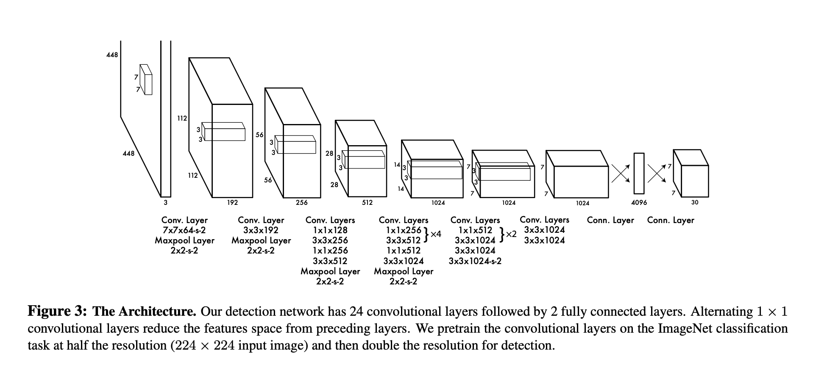
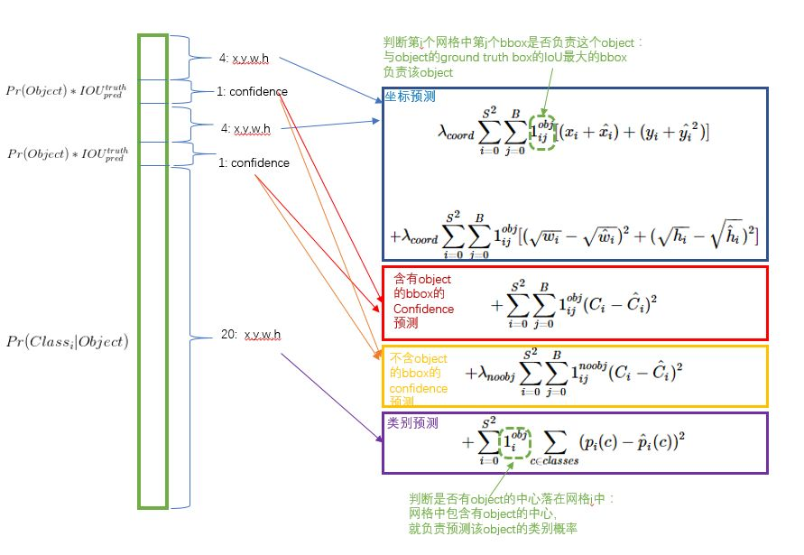
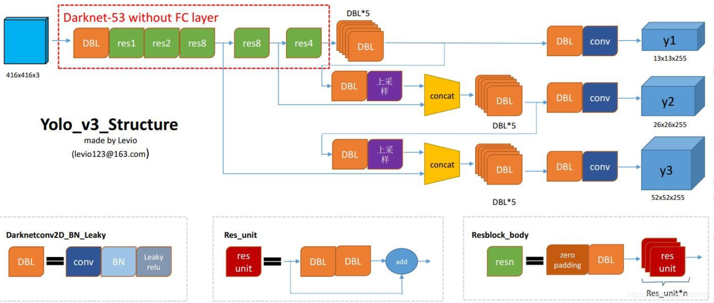

# You only look once: unified real-time object detection 
## Info
- CVPR 2016

## 主要内容
### 创新点
- R-CNN系列算法（R-CNN、SPPNet、Fast R-CNN、Faster R-CNN）均是采用two-stage的方法（1.提取region proposal 2.分类+边框回归），主要是对region proposal进行识别定位。虽然这类方法检测精度很高，但由于需要一个单独的网络进行提取region proposal，因此在速度上无法突破瓶颈。
- 之前的检测器是是使用RPN产生一些候选框然后使用分类器来判别，通过后处理来调整这些候选框，消除重复的检测框，这些pipeline很慢并且也很难优化因为每个独立的子模块需要单独训练。
- 重新定义物体检测任务为单回归问题，直接从整个图像的像素推测候选框坐标和类别概率，富含全局信息。端到端且速度快。
### 数据定义
- confidence
  - 是一个物体概率 * 交并比
  $$
\operatorname{Pr}(\text { Object }) * \mathrm{IOU}_{\text {pred }}^{\text {truth }}
$$
-  类别概率
   -  在该框内是一个物体的概率下，它是类别i的概率
  $$
\operatorname{Pr}\left(\text { Class }_{i} \mid \text { Object }\right)
$$

- class-specific confidence scores for each box
  - 测试阶段可以得到每个预测框的置信度
$$
  \operatorname{Pr}\left(\text { Class }_{i} \mid \text { Object }\right) * \operatorname{Pr}(\text { Object }) * \mathrm{IOU}_{\text {pred }}^{\text {truth }}=\operatorname{Pr}\left(\text { Class }_{i}\right) * \mathrm{IOU}_{\text {pred }}^{\text {truth }}
$$
### 候选区与网格划分
- 网格划分SxS
  - 每个网格负责预测一个物体，该物体的中心点落在这个网格，bounding box通过回归来确定，4个参数(x,y,w,h)分别代表中心点(x,y)相对于格子边缘的偏移量，检测框的宽高(w,h)相对于整个图片的比例。还预测一个置信度confidence。
  - 每个网格预测两个bounding box，包含置信度，中心点坐标和宽高，故而整个网络的输出为SxSx(2*(1+4)+classes)，注意，一个格子只能预测一个类。
  

### 网络设计
- 受到GoogLeNet的启发，但把inception modules换成了简单的卷积模块

  

### 损失函数
$\lambda_{\text {coord }} \sum_{i=0}^{S^{2}} \sum_{j=0}^{B} \mathbb{1}_{i j}^{\text {obj }}\left[\left(x_{i}-\hat{x}_{i}\right)^{2}+\left(y_{i}-\hat{y}_{i}\right)^{2}\right]$
$$
\begin{aligned}+\lambda_{\text {coord }} \sum_{i=0}^{S^{2}} \sum_{j=0}^{B} \mathbb{1}_{i j}^{\text {obj }}\left[\left(\sqrt{w_{i}}-\sqrt{\hat{w}_{i}}\right)^{2}+\left(\sqrt{h_{i}}-\sqrt{\hat{h}_{i}}\right)^{2}\right] \\+\sum_{i=0}^{S^{2}} \sum_{j=0}^{B} \mathbb{1}_{i j}^{\text {obj }}\left(C_{i}-\hat{C}_{i}\right)^{2} \\+\lambda_{\text {noobj }} \sum_{i=0}^{S^{2}} \sum_{j=0}^{B} \mathbb{1}_{i j}^{\text {noobj }}\left(C_{i}-\hat{C}_{i}\right)^{2} \\ &+\sum_{i=0}^{S^{2}} \mathbb{1}_{i}^{\text {obj }} \sum_{c \in \text { classes }}\left(p_{i}(c)-\hat{p}_{i}(c)\right)^{2} \end{aligned}
$$
- 图解

- trick 1
  - 根号，小物体能忍受的误差比大物体小，所以取根号能够使其尺寸接近些
- trick 2
  - 大量的负样本，因此需要一个权重来平衡

### NMS算法
- YOLO在最后的一个步骤就是对 SxSx(Bx5+C) 个向量进行非极大值抑制（Non-max suppression）
- 多个网格可能会预测出同一个物体的检测框，非极大值抑制算法可以去除冗余框
- 原理：
  - 设定目标框的置信度阈值，常用的阈值是0.5左右

  - 根据置信度降序排列候选框列表

  - 选取置信度最高的框A添加到输出列表，并将其从候选框列表中删除

  - 计算A与候选框列表中的所有框的IoU值，删除大于阈值的候选框

  - 重复上述过程，直到候选框列表为空，返回输出列表
- 思考：应用NMS是不区分类别还是区分类别？比如现在要预测一个人和一只狗，这两个物体的检测框挨得太近以至于IOU超过阈值，那么两个框只能保留一个吗？
  - 不同的类分别应用NMS（非极大值抑制），即每个索引值对应一个类别，不同类别的元素之间不会应用NMS。
  实现方法一句话
  - 多类别NMS（非极大值抑制）的处理策略是为了让每个类都能独立执行NMS，在所有的边框上添加一个偏移量。偏移量仅取决于类IDX，并且足够大，以便来自不同类的框不会重叠。

### 缺点
- 预测的框不准确：位置精确性差，对于小目标物体以及物体比较密集的也检测不好，比如一群小鸟。
- 很多目标找不到：YOLO虽然可以降低将背景检测为物体的概率，但同时导致recall不足。

## yolo v3
### Darknet53
- 为了达到更好的分类效果，作者自己设计训练了darknet-53。作者在ImageNet上实验发现这个darknet-53效果很好，相对于ResNet-152和ResNet-101，darknet-53不仅在分类精度上差不多，计算速度还比ResNet-152和ResNet-101快多了，网络层数也比他们少。
  - DBL:代码中的Darknetconv2d_BN_Leaky，是yolo_v3的基本组件。就是卷积+BN+Leaky relu
  - resn：n代表数字，有res1，res2, … ,res8等等，表示这个res_block里含有多少个res_unit

### 多尺度目标检测
- Yolov3借鉴了金字塔特征图思想，小尺寸特征图用于检测大尺寸物体，而大尺寸特征图检测小尺寸物体。特征图的输出维度为NxNx(3x(4+1+80)) ，N为输出特征图格点数，一共3个Anchor框，每个框有4维预测框数值，1个置信度。一共有80个类别。

- 三次检测，每次对应的感受野不同，32倍降采样的感受野最大，适合检测大的目标，所以在输入为416×416时，每个cell的三个anchor box为(116 ,90); (156 ,198); (373 ,326)。16倍适合一般大小的物体，anchor box为(30,61); (62,45); (59,119)。8倍的感受野最小，适合检测小目标，因此anchor box为(10,13); (16,30); (33,23)

## yolo v4 & v5
- yolov4 保留了yolov3的head部分，修改了主干网络为CSPDarknet53，同时采用了SPP（空间金字塔池化）的思想来扩大感受野，PANet作为neck部分,并且使用了Spatial Attention Module (SAM)。
- yolov5 更适合移动端

## volo （待完成）