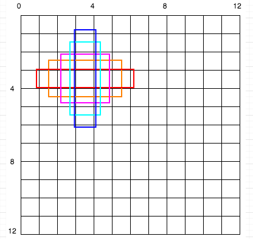
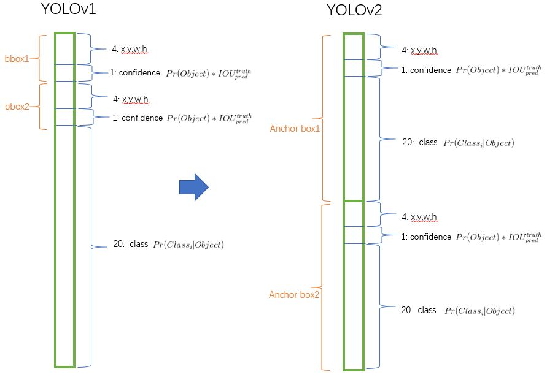

# YOLO9000: Better, Faster, Stronger
### Info
- yolov2

## 主要内容
### batch normalization（批归一化）
- 批归一化有助于解决反向传播过程中的梯度消失和梯度爆炸问题，降低对一些超参数（比如学习率、网络参数的大小范围、激活函数的选择）的敏感性，并且每个batch分别进行归一化的时候，起到了一定的正则化效果（YOLO2不再使用dropout），从而能够获得更好的收敛速度和收敛效果。贡献了2% 的map提升

### 使用高分辨率图像微调分类模型
- YOLO v1使用ImageNet的图像分类样本采用 224*224 作为输入，来训练CNN卷积层。然后在训练对象检测时，检测用的图像样本采用更高分辨率的 448*448 的图像作为输入。但这样切换对模型性能有一定影响。

- YOLO2在采用 224*224 图像进行分类模型预训练后，再采用 448*448 的高分辨率样本对分类模型进行微调（10个epoch），使网络特征逐渐适应 448*448 的分辨率。然后再使用 448*448 的检测样本进行训练，缓解了分辨率突然切换造成的影响。贡献了4% 的map提升。

### 采用先验框 anchor box
- yolov1 输入图片最终被划分为 7x7 网格，每个单元格预测2个边界框。YOLOv1最后采用的是全连接层直接对边界框进行预测，其中边界框的宽与高是相对整张图片大小的，而由于各个图片中存在不同尺度和长宽比（scales and ratios）的物体，YOLOv1在训练过程中学习适应不同物体的形状是比较困难的，这也导致YOLOv1在精确定位方面表现较差。

- 借鉴Faster RCNN的做法，YOLO2也尝试采用先验框（anchor）。在每个grid预先设定一组不同大小和宽高比的边框，来覆盖整个图像的不同位置和多种尺度，这些先验框作为预定义的候选区在神经网络中将检测其中是否存在对象，以及微调边框的位置。

- 之前先验框都是手工设定的，YOLO2尝试统计出更符合样本中对象尺寸的先验框，这样就可以减少网络微调先验框到实际位置的难度。YOLO2的做法是对训练集中标注的边框进行聚类分析，以寻找尽可能匹配样本的边框尺寸。最后得到5类先验框。
  
  

- 每个框都有属于自己的类概率向量（decouple the class prediction mechanism from the spatial location and instead predict class and objectness for every anchor box.）
  
  
- 加入了anchor boxes后，可以预料到的结果是召回率上升，准确率下降。我们来计算一下，假设每个cell预测9个建议框，那么总共会预测13 * 13 * 9 = 1521个boxes，而之前的网络仅仅预测7 * 7 * 2 = 98个boxes。具体数据为：没有anchor boxes，模型recall为81%，mAP为69.5%；加入anchor boxes，模型recall为88%，mAP为69.2%。这样看来，准确率只有小幅度的下降，而召回率则提升了7%
- 除了yolov1没用先验框，其他yolo都用了。
### 约束预测边框的位置
- cx,cy是当前网格左上角到图像左上角的距离，要先将网格大小归一化，即令一个网格的宽=1，高=1。 pw,ph 是先验框的宽和高。 σ是sigmoid函数。 t{x,y,w,h,0} 是要学习的参数，分别用于预测边框的中心和宽高，以及置信度。预测值计算公式如下：
    $b_{x}=\sigma\left(t_{x}\right)+c_{x}$
    $b_{y}=\sigma\left(t_{y}\right)+c_{y}$
    $b_{w}=p_{w} e^{t_{w}}$
    $b_{h}=p_{h} e^{t_{h}}$
    $\operatorname{Pr}($ object $) * I O U(b$, object $)=\sigma\left(t_{o}\right)$
- 由于σ函数将 $t_x, t_y$ 约束在(0,1)范围内，所以根据上面的计算公式，预测边框的蓝色中心点被约束在蓝色背景的网格内。约束边框位置使得模型更容易学习，且预测更为稳定。

### passthrough层检测细粒度特征
- 对象检测面临的一个问题是图像中对象会有大有小，输入图像经过多层网络提取特征，最后输出的特征图中（比如YOLO2中输入416\*416经过卷积网络下采样最后输出是13\*13），较小的对象可能特征已经不明显甚至被忽略掉了。为了更好的检测出一些比较小的对象，最后输出的特征图需要保留一些更细节的信息。

- YOLO2引入一种称为passthrough层的方法在特征图中保留一些细节信息。具体来说，就是在最后一个pooling之前，特征图的大小是26\*26\*512，将其1拆4，直接传递（passthrough）到pooling后（并且又经过一组卷积）的特征图，两者叠加到一起作为输出的特征图。

### Darknet-19
- DarkNet-19比VGG-16小一些，精度不弱于VGG-16，但浮点运算量减少到约1/5，以保证更快的运算速度
