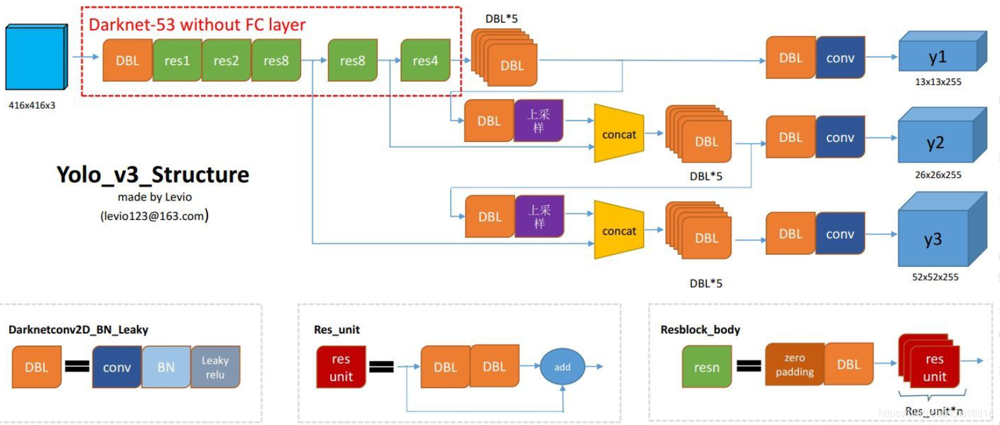

# YOLOv3: An Incremental Improvement
## 主要内容
### Darknet53
- 为了达到更好的分类效果，作者自己设计训练了darknet-53。作者在ImageNet上实验发现这个darknet-53效果很好，相对于ResNet-152和ResNet-101，darknet-53不仅在分类精度上差不多，计算速度还比ResNet-152和ResNet-101快多了，网络层数也比他们少。
  - DBL:代码中的Darknetconv2d_BN_Leaky，是yolo_v3的基本组件。就是卷积+BN+Leaky relu
  - resn：n代表数字，有res1，res2, … ,res8等等，表示这个res_block里含有多少个res_unit

### 多尺度目标检测
- Yolov3借鉴了金字塔特征图思想，小尺寸特征图用于检测大尺寸物体，而大尺寸特征图检测小尺寸物体。特征图的输出维度为NxNx(3x(4+1+80)) ，N为输出特征图格点数，一共3个Anchor框，每个框有4维预测框数值，1个置信度。一共有80个类别。

- 三次检测，每次对应的感受野不同，32倍降采样的感受野最大，适合检测大的目标，所以在输入为416×416时，每个cell的三个anchor box为(116 ,90); (156 ,198); (373 ,326)。16倍适合一般大小的物体，anchor box为(30,61); (62,45); (59,119)。8倍的感受野最小，适合检测小目标，因此anchor box为(10,13); (16,30); (33,23)

## yolo v4 & v5
- yolov4 保留了yolov3的head部分，修改了主干网络为CSPDarknet53，同时采用了SPP（空间金字塔池化）的思想来扩大感受野，PANet作为neck部分,并且使用了Spatial Attention Module (SAM)。
- yolov5 更适合移动端

## volo （待完成）