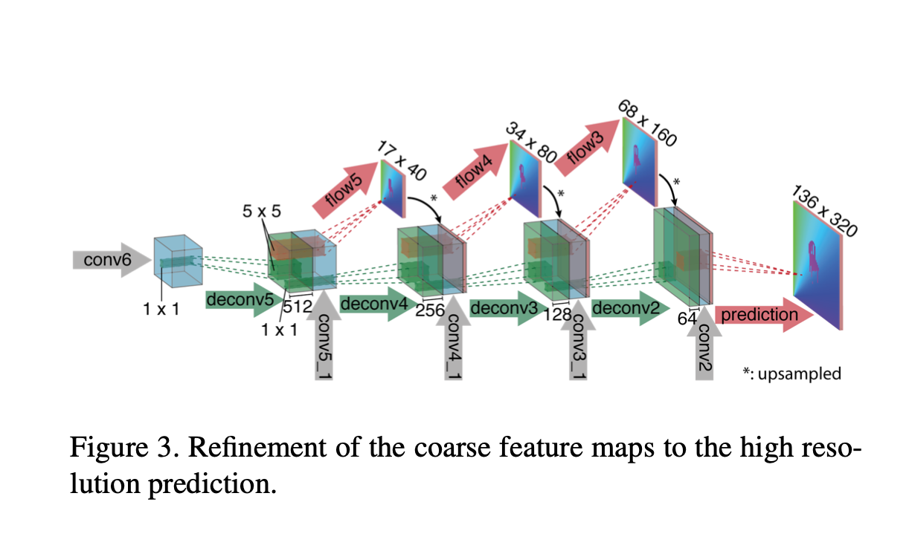

# 光流估计

## 概念

- 光流，顾名思义，光的流动。在计算机视觉中，定义图像中对象的移动，这个移动可以是相机移动或者物体移动引起的。具体是指，视频图像的一帧中的代表同一对象(物体)像素点移动到下一帧的移动量，使用二维向量[u,v]表示。

- 稀疏光流：对特征明显（梯度较大）的点进行光流估计和跟踪。

- 稠密光流：描述图像每个像素向下一帧运动的光流。为了方便表示，论文中一般使用不同颜色代表光流的方向，用颜色深浅表示大小。

  

## Lucas-Kanade算法

### 亮度不变假设

- 相邻两帧图像同一个物体在不同位置亮度基本不变，点$(x,y)$处在第t帧的亮度I可以表示为：

$$
I(x, y, t)=I\left(x+u, y+v, t+\Delta_{t}\right)
$$

$$
\text{由泰勒展开，} I\left(x+u, y+v, t+\Delta_{t}\right)=I(x, y, t)+I_{x}^{\prime} u+I_{y}^{\prime} v+I_{t}^{\prime} \Delta_{t}
$$

$$
\begin{aligned}
\text{从而，}&I_{x}^{\prime} u+I_{y}^{\prime} v+I_{t}^{\prime} \Delta_{t}=0 \\
&{\left[I_{x}^{\prime}, I_{y}^{\prime}\right]\left[\begin{array}{l}
u \\
v
\end{array}\right]=-I_{t}^{\prime} \Delta_{t}}
\end{aligned}
$$

### 邻域光流相似假设

- 通常，一个小的图像区域里像素移动方向和大小是基本一致的。按照这个思路，设某一点$A(x,y)$处的光流为$(u,v)$，那么可以假设点A周围的n个点的光流也是$(u,v)$

$$
\left[\begin{array}{c}
I_{x}^{\prime(1)}, I_{y}^{\prime(1)} \\
I_{x}^{\prime(2)}, I_{y}^{\prime(2)} \\
\ldots \\
I_{x}^{\prime(n)}, I_{y}^{\prime(n)}
\end{array}\right]\left[\begin{array}{l}
u \\
v
\end{array}\right]=\left[\begin{array}{c}
-\Delta I_{t}^{(1)} \\
-\Delta I_{t}^{(2)} \\
\cdots \\
-\Delta I_{t}^{(n)}
\end{array}\right]
$$

- 解这个方程组$Ax = b$，可以得到:

$$
x=\left(A^{T} A\right)^{-1} A^{T} b
$$

- 前提条件：$A^TA$可逆，否则相当于某些约束条件失效，方程组有无穷多解，光流也变得不确定。因此Lucas-Kanade算法一般还会借助角点检测算法，选取这些角点计算光流。

## 深度学习算法

### FlowNet

- 使用端到端的CNN预测稠密光流的开山之作

  

  

- FlowNetSimple
  - 已知卷积神经网络在具有足够的标记数据的情况下非常擅长学习输入输出关系。作者采用端到端的学习方法来预测光流：**给定一个由图像对和GT流组成的数据集，训练网络以直接从图像中预测x-y流场**

- FlowNetCorr

  - 将两帧图像沿两条路径分开处理提取特征
  - 引入相关性计算得到融合后的特征图，对于第一个特征图中的以$x_1$为中心的patch，和第二个特征图中的以$x_2$为中心的patch，使用向量内积计算相关性，然后继续进行前向计算。

  $$
  c\left(\mathbf{x}_{1}, \mathbf{x}_{2}\right)=\sum_{\mathbf{o} \in[-k, k] \times[-k, k]}\left\langle\mathbf{f}_{1}\left(\mathbf{x}_{1}+\mathbf{o}\right), \mathbf{f}_{2}\left(\mathbf{x}_{2}+\mathbf{o}\right)\right\rangle
  $$

- Refinement
  - 使用反卷积逐步提高特征图尺寸，并concate之前得到的各级特征以及上一步得到的中间光流图，最终得到完整尺寸的光流预测。

## 光流估计在去背景项目的应用

### 主要思想

- 先分割，使用opencv光流估计后处理alpha matte

- 基于背景点基本不动，变换的像素点主要是人像像素点

- 通过光流来跟踪像素点的变化，在追踪到的像素区域使用一定比例融合当前帧的分割图和上一帧的分割图，使得当前分割结果保持帧间平滑性，降低背景闪烁。

### 步骤

1. 通过计算前向光流和后向光流，找到光流点跟踪二值图 is_track
   1. 先找出非跟踪点not_track。
      1. $x_0 + u_0 < 0 \quad or \quad x_0 + u_0 >= w$, y方向同理（超出边界）
      2. 前向光流+后向光流的向量模长大于阈值 （一致性）
      3.  not_track取反即跟踪到的坐标矩阵
   2. is_track赋值为跟踪到的像素通过光流应该运动到的当前坐标，把这些坐标标记为1，表示当前光流点跟踪二值图，即是否具有光流点匹配。$is\_track[i,j] = 1$表示当前像素点是通过上一帧转移而来，即是有光流点匹配的。
2. 初始化融合权重矩阵dl_weights为0.3，其中光流值模长为0的坐标点设置为0.05（基本上就是不动点）
3. 上一帧分割结果复用。初始化track_cfd矩阵为0，并把跟踪到的坐标矩阵区域的值设为上一帧的分割结果prev_cfd在该区域的值（例如上一帧A点处的分割值为x,在当前帧A点运动到了B点，则track_cfd矩阵矩阵在B处的值就是x）
4. 计算融合分割结果。使用is_track、dl_weights、track_cfd以及当前帧分割结果cur_cfd来计算融合后的分割结果fusion_cfd

$$
if (i, j)处的有光流点匹配，then： \\
fusion\_cfd[i,j] = dl\_weights[i,j] * cur\_cfd[i,j] + (1 - dl\_weights[i,j])*track\_cfd[i,j]
$$

5. 确定区域的修正。某些区域的光流值为0，则dl_weights在此处很小，导致基本上沿用上一帧的分割值。但是，如果当前分割结果对此处像素点很有把握，比如超过了0.9或者小于0.1，意味着对该处是属于前景或者背景置信度很高，此时不宜沿用上一帧的结果，对满足这些条件的区域进行修正，提高当前帧的权重比例重新计算。

