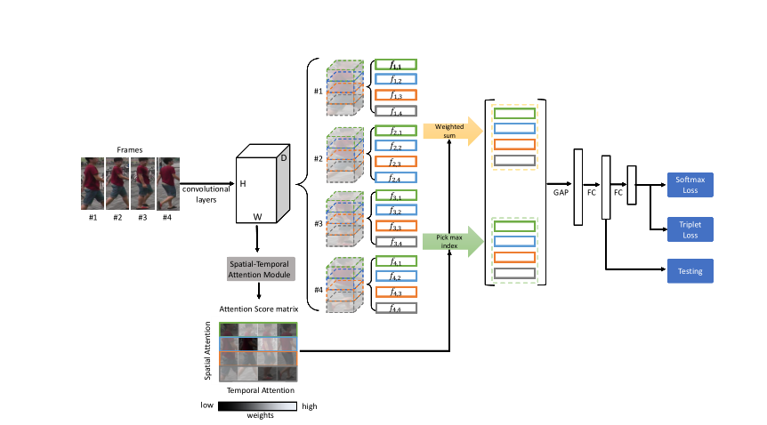
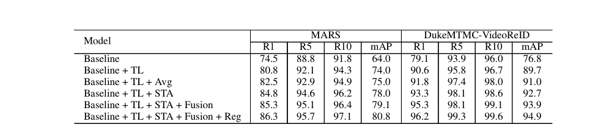
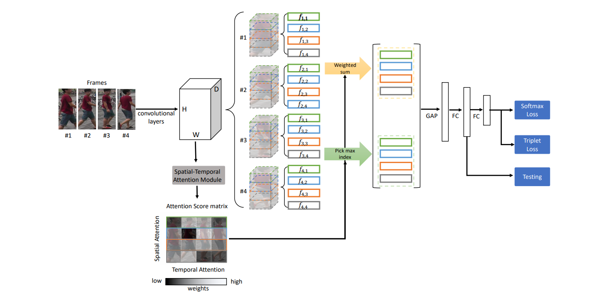

# 行人重识别

## 任务定义
- 判断图像或者视频序列中是否存在特定行人的技术
- 通过样貌、穿着、体态、发型等特征在不确定的场景中能够再次识别是同一个人
- 简而言之，就是检索不同摄像头下的同一个目标人物

## 基本思路

- 提取目标特征，与其他图像计算相似度，最相近的认为是同一个目标
  
    

    

- 大多是基于resnet进行特征提取
- 对于视频re-id任务来说，关键问题是让网络学习一个映射，能将一个视频片段转化为一个低维特征向量

## 问题与挑战
- 低分辨率（超分）
- 遮挡（分区提取特征part matching）
- 视角姿势光照变化（类间类内）
- 训练集（少、跨域问题） 

## 损失函数
- identity loss:把ReID问题看做是一个图像分类问题，每一个ID都是一个类,计算输出与gt的交叉熵损失
- verification Loss:以度量两个样本之间的关系。输入为一对图片判定，是不是同一个行人
- Triplet loss
  - 输入3份数据 A P N 后两者是A的正样本和负样本
  - 期望AP尽量近 AN尽量远 3个数据都是经过同一个卷积网络 同类之间的距离不光要比不同类之间的距离要小，而且要小出一个margin  然后取它与0之间的最大值
  - $L(A,P,N) = max(d(A,P)-d(A,N)+a, 0)$

## 常用数据集
- CUHK03 港中文
- Market-1501 清华
- DukeMTMC 8个摄像机
- MSMIT17 12室内+13室外 校园

## 评价指标
- rank1第一张结果正确 相似度最高的正确与否
- map 

## 论文阅读
### STA: Spatial-Temporal Attention for Large-Scale Video-based Person Re-Identification
- 会议：2019 AAAI
- 创新点
  - 利用包含时间和空间信息的2-D attention score matrix，生成一个更具鲁棒性的clip-level特征表示。主要针对姿势变换与遮挡的难题。
  - 一种Inter-Frame Regularization，为了使得时空注意力模型能够保留同一个人各帧之间的相似性，同时避免过于关注某一帧，设计了帧间正则化来测量输入帧的不同
- 基本思路：输入是一个视频片段，随机采采样N帧，送入backbone中提取特征。然后将特征图如spatial-temporal attention模块中得到不同帧每个空间区域的attention score(2-D matrix),并且使用Inter-Frame Regularization。使用attention score
得到注意力最高的特征图并做加权和，然后采用特征融合策略来生成两套特征图，一个是 global representation, 另一个是discriminative representation。后续做全局平均池化和全连接来分类。

    

- 效果
  
    

### 数学推导过程
- 输入 Video
  - $V=\left\{I_{1}, \ldots, I_{n}, \ldots, I_{N}\right\}$

- 特征提取(Backbone = ResNet50)
  - $\left\{f_{n}\right\}_{\{n=1: N\}}$
  - $f_i \in R^{HWC} \qquad size = (16, 8, 2048)$

- 注意力权重矩阵$S$推导过程
  - $g_{n}(h, w)=\frac{\left\|\sum_{d=1}^{d=D} f_{n}(h, w, d)^{2}\right\|_{2}}{\sum_{h, w}^{H, W}\left\|\sum_{d=1}^{d=D} f_{n}(h, w, d)^{2}\right\|_{2}}$
    - $g_n \in R^{HW}$ 
    - 先平方是为了放大差异，大的越大，小的越小
    - 注意力实际上就是计算占比，这里是空间维度上的
  - 分块 将特征图$f_n$和$g_n$水平分成一一对应的K块
    - $\left\{\begin{array}{l}g_{n}=\left[g_{n, 1}, \ldots, g_{n, k}, \ldots, g_{n, K}\right] \\ f_{n}=\left[f_{n, 1}, \ldots, f_{n, k}, \ldots, f_{n, K}\right]\end{array}\right.$
    - 实际上是将特征图划分成K个部分，对应人体不同部位，目的是为每一个部分都赋上一个注意力权重(文中K=4)
  
  - $s_{n, k}=\sum_{i, j}\left\|g_{n, k}(i, j)\right\|_{1}$
  
    - $s_n$矩阵是将$g_n$矩阵每个块的和组成的
    - $s_n \in R^{KX1}$ $g_n \in R^{HW}$ 
  - $S(n, k)=\frac{s_{n, k}}{\sum_{n}\left\|s_{n, k}\right\|_{1}}$
  
    - 对每一个$n \in N$, 计算 $s_n$，$S(n,k)$就是$s_n(k)$在时间维度的占比$n \in [1,N]$，实际上是时间维度上的注意力衡量
    - $S \in R^{NXK}$ $S(n,k)$即$f(n,k)$的注意力权重
    
- Discriminative Representation
  - 对每一个部位$k \in [1,K]$, 沿着时间轴选取最大的值所对应的序号n，表示选取$f_n$的第k个部位。最终的得到一个特征图的组合P1
- Global Representation
  - 将注意力权重矩阵S与特征图f矩阵做element-wise乘法得到另一个特征图P2

    
- video的特征表示
  - P1 P2 concatenate之后送入GAP和全连接层输出得到的特征向量

- Inter-Frame Regularization
  - 同一个视频中帧间目标应该是相似的，同时为了避免空间注意力模块过于注意某一帧而忽略了其它帧，引入帧间正则化
  
  $$\begin{aligned} \operatorname{Reg} &=\left\|g_{i}-g_{j}\right\|_{F} \\ &=\sqrt{\sum_{h=1}^{H} \sum_{w=1}^{W}\left|g_{i}(h, w)-g_{j}(h, w)\right|^{2}} \end{aligned}$$
  
  - $\min \left(L_{\text {total}}+\lambda \operatorname{Reg}\right)$

## 应用到背景去除项目
- 背景去除：参考帧中人物离开之后再重新进入时，可能导致分割不出人物
- 朴素的想法，可以间隔一定时间s侦测一次re-id，若发现当前帧序列没有之前的人物了，那就间隔k (k<s) 进行re-id侦测，直到人物重新出现时，重新进行分割得到参考帧。但是可能延迟较高。