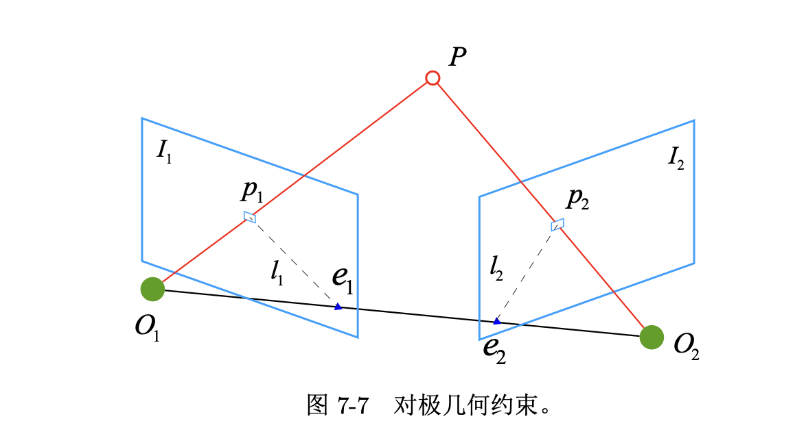
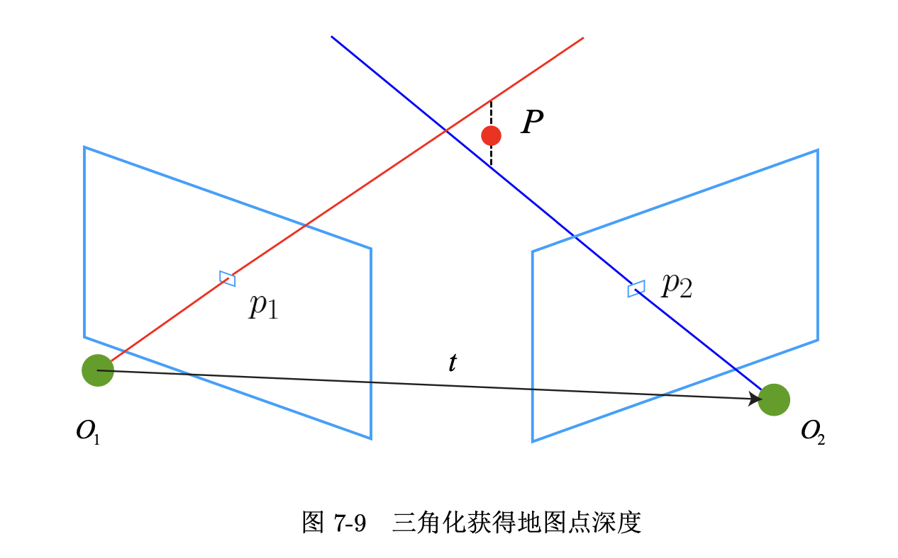
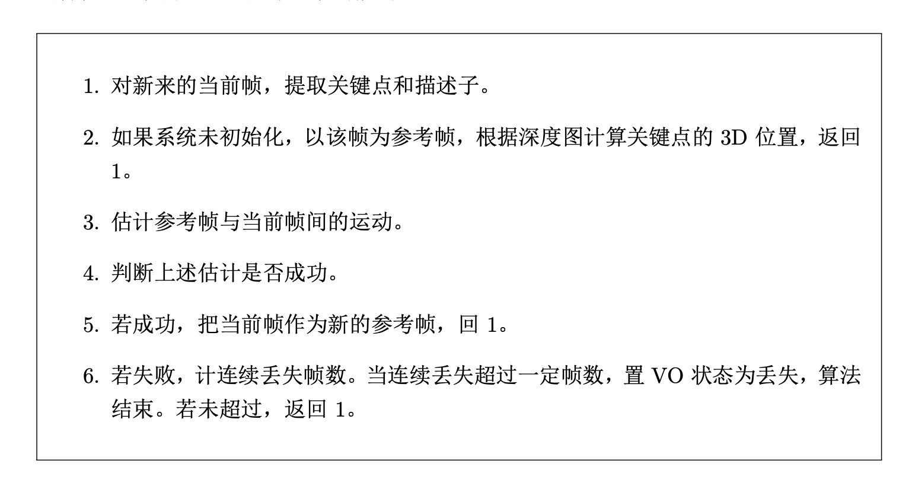
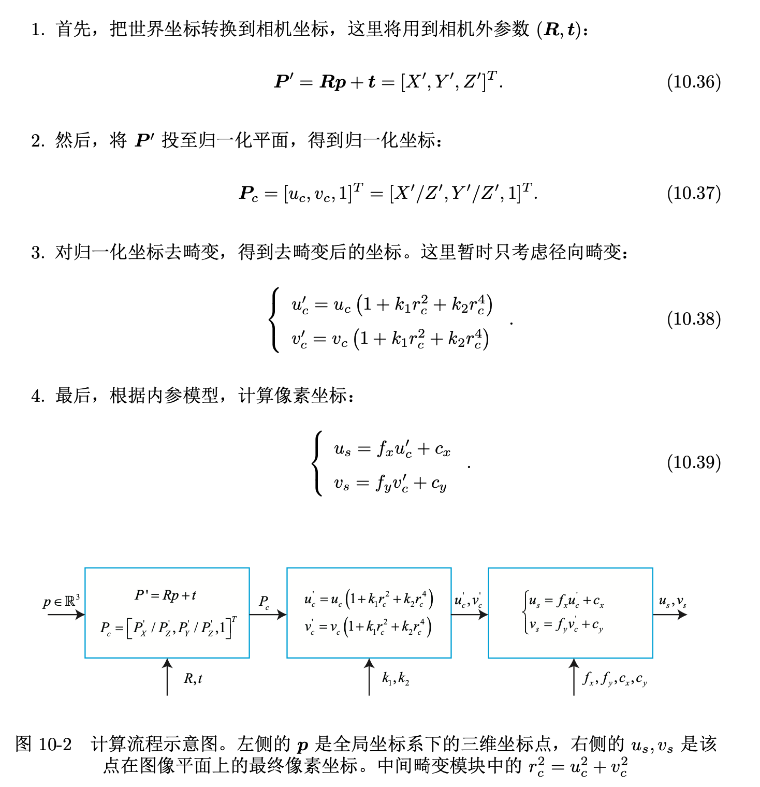
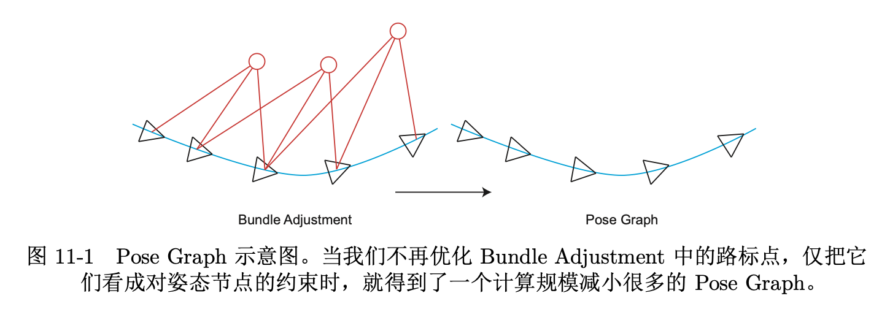
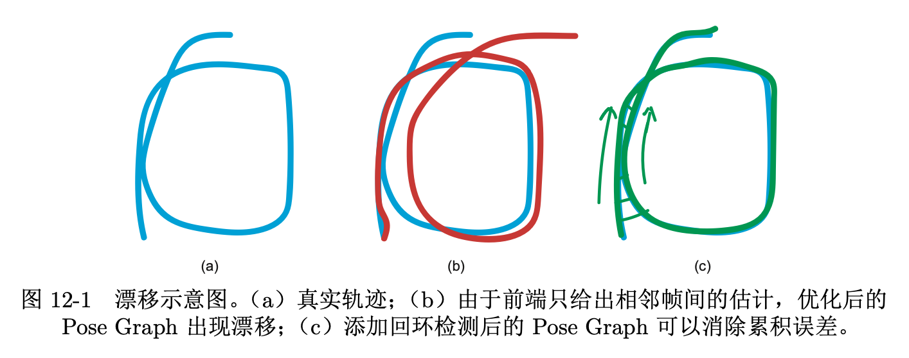
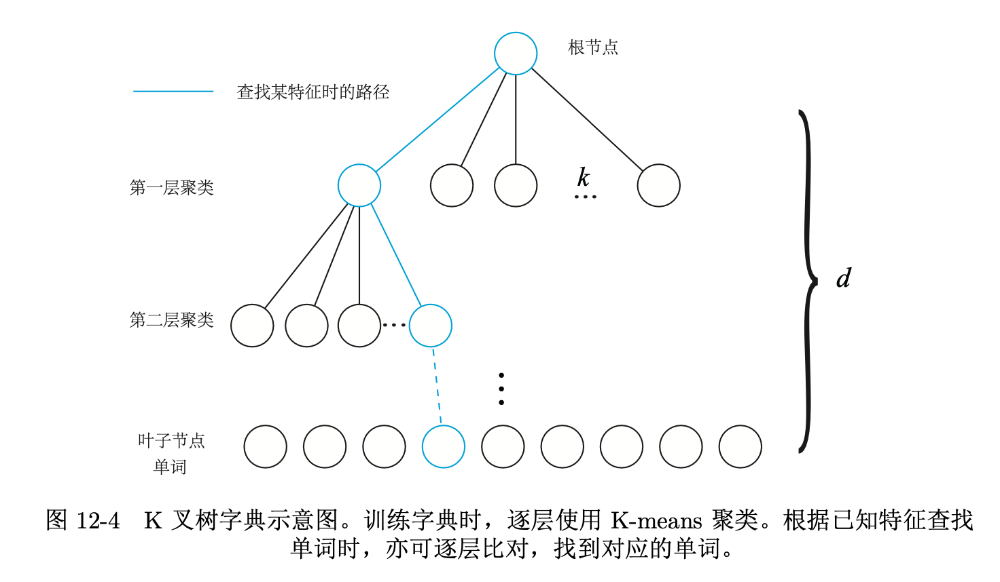
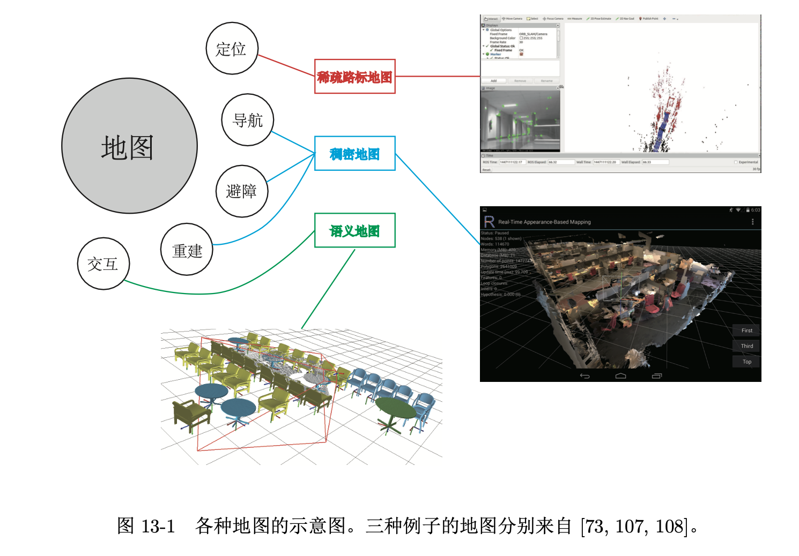
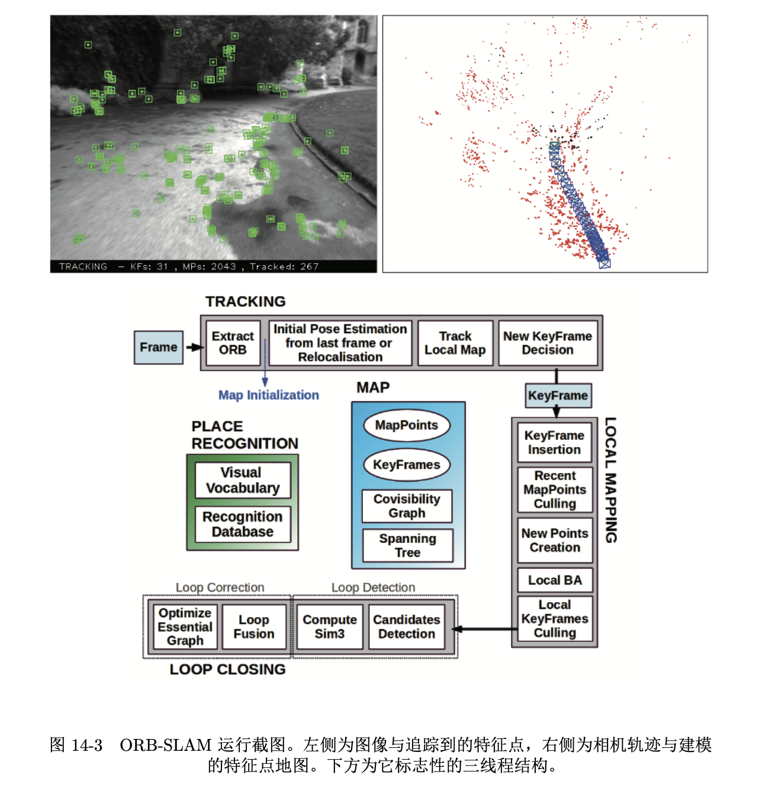

# SLAM14讲摘要

## chapter 1

## chapter2 

### SLAM过程

- 传感器信息读取
- 视觉里程计：估计相邻图像间的运动 VO又称前端
- 后端优化：后端接受不同时刻视觉里程计测量的相机位姿，以及回 环检测的信息，对它们进行优化，得到全局一致的轨迹和地图
- 回环检测：回环检测判断机器人是否曾经到达过先前的位置。如果 检测到回环，它会把信息提供给后端进行处理
- 建图：它根据估计的轨迹，建立与任务要求对应的地图。

### 视觉里程计

- 视觉里程计关心相邻图像之间的相机运动，最简单的情况当然是两张图像之间的运动 关系。
- “里程计”是因为它和实际的里程计一样，只计算相邻时刻的运动，而和再往前的 过去的信息没有关联
- 仅通过视觉里程计来估计轨迹，将不可避免地出现累计漂移(Accumulating Drift)。这 是由于视觉里程计(在最简单的情况下)只估计两个图像间运动造成的，所谓的漂移(Drift)。它将导致我们无法建立一致的地图。
- 为了解决漂移问题，我们还需要两种技术:后端优化x和回环检测。回环检测负责把“机器 人回到原始位置”的事情检测出来，而后端优化则根据该信息，校正整个轨迹的形状

### 后端优化

- 后端优化要考虑的问题， 就是如何从这些带有噪声的数据中，估计整个系统的状态，以及这个状态估计的不确定性 有多大——这称为最大后验概率估计(Maximum-a-Posteriori，MAP)。这里的状态既包括 机器人自身的轨迹，也包含地图。
- 在视觉 SLAM 中，前端和计算机视觉研 究领域更为相关，比如图像的特征提取与匹配等，后端则主要是滤波与非线性优化算法
- 把 定位和建图的不确定性表达出来，然后采用滤波器或非线性优化，去估计状态的均值和不 确定性(方差)。

### 回环检测

- 回环检测，又称闭环检测(Loop Closure Detection)，主要解决位置估计随时间漂移 的问题
- 为了实现回环检测，我们需要让机 器人具有识别曾到达过的场景的能力
- 我们可以判断图像间的相似性，来完成回环检测
- 所以视觉回环检测，实质上是一种计算图像数据相 似性的算法。由于图像的信息非常丰富，使得正确检测回环的难度也降低了不少。在检测到回环之后，我们会把“A 与 B 是同一个点”这样的信息告诉后端优化算法。 然后，后端根据这些新的信息，把轨迹和地图调整到符合回环检测结果的样子。
- 如果我们有充分而且正确的回环检测，就可以消除累积误差，得到全局一致的轨迹和地图

## 三维空间刚体运动

### 坐标系间的欧氏变换

- 刚体，它 不光有位置，还有自身的姿态。相机也可以看成三维空间的刚体，于是位置是指相机在空 间中的哪个地方，而姿态则是指相机的朝向
- 用一个旋转矩阵 R 和一个平移向量 t 完整地描述了一个欧氏空间的坐标变换关系。其中R是3维正交矩阵，t是3维向量

$$
S O(n)=\left\{\boldsymbol{R} \in \mathbb{R}^{n \times n} \mid \boldsymbol{R} \boldsymbol{R}^{T}=\boldsymbol{I}, \operatorname{det}(\boldsymbol{R})=1\right\}
$$

- 旋转可以由旋转 矩阵 SO(3) 描述，而平移直接由一个 R3 向量描述。最后，如果将平移和旋转放在一个矩 阵中，就形成了变换矩阵 SE(3)。
  - 把一个三维向量的末尾添加 1，变成了四维向量，称为齐次坐标。
  - 依靠齐次坐标和变换矩阵，两次变换的累加就可以有很好的形式 $\tilde{\boldsymbol{b}}=\boldsymbol{T}_{1} \tilde{\boldsymbol{a}}, \quad \tilde{\boldsymbol{c}}=\boldsymbol{T}_{2} \tilde{\boldsymbol{b}} \quad \Rightarrow \tilde{\boldsymbol{c}}=\boldsymbol{T}_{2} \boldsymbol{T}_{\mathbf{1}} \tilde{\boldsymbol{a}}$

$$
S E(3)=\left\{\boldsymbol{T}=\left[\begin{array}{cc}
\boldsymbol{R} & \boldsymbol{t} \\
\mathbf{0}^{T} & 1
\end{array}\right] \in \mathbb{R}^{4 \times 4} \mid \boldsymbol{R} \in S O(3), \boldsymbol{t} \in \mathbb{R}^{3}\right\}
$$

### 旋转向量

- SO(3) 的旋转矩阵有九个量，但一次旋转只有三个自由度。因此这种表达方式是冗 余的。同理，变换矩阵用十六个量表达了六自由度的变换。

- 旋转矩阵自身带有约束:它必须是个正交矩阵，且行列式为 1。变换矩阵也是如此。当 我们想要估计或优化一个旋转矩阵/变换矩阵时，这些约束会使得求解变得更困难
- 任意旋转都可以用一个旋转轴和一个旋转角来刻画。
  - 于是，我们可以使用一个 向量，其方向与旋转轴一致，而长度等于旋转角。
  - 这种向量，称为旋转向量(或轴角，Axis- Angle)。
  - 这种表示法只需一个三维向量即可描述旋转。
  - 同样，对于变换矩阵，我们使用一 个旋转向量和一个平移向量即可表达一次变换。这时的维数正好是六维
- 旋转向量和旋转矩阵之间如何转换
  - 旋转向量到旋转矩阵的过程由罗德里格斯公式(Rodrigues’s Formula )表明
  - 符号 ∧ 是向量到反对称的转换符
  - 两个转换公式它们正是 SO(3) 上李群与李代 数的对应关系。

### 欧拉角

- 与旋转向量转换

### 四元数

- 与旋转向量转换

### 变换

- 相似变换：相似变换比欧氏变换多了一个自由度，它允许物体进行均匀的缩放,s是缩放因子

$$
\boldsymbol{T}_{S}=\left[\begin{array}{ll}
s \boldsymbol{R} & \boldsymbol{t} \\
\mathbf{0}^{T} & 1
\end{array}\right]
$$

- 仿射变换：仿射变换只要求 A 是一个可逆矩阵，而不必是正交矩阵。仿 射变换也叫正交投影。经过仿射变换之后，立方体就不再是方的了，但是各个面仍然 是平行四边形。

$$
\boldsymbol{T}_{A}=\left[\begin{array}{ll}
\boldsymbol{A} & \boldsymbol{t} \\
\mathbf{0}^{T} & 1
\end{array}\right]
$$

- 影射变换
  - 从真实世界到相机照片的变换可以看 成一个射影变换。可以想象一个原本方形的地板砖，在照片当中是什么样子:首先，它不再是方形的。由于近大远小的关系，它甚至不是平行四边形，而是一个不规则的四边形。
  - 从真实世界到相机照片的变换是一个射影变换。如果相机的焦距为无穷远，那么这个变换则为仿射变换

$$
\boldsymbol{T}_{P}=\left[\begin{array}{cc}
\boldsymbol{A} & \boldsymbol{t} \\
\boldsymbol{a}^{T} & v
\end{array}\right]
$$

## chapter3 李群与李代数

- 转换

  

- 

​		

##  相机与图像

### 相机模型

- 相机将三维世界中的坐标点(单位为米)映射到二维图像平面(单位为像素)的过程 能够用一个几何模型进行描述。

  - 设相机坐标系下 P 的坐标为$ [X, Y, Z]^T$ ，像素平面下$P ′ = [X′, Y ′, Z′]^T$ ，并且设物理成像平面到小孔的距离为 f(焦距)

  - 根据三角形相似原理
    $$
    \begin{aligned}
    &X^{\prime}=f \frac{X}{Z} \\
    &Y^{\prime}=f \frac{Y}{Z}
    \end{aligned}
    $$

- 针孔相机模型

  - 大多数相机输出的图像并不是倒像——相机自身的软件会帮你翻转这张图像，所以你看到的一般是正着的像，也就是对称的成像平面上的像。

  

- 最终成像时，p在像素平面$[u, v]^T$处，这个坐标实际上是P'按照一定缩放和平移转换而来，然后合并一些常数，可以得到最终的坐标变换--从相机坐标系到像素成像平面坐标系下的变换

$$
\left\{\begin{array}{l}
u=\alpha X^{\prime}+c_{x} \\
v=\beta Y^{\prime}+c_{y}
\end{array}\right.
$$

$$
\left\{\begin{array}{l}
u=f_{x} \frac{X}{Z}+c_{x} \\
v=f_{y} \frac{Y}{Z}+c_{y}
\end{array}\right.
$$

- 从相机坐标系到像素成像平面坐标系下的变换，写成矩阵形式，其中$K$是相机的内参数矩阵(Camera Intrinsics) 
  $$
  \left(\begin{array}{c}
  u \\
  v \\
  1
  \end{array}\right)=\frac{1}{Z}\left(\begin{array}{ccc}
  f_{x} & 0 & c_{x} \\
  0 & f_{y} & c_{y} \\
  0 & 0 & 1
  \end{array}\right)\left(\begin{array}{c}
  X \\
  Y \\
  Z
  \end{array}\right) \triangleq \frac{1}{Z} \boldsymbol{K} \boldsymbol{P}
  $$

- 从相机坐标系到像素成像平面坐标系下的变换，其中R， t是相机外参数，写成矩阵形式

  

$$
Z \boldsymbol{P}_{u v}=Z\left[\begin{array}{l}
u \\
v \\
1
\end{array}\right]=\boldsymbol{K}\left(\boldsymbol{R} \boldsymbol{P}_{w}+\boldsymbol{t}\right)=\boldsymbol{K} \boldsymbol{T} \boldsymbol{P}_{w}
$$

- 归一化平面

  - 将上面的等式两边同除以Z，左边Z消除，右边生成的$\tilde{\boldsymbol{P}}_{c}$得到$P_c$，

  - $\boldsymbol{P}_{c}$是一个齐次坐标，称为归一化坐标。它位于相机前方 z = 1 处 的平面上。该平面称为归一化平面

    

    $\tilde{\boldsymbol{P}}_{c}=\left[\begin{array}{c}X \\ Y \\ Z\end{array}\right]=\left(\boldsymbol{T} \boldsymbol{P}_{w}\right)_{(1: 3)}, \quad \boldsymbol{P}_{c}=\left[\begin{array}{l}X / Z \\ Y / Z \\ 1\end{array}\right]$

    

  - 所以我们可以把最终的像素坐标$ [u, v]^T$ ，看成对归一化平面上的点进行量化测量的结果。

    

  

## 非线性优化

## 视觉里程计

### 特征点

- 首先，从图像中选取比较有代表性的点。这些点在相机视角发生少量变 化后会保持不变，所以我们会在各个图像中找到相同的点。
- 图像中的角点、边缘相比于像素区块而言更加“特别”， 它们不同图像之间的辨识度更强。稳定的局部图像特征，如著名的 SIFT， SURF， ORB
- **在这些点的基础上，讨论相机位姿估计问题，以及这些点的定位问题。**
- 在经典 SLAM 模型中，把它们称为路标。 而在视觉 SLAM 中，路标则是指图像特征(Features)

### 关键点/描述子

- 特征点由关键点(Key-point)和描述子(Descriptor)两部分组成。比方说，当我们 谈论 SIFT 特征时，是指“提取 SIFT 关键点，并计算 SIFT 描述子”两件事情。关键点 是指该特征点在图像里的位置，有些特征点还具有朝向、大小等信息。描述子通常是一个 向量，按照某种人为设计的方式，描述了该关键点周围像素的信息。
- 描述子是按照“外观相似的特征应该有相似的描述子”的原则设计的。因此，只要两个特征点的描述子在向量 空间上的距离相近，就可以认为它们是同样的特征点。

### ORB特征点

- FAST 关键点提取:找出图像中的” 角点”。相较于原版的 FAST, ORB 中计算了特征点的主方向，为后续的 BRIEF 描述子增加了旋转不变特性。

  - FAST 是一种角点，主要检测局部像素灰度变化明显的地方，以速度快著称。它的思想是:如果一个像素与它邻域的像素差别较大(过亮或过暗), 那它更可能是角点。
  - FAST 只需比较像素亮度的大小，十分快捷

  

- ORB旋转不变性

  - 图像块的几何中心 O 与质心 C，得到一个方向向量 OC，特征点的方向可以定义为OC的方向，于是ORB对关键点的旋转有了描述

- ORB 尺度不变性

  - 构建图像金字塔x，并在金字 塔的每一层上检测角点来实现，于是ORB对关键点尺度也有了描述
  - 金字塔是指对图像进行不同层次的降采样，以获得不同分辨率的图像

- BRIEF描述子:对前一步提取出关键点的周围图像区域进行描述
  - BRIEF 是一种二进制描述子，它的描述向量由许多个 0 和 1 组成，这里的 0 和 1 编 码了关键点附近两个像素(比如说 p 和 q)的大小关系:如果 p 比 q 大，则取 1，反之就 取 0。如果我们取了 128 个这样的 p, q，最后就得到 128 维由 0，1 组成的向量。
  - ORB- SLAM框架中在关键点周围半径为`16`的圆域内选取`256`对点对,每个点对内比较得到1位,共得到`256`位的描述子，计算描述子时,应该将特征点周围像素旋转到主方向上来计算

### 特征点匹配

- 如果在图像 It 中提取到特征点 $x^m_t ，m = 1, 2, ..., M$ ，在图像 $I_{t+1}$ 中提取 到特征点$ x^n_{t+1}，n = 1, 2, ..., N，$如何寻找这两个集合元素的对应关系呢
  - 暴力匹配(Brute-Force Matcher)。即对每一个特征点 $x_m^t$ ，与所有的 $x^n_{t+1}$ 测量描述子的距离，然后排序，取最近的一个作为匹配点。描述子距离表示了两个特征之 间的相似程度。

- ​	汉明距离(Hamming distance)做为度量

  - 两个二进制串之间的汉明距离，指的是它 们不同位数的个数
  - 快速近似最 近邻(FLANN)算法更加适合于匹配点数量极多的情况

  

### 2D-2D 对级几何

​		

- 两个像素点$p_1, p_2$在对相机运动R｜t下的对级约束，其中E是本质矩阵，F是基础矩阵。
- 它的几何意义是 O1, P, O2 三者共 面。

$$
\boldsymbol{p}_{2}^{T} \boldsymbol{K}^{-T} \boldsymbol{t}^{\wedge} \boldsymbol{R} \boldsymbol{K}^{-1} \boldsymbol{p}_{1}=0

\boldsymbol{x}_{1}=\boldsymbol{K}^{-1} \boldsymbol{p}_{1}, \quad \boldsymbol{x}_{2}=\boldsymbol{K}^{-1} \boldsymbol{p}_{2}
$$

$$
\boldsymbol{E}=\boldsymbol{t}^{\wedge} \boldsymbol{R}, \quad \boldsymbol{F}=\boldsymbol{K}^{-T} \boldsymbol{E} \boldsymbol{K}^{-1}, \quad \boldsymbol{x}_{2}^{T} \boldsymbol{E} \boldsymbol{x}_{1}=\boldsymbol{p}_{2}^{T} \boldsymbol{F} \boldsymbol{p}_{1}=0
$$

- 对极约束简洁地给出了两个匹配点的空间位置关系。于是，相机位姿估计问题变为：
  - 根据配对点的像素位置，求出 E 或者 F ;
  - 根据 E 或者 F ，求出 R, t。

### 本质矩阵

- 本质矩阵是由对极约束定义的。由于对极约束是等式为零的约束，所以对 E 乘以任 意非零常数后，对极约束依然满足。我们把这件事情称为 E 在不同尺度下是等价的

- 使用八对点来估计 E——这就是经典的八点法(Eight-point-algorithm)

$$
\left(u_{1}, v_{1}, 1\right)\left(\begin{array}{ccc}
e_{1} & e_{2} & e_{3} \\
e_{4} & e_{5} & e_{6} \\
e_{7} & e_{8} & e_{9}
\end{array}\right)\left(\begin{array}{c}
u_{2} \\
v_{2} \\
1
\end{array}\right)=0
$$

$$
\left(\begin{array}{ccccccccc}
u_{1}^{1} u_{2}^{1} & u_{1}^{1} v_{2}^{1} & u_{1}^{1} & v_{1}^{1} u_{2}^{1} & v_{1}^{1} v_{2}^{1} & v_{1}^{1} & u_{2}^{1} & v_{2}^{1} & 1 \\
u_{1}^{2} u_{2}^{2} & u_{1}^{2} v_{2}^{2} & u_{1}^{2} & v_{1}^{2} u_{2}^{2} & v_{1}^{2} v_{2}^{2} & v_{1}^{2} & u_{2}^{2} & v_{2}^{2} & 1 \\
\vdots & \vdots & \vdots & \vdots & \vdots & \vdots & \vdots & \vdots & \\
u_{1}^{8} u_{2}^{8} & u_{1}^{8} v_{2}^{8} & u_{1}^{8} & v_{1}^{8} u_{2}^{8} & v_{1}^{8} v_{2}^{8} & v_{1}^{8} & u_{2}^{8} & v_{2}^{8} & 1
\end{array}\right)\left(\begin{array}{c}
e_{1} \\
e_{2} \\
e_{3} \\
e_{4} \\
e_{5} \\
e_{6} \\
e_{7} \\
e_{8} \\
e_{9}
\end{array}\right)=0
$$

- 接下来的问题是如何根据已经估得的本质矩阵 E，恢复出相机的运动 R, t。这个过程 是由奇异值分解(SVD)得到的。

### 单应矩阵

- 单应矩阵通常描述处于共同平面上的一些点，在两张图像之间的变换关系。考虑在图 像 I1 和 I2 有一对匹配好的特征点 p1 和 p2。这些特征点落在某平面上。设这个平面满足 方程:

$$
\boldsymbol{n}^{T} \boldsymbol{P}+d=0
$$

$$
\begin{aligned}
\boldsymbol{p}_{2} &=\boldsymbol{K}(\boldsymbol{R} \boldsymbol{P}+\boldsymbol{t}) \\
&=\boldsymbol{K}\left(\boldsymbol{R} \boldsymbol{P}+\boldsymbol{t} \cdot\left(-\frac{\boldsymbol{n}^{T} \boldsymbol{P}}{d}\right)\right) \\
&=\boldsymbol{K}\left(\boldsymbol{R}-\frac{\boldsymbol{t} \boldsymbol{n}^{T}}{d}\right) \boldsymbol{P} \\
&=\boldsymbol{K}\left(\boldsymbol{R}-\frac{\boldsymbol{t n}^{T}}{d}\right) \boldsymbol{K}^{-1} \boldsymbol{p}_{1} .
\end{aligned}
$$

$$
\boldsymbol{p}_{2}=\boldsymbol{H} \boldsymbol{p}_{1}
$$

- 基础矩阵 F 类似，单应矩阵 H 也是 一个 3 × 3 的矩阵，求解时的思路也和 F 类似，同样地可以先根据匹配点计算 H，然后 将它分解以计算旋转和平移。

$$
\left(\begin{array}{l}
u_{2} \\
v_{2} \\
1
\end{array}\right)=\left(\begin{array}{lll}
h_{1} & h_{2} & h_{3} \\
h_{4} & h_{5} & h_{6} \\
h_{7} & h_{8} & h_{9}
\end{array}\right)\left(\begin{array}{c}
u_{1} \\
v_{1} \\
1
\end{array}\right)
$$

$$
\begin{aligned}
&h_{1} u_{1}+h_{2} v_{1}+h_{3}-h_{7} u_{1} u_{2}-h_{8} v_{1} u_{2}=u_{2} \\
&h_{4} u_{1}+h_{5} v_{1}+h_{6}-h_{7} u_{1} v_{2}-h_{8} v_{1} v_{2}=v_{2}
\end{aligned}
$$

$$
\left(\begin{array}{cccccccc}
u_{1}^{1} & v_{1}^{1} & 1 & 0 & 0 & 0 & -u_{1}^{1} u_{2}^{1} & -v_{1}^{1} u_{2}^{1} \\
0 & 0 & 0 & u_{1}^{1} & v_{1}^{1} & 1 & -u_{1}^{1} v_{2}^{1} & -v_{1}^{1} v_{2}^{1} \\
u_{1}^{2} & v_{1}^{2} & 1 & 0 & 0 & 0 & -u_{1}^{2} u_{2}^{2} & -v_{1}^{2} u_{2}^{2} \\
0 & 0 & 0 & u_{1}^{2} & v_{1}^{2} & 1 & -u_{1}^{2} v_{2}^{2} & -v_{1}^{2} v_{2}^{2} \\
u_{1}^{3} & v_{1}^{3} & 1 & 0 & 0 & 0 & -u_{1}^{3} u_{2}^{3} & -v_{1}^{3} u_{2}^{3} \\
0 & 0 & 0 & u_{1}^{3} & v_{1}^{3} & 1 & -u_{1}^{3} v_{2}^{3} & -v_{1}^{3} v_{2}^{3} \\
u_{1}^{4} & v_{1}^{4} & 1 & 0 & 0 & 0 & -u_{1}^{4} u_{2}^{4} & -v_{1}^{4} u_{2}^{4} \\
0 & 0 & 0 & u_{1}^{4} & v_{1}^{4} & 1 & -u_{1}^{4} v_{2}^{4} & -v_{1}^{4} v_{2}^{4}
\end{array}\right)\left(\begin{array}{l}
h_{1} \\
h_{2} \\
h_{3} \\
h_{4} \\
h_{5} \\
h_{6} \\
h_{7} \\
h_{8}
\end{array}\right)=\left(\begin{array}{c}
u_{2}^{1} \\
v_{2}^{1} \\
u_{2}^{2} \\
v_{2}^{2} \\
u_{2}^{3} \\
v_{2}^{3} \\
u_{2}^{4} \\
v_{2}^{4}
\end{array}\right)
$$

- 一组匹配点对可以构造出两项约束(事实上有三个约束，但是因为线性相关，只 取前两个)，于是自由度为 8 的单应矩阵可以通过 4 对匹配特征点算出
- 这种做法把 H 矩阵看成了向量，通过解该向量的线性方程来恢复 H，又称直接线性 变换法(Direct Linear Transform)。与本质矩阵相似，求出单应矩阵以后需要对其进行分解，才可以得到相应的旋转矩阵 R 和平移向量 t
- 从 E, F 和 H 都可以分解出运动，不过 **H 需要假设特征点位于平面上**

### 单目初始化问题

- 从 E 分解到 R, t 的过程中，如果相机发生的是纯旋转，导致 t 为零，那么，得到的 E 也将为零，这将导致我们无从求解 R。不过，此时我们可以依靠 H 求取旋转，但仅有 旋转时，我们无法用三角测量估计特征点的空间位置(这将在下文提到)，于是，另一个 结论是，单目初始化不能只有纯旋转，必须要有一定程度的平移。如果没有平移，单目将 无法初始化

### 解超定方程

- 当给定的点数多于八对时(比如例程找到了 79 对匹配)，我们可以计算一个最小二乘解。
- 当可能存在误匹配的情况时，使用随机采样一致性(Random Sample Concensus, RANSAC)来求，而不是最小二乘。RANSAC 是一种通用的做法，适用于很多带错误数据的情况，可以处理带 有错误匹配的数据。

### 三角测量

- 使用对极几何约束估计了相机运动，也讨论这种方法的局限性。在得 到运动之后，下一步我们需要用相机的运动估计特征点的空间位置。在单目 SLAM 中，仅 通过单张图像无法获得像素的深度信息，我们需要通过三角测量(Triangulation)(或三 角化)的方法来估计地图点的深度。

- 三角测量是指，通过在两处观察同一个点的夹角，确定该点的距离。

  

- 设 x1, x2 为两个特征点的归一化坐标，***我们已经知道了 R, t***，想要求解的是两个特征点的深度 s1, s2

$$
s_{1} \boldsymbol{x}_{1}=s_{2} \boldsymbol{R} \boldsymbol{x}_{2}+\boldsymbol{t}
$$

- 先对上式两侧左乘一个 $\boldsymbol{x}_{1}^{\wedge}$，得:

$$
s_{1} \boldsymbol{x}_{1}^{\wedge} \boldsymbol{x}_{1}=0=s_{2} \boldsymbol{x}_{1}^{\wedge} \boldsymbol{R} \boldsymbol{x}_{2}+\boldsymbol{x}_{1}^{\wedge} \boldsymbol{t} .
$$

- 该式左侧为零，右侧可看成 s2 的一个方程，可以根据它直接求得 s2。有了 s2，s1 也 非常容易求出。于是，我们就得到了两个帧下的点的深度，确定了它们的空间坐标.我们估得的 R, t，不一定精确使式为零，所以更常见的做法求最小二乘解而不是零解。

### 3D-2D: PnP

- 2D-2D 的对极几何方法需要八个或八个以上的点对(以八点法为例)，且存在着初始化、纯旋转 和尺度的问题。

- PnP(Perspective-n-Point)是求解 3D 到 2D 点对运动的方法。它描述了当我们知道 n 个 3D 空间点以及它们的投影位置时，如何估计相机所在的位姿。

- 然而，如果两张图像中，其中一张特征点的 3D 位置已知，那么最少只需 三个点对(需要至少一个额外点验证结果)就可以估计相机运动。
  - 特征点的 3D 位置可以 由三角化，或者由 RGB-D 相机的深度图确定。

- 单目视觉里程计中，必须先进行初始化，然后 才能使用 PnP。3D-2D 方法不需要使用对极约束，又可以在很少的匹配点中获得较好的运 动估计，是最重要的一种姿态估计方法

- 某个空间点 P，它的齐次坐标为 $P = (X, Y, Z, 1)^T$ 。在图像 I1 中，投影到特征 点 $x1 = (u1, v1, 1)^T$(以归一化平面齐次坐标表示)。此时相机的位姿 R, t 是未知的,用12个未知数来表示，求解方法
  $$
  s\left(\begin{array}{l}
  u_{1} \\
  v_{1} \\
  1
  \end{array}\right)=\left(\begin{array}{cccc}
  t_{1} & t_{2} & t_{3} & t_{4} \\
  t_{5} & t_{6} & t_{7} & t_{8} \\
  t_{9} & t_{10} & t_{11} & t_{12}
  \end{array}\right)\left(\begin{array}{c}
  X \\
  Y \\
  Z \\
  1
  \end{array}\right)
  $$

$$
u_{1}=\frac{t_{1} X+t_{2} Y+t_{3} Z+t_{4}}{t_{9} X+t_{10} Y+t_{11} Z+t_{12}} \quad v_{1}=\frac{t_{5} X+t_{6} Y+t_{7} Z+t_{8}}{t_{9} X+t_{10} Y+t_{11} Z+t_{12}}
$$

$$
\boldsymbol{t}_{1}=\left(t_{1}, t_{2}, t_{3}, t_{4}\right)^{T}, \boldsymbol{t}_{2}=\left(t_{5}, t_{6}, t_{7}, t_{8}\right)^{T}, \boldsymbol{t}_{3}=\left(t_{9}, t_{10}, t_{11}, t_{12}\right)^{T}
$$

$$
\begin{aligned}
&\boldsymbol{t}_{1}^{T} \boldsymbol{P}-\boldsymbol{t}_{3}^{T} \boldsymbol{P} u_{1}=0 \\
&\boldsymbol{t}_{2}^{T} \boldsymbol{P}-\boldsymbol{t}_{3}^{T} \boldsymbol{P} v_{1}=0
\end{aligned}
$$

$$
\left(\begin{array}{ccc}
\boldsymbol{P}_{1}^{T} & 0 & -u_{1} \boldsymbol{P}_{1}^{T} \\
0 & \boldsymbol{P}_{1}^{T} & -v_{1} \boldsymbol{P}_{1}^{T} \\
\vdots & \vdots & \vdots \\
\boldsymbol{P}_{N}^{T} & 0 & -u_{N} \boldsymbol{P}_{N}^{T} \\
0 & \boldsymbol{P}_{N}^{T} & -v_{N} \boldsymbol{P}_{N}^{T}
\end{array}\right)\left(\begin{array}{l}
\boldsymbol{t}_{1} \\
\boldsymbol{t}_{2} \\
\boldsymbol{t}_{3}
\end{array}\right)=0
$$

- **推论**
  - 设定原图src 当前帧为cur
  - src的角点2D坐标src_corners_2d已知，且固定[0,0],[0,h-1],[w-1,h-1],[w-1,0]
  - 当前帧cur的角点3D, cur_corners_3d坐标已知
  - src的特征点src_f也可以认为是已知且固定
  - 计算cur的特征点cur_f，通过2D-2D约束，计算单应矩阵H
  - 通过单应矩阵H计算透视变换后的角点在当前帧的2D坐标cur_corners_2D
  - 通过PnP算法，利用cur_corners_3d和cur_corners_2D计算位姿R｜t

### 3D-3D: ICP

- 3D-3D 的位姿估计问题。假设我们有一组配对好的 3D 点(比如我 们对两个 RGB-D 图像进行了匹配),要找到一个R｜t对所有匹配点都成立

$$
\boldsymbol{P}=\left\{\boldsymbol{p}_{1}, \ldots, \boldsymbol{p}_{n}\right\}, \quad \boldsymbol{P}^{\prime}=\left\{\boldsymbol{p}_{1}^{\prime}, \ldots, \boldsymbol{p}_{n}^{\prime}\right\}
$$

$$
\forall i, \boldsymbol{p}_{i}=\boldsymbol{R} \boldsymbol{p}_{i}^{\prime}+\boldsymbol{t} .
$$

- 这个问题可以用迭代最近点(Iterative Closest Point, ICP)求解

## chapter 9 前端框架（RGBD）

### 基本概念

- 帧：一个帧是相机采集到的图像单位。它主要包含一个图像(RGB-D情形下是一对图像)。此外，还有特征点、位姿、内参等信息。

- 路标: 路标点即图像中的特征点。当相机运动之后，我们还能估计它们的 3D 位置。通常，会把路标点放在一个地图当中，并将新来的帧与地图中的路标点进行匹配，估 计相机位姿。

- 地图：这里的地图仅是一个临时性的概念，指的是把各帧特征点缓存 到一个地方，构成了特征点的集合，我们称它为地图

### 五大类

- Frame 为帧
  - 基本数据单元
  - 定义了 ID、时间戳、位姿、相机、图像这几个量，这应该是一个 帧当中含有的最重要的信息。
- Camera 为相机模型
  - Camera 类存储相机的内参和外参，并完成相机坐标系、像素坐标系、和世界坐标系 之间的坐标变换
- MapPoint 为特征点/路标点
  - MapPoint 表示路标点。我们将估计它的世界坐标，并且我们会拿当前帧提取到的特征点与地图中的路标点匹配，来估计相机的运动，因此还需要存储它对应的描述子。此外， 我们会记录一个点被观测到的次数和被匹配到的次数，作为评价它的好坏程度的指标。
  - 在提取第一帧的特征点之后，将第一帧的所有特征点全部放入地图中
  - 后续的帧中，使用 OptimizeMap 函数对地图进行优化。包括删除不在视野内的点， 在匹配数量减少时添加新点等
  - 特征匹配代码。匹配之前，我们从地图中拿出一些候选点(出现在视野内的点)，然后将它们与当前帧的特征描述子进行匹配
- Map 管理特征点
  - Map 类管理着所有的路标点，并负责添加新路标、删除不好的路标等工作。VO 的匹 配过程只需要和 Map 打交道即可。
- Config 提供配置参数
  - Config 类负责参数文件的读取，并在程序任意地方都可随时提供参数的值。所以我们 把 Config 写成单例模式(Singleton)。

### 基础流程

### discuss

- 在位姿估计时，我们使用了 RANSAC 求出的 PnP 解。由于 RANSAC 只采用少数 几个随机点来计算 PnP，虽然能够确定 inlier，但该方法容易受噪声影响。在 3D-2D 点存在噪声的情形下，我们要用 RANSAC 的解作为初值，再用非线性优化求一个最 优值。
- 由于现在的 VO 是无结构的，特征点的 3D 位置被当作真值来估计运动。但实际上， RGB-D 的深度图必定带有一定的误差，特别是那些深度过近或过远的地方。并且，由 于特征点往往位于物体的边缘处，那些地方的深度测量值通常是不准确的。所以现在 的做法不够精确，我们需要把特征点也放在一起优化。
- 只考虑参考帧/当前帧的方式，一方面使得位姿估计过于依赖参考帧。如果参考帧质 量太差，比如出现严重遮挡、光照变化的情况下，跟踪容易会丢失。并且，当参考帧 位姿估计不准时，还会出现明显的漂移。另一方面，仅使用两帧数据显然没有充分地 利用所有的信息。更自然的方式是比较当前帧和地图，而不是比较当前帧和参考帧。 于是，我们要关心如何把当前帧与地图进行匹配，以及如何优化地图点
- 特征点的提取和匹配占据了绝大多数的计算时间，而看似复杂的 PnP 优 化，计算量与之相比基本可以忽略。

### 局部地图

- 在两两帧间比较时，我们只计算参考帧与当前帧之间的特征匹配和运动关系，在计算 之后把当前帧设为新的参考帧。而在使用地图的 VO 中，每个帧为地图贡献一些信息，比 方说添加新的特征点或更新旧特征点的位置估计。地图中的特征点位置往往是使用世界坐标的。因此，当前帧到来时，我们求它和地图之间的特征匹配与运动关系，即直接计算了$T_{cw}$ 。

- 我们能够维护一个不断更新的地图。只要地图是正确的，即使中间某帧出了差错，仍有希望求出之后那些帧的正确位置

- 局部地图：局部地图描述了附近的特征点信息——我们只保留离相机当前位置 较近的特征点，而把远的或视野外的特征点丢掉。这些特征点是用来和当前帧匹配来求相 机位置的，所以我们希望它能够做的比较快
- 全局地图：全局地图则记录了从 SLAM 运行 以来的所有特征点。它显然规模要大一些，主要用来表达整个环境，但是直接在全局地图 上定位，对计算机的负担就太大了。它主要用于回环检测和地图表达。
- 视觉里程计中，我们更关心可以直接用于定位的局部地图(如果决心要用地图的话)。 所以本讲我们来维护一个局部地图。随着相机运动，我们往地图里添加新的特征点，并去掉之前的，需要平衡精度和速度。

## chapter 10 后端

### 概述

- 前端视觉里程计能给出一个短时间内的轨迹和地图，但由于不可避免的误差累积，这个地图在长时间内是不准确的。所以，在视觉里程计的基础上，我们还希望构建一个尺度、规模更大的优化问题，以考虑长时间内的最优轨迹和地图。

### 状态估计与概率

- 运动和观测方程

$$
\left\{\begin{array}{l}
\boldsymbol{x}_{k}=f\left(\boldsymbol{x}_{k-1}, \boldsymbol{u}_{k}\right)+\boldsymbol{w}_{k} \\
\boldsymbol{z}_{k, j}=h\left(\boldsymbol{y}_{j}, \boldsymbol{x}_{k}\right)+\boldsymbol{v}_{k, j}
\end{array} \quad k=1, \ldots, N, j=1, \ldots, M\right.
$$

- 要把这里的位姿 x 和路标 y 看成服从某种概率分布的随机变量，问题就变成了：当我拥有某些 运动数据 u 和观测数据 z 时，如何来确定状态量 x, y 的分布？（假设状态量和噪声项服从高斯分布）

### 卡尔曼滤波器KF

- 假设我们知道了 k − 1 时刻的后验(在 k − 1 时刻看来)状态估计$\hat x_{k−1}$ 和它的协方差$ \hat P_{k−1}$
- 现在要根据 k 时 刻的输入和观测数据，确定 $x_k$ 的后验分布。
- 卡尔曼滤波器构成了线性系统的最优无偏估计。

### 非线性系统和EKF

- SLAM 中的运动方程和观测方程通常 是非线性函数，尤其是视觉 SLAM 中的相机模型，需要使用相机内参模型以及李代数表示 的位姿，更不可能是一个线性系统。一个高斯分布，经过非线性变换后，往往不再是高斯 分布，所以在非线性系统中，我们必须取一定的近似，将一个非高斯的分布近似成一个高斯分布。
- 扩展卡尔曼滤波器(Ex- tended Kalman Filter，EKF)。通常的做法是，在某个点附近考虑运动方程以及观测方程的 一阶泰勒展开，只保留一阶项，即线性的部分，然后按照线性系统进行推导。
- 在卡尔曼增益$K_k$的基础上，后验概率的形式为

$$
\hat{\boldsymbol{x}}_{k}=\overline{\boldsymbol{x}}_{k}+\boldsymbol{K}_{k}\left(\boldsymbol{z}_{k}-h\left(\overline{\boldsymbol{x}}_{k}\right)\right), \hat{\boldsymbol{P}}_{k}=\left(\boldsymbol{I}-\boldsymbol{K}_{k} \boldsymbol{H}\right) \overline{\boldsymbol{P}}_{k}
$$

- 局限性
  - 滤波器方法在一定程度上假设了马尔可夫性，也就是 k 时刻的状态只与 k − 1 时刻相关，而与 k − 1 之前的状态和观测都无关(或者和前几个有限时间的状态相 关)。这有点像是在视觉里程计中，只考虑相邻两帧关系一样。如果当前帧确实与很 久之前的数据有关(例如回环)，那么滤波器就会难以处理这种情况。
  - 一阶泰勒展开并不一定能够近似整个函数，这取决于运动模型和观测模型的非线 性情况。如果它们有强烈的非线性，那线性近似就只在很小范围内成立，不能认为在 很远的地方仍能用线性来近似。这就是 EKF 的非线性误差，是它的主要问题所在。
  - EKF 需要存储状态量的均值和方差，并对它们进行维护和更新。 如果把路标也放进状态的话，由于视觉 SLAM 中路标数量很大，这个存储量是相当 可观的，且与状态量呈平方增长(因为要存储协方差矩阵)。因此，EKF SLAM 普遍 被认为不可适用于大型场景
  - 由于 EKF 存在这些明显的缺点，我们通常认为，在同等计算量的情况下，非线性优 化能取得更好的效果

### BA与图优化

- 所谓的 Bundle Adjustment
  - 是指从视觉重建中提炼出最优的 3D 模型和相机参数(内参数和外参数)。 
  - 从每一个特征点反射出来的几束光线(bundles of light rays)，在我们把相机姿态和特征点空间位置做出最优的调整 (adjustment) 之后，最后收束到相机光心的这个过程 ，简称为 BA。
  - 在以图优化框架的视觉 SLAM 算法里，BA 起到了核心作用。它类似于求解只有观测 方程的 SLAM 问题。在最近几年视觉 SLAM 理论的研究中，BA 算法不仅具有很高的精度，也开始具备良好的实时性，能够应用于在线计算的 SLAM 场景中。
  -  SLAM 问题中 BA 的稀疏特性，才使它能够在实时的场景中使用
- 投影过程

- 优化目标函数

$$
\boldsymbol{z}=h(\boldsymbol{x}, \boldsymbol{y})
$$

$$
\boldsymbol{e}=\boldsymbol{z}-h(\boldsymbol{\xi}, \boldsymbol{p})
$$

$$
\frac{1}{2} \sum_{i=1}^{m} \sum_{j=1}^{n}\left\|\boldsymbol{e}_{i j}\right\|^{2}=\frac{1}{2} \sum_{i=1}^{m} \sum_{j=1}^{n}\left\|\boldsymbol{z}_{i j}-h\left(\boldsymbol{\xi}_{i}, \boldsymbol{p}_{j}\right)\right\|^{2}
$$

### 位姿图 Pose Graph

- 带有相机位姿和空间点的图优化称为 BA，能够有效地求解大规模的定位与建图问题。 但是，随着时间的流逝，机器人的运动轨迹将越来越长，地图规模也将不断增长。像 BA 这样的方法，计算效率就会(令人担忧地)不断下降。

- 我们完全 可以构建一个只有轨迹的图优化，而位姿节点之间的边，可以由两个关键帧之间通过特征 匹配之后得到的运动估计来给定初始值。不同的是，一旦初始估计完成，我们就不再优化 那些路标点的位置，而只关心所有的相机位姿之间的联系了。通过这种方式，我们省去了大 量的特征点优化的计算，只保留了关键帧的轨迹，从而构建了所谓的位姿图

- 在 BA 中，特征点数量远大于位姿节点的数量。一个关键帧往往关联了数百 个关键点，而实时 BA 的最大计算规模，即使利用稀疏性，在当前的主流 CPU 上一般也 就是几万个点左右。这就限制了 SLAM 应用场景。所以，当机器人在更长的时间和空间中 运动时，必须考虑一些解决方式
  - 要么像滑动窗口法那样，丢弃一些历史数据 
  - 要么像 Pose Graph 的做法那样，舍弃对路标点的优化，只保留 Pose 之间的边，使用 Pose Graph

### 位姿图的优化

- Pose Graph 图优化中的节点和边都是什么意思呢?
  - 这里的节点表示相机位姿， 以ξ1,...,ξn 来表达。
  - 边，则是两个位姿节点之间相对运动的估计，该估计可能来自于 特征点法或直接法，但不管如何，我们估计了，比如说 ξi 和 ξj 之间的一个运动 ∆ξij。

- 所有的位姿顶点和位姿——位姿边构成了一个图优化，本质上是一个最小二乘问题，优化变量为各个顶点的位姿，边来自于位姿观测约束。记 E 为所有边的集合，那么总体目标函数为：
  $$
  \min _{\boldsymbol{\xi}} \frac{1}{2} \sum_{i, j \in \mathcal{E}} \boldsymbol{e}_{i j}^{T} \boldsymbol{\Sigma}_{i j}^{-1} \boldsymbol{e}_{i j}
  $$

## 回环检测

### 概念

- SLAM 主体(前 端、后端)主要的目的在于估计相机运动
- 回环检测模块，无论是目标上还是方法上，都与 前面讲的内容相差较大，所以通常被认为是一个独立的模块。
- 主流视觉 SLAM 中检测回环的方式:词袋模型

### 回环检测的意义

- 问题： 假设我们在前端提取了特征，然后忽略掉特征点，在后端使用 Pose Graph 优化整个轨迹，如图 12-1(a) 所示。由于前端给出的只是局部的位姿间约束，比方说，可能 是 x1 − x2 , x2 − x3 等等。但是，由于 x1 的估计存在误差，而 x2 是根据 x1 决定的，x3 又是由 x2 决定的。以此类推，误差就会被累积起来，使得后端优化的结果如图 12-1 (b) 所示，慢慢地趋向不准确。

- 回环边把带有累计误差的边“拉”到了正确的位置——如 果回环本身是正确的话。

- 回环检测提供了当前数据与所有历史数据的关联，在跟踪算法丢失之后，我们还可以利用回环检测进行重定位。因此，回环检测对整个 SLAM 系统精度与 鲁棒性的提升，是非常明显的。

### 方法-词袋模型

- 基于外观的回环检测算法中，核心问题是如何计算图像间的相似性。
  - 比如对于图像 A 和图像 B，我们要设计一种方法，计算它们之间的相似性评分:s(A, B)。
  - 当然这个评 分会在某个区间内取值，当它大于一定量后我们认为出现了一个回环。

- 为何不像 VO 那样特征点来做回环检测呢?
  - 和 VO 一 样，我们对两个图像的特征点进行匹配，只要匹配数量大于一定值，就认为出现了回环。
  - 进 一步，根据特征点匹配，我们还能计算出这两张图像之间的运动关系。
  - 当然这种做法会存 在一些问题，例如特征的匹配会比较费时、当光照变化时特征描述可能不稳定等，但离我 们要介绍的词袋模型已经很相近了。

- 词袋，也就是 Bag-of-Words(BoW)，目的是用“图像上有哪几种特征”来描述一个 图像
  - BoW 中的“单词”(Word)，许多单词放在一起，组成了“字典”(Dictionary)。
  - Bag-of-Words 而不是什么 List-of-Words，强调的是 Words 的有无，而无关其顺序
  - 确定一张图像中，出现了哪些在字典中定义的概念——我们用单词出现的情况(或直方图)描述整张图像。这就把一个图像转换成了一个向量的描述。
  - 比较上一步中的描述的相似程度。

$$
s(\boldsymbol{a}, \boldsymbol{b})=1-\frac{1}{W}\|\boldsymbol{a}-\boldsymbol{b}\|_{1}
$$

- 字典

  - 个单词与 一个单独的特征点不同，它不是从单个图像上提取出来的，而是某一类特征的组合。所以， 字典生成问题类似于一个聚类(Clustering)问题。
    - K-means 是一个非常简单有效的方法。
    - 根据 K-means，我们可以把已经提取的大量特征点聚类成一个含有 k 个单词的字典

  - 如何根据图像中某个特征点，查找字典中相应的单词？

    - 朴素的思想:只要和每个单词进行比对，取最相似的那个就可以了，每个特征点都需要O(K)时间，K很大

    - 用一种 k 叉树来表达字典。它的思路很简单，类似于层次聚类，是 k- means 的直接扩展。假定我们有 N 个特征点，希望构建一个深度为 d，每次分叉为 k 的 树

      - 在根节点，用 k-means 把所有样本聚成 k 类(实际中为保证聚类均匀性会使用 k-means++)。这样得到了第一层。

      - 对第一层的每个节点，把属于该节点的样本再聚成 k 类，得到下一层

      - 依此类推，最后得到叶子层。叶子层即为所谓的 Words

        

    - 实际上，最终我们仍在叶子层构建了单词，而树结构中的中间节点仅供快速查找时使 用。这样一个 k 分支，深度为 d 的树，可以容纳 $k^d$ 个单词,每次查找最多d次，对数级别。

    

  - 最好自己生成字典，有开源代码；也可以使用别人训练的大规模字典。

  ### 一些优化处理

  - 相似性评分的处理

    - 对任意两个图像，我们都能给出一个相似性评分，但是只利用这个分值的绝对大小，并 不一定有很好的帮助。譬如说，有些环境的外观本来就很相似，像办公室往往有很多同款 式的桌椅;另一些环境则各个地方都有很大的不同。
    - 取一个先验 相似度 s (vt, vt−∆t)，它表示某时刻关键帧图像与上一时刻的关键帧的相似性。然后，其他 的分值都参照这个值进行归一化

    $$
    s\left(\boldsymbol{v}_{t}, \boldsymbol{v}_{t_{j}}\right)^{\prime}=s\left(\boldsymbol{v}_{t}, \boldsymbol{v}_{t_{j}}\right) / s\left(\boldsymbol{v}_{t}, \boldsymbol{v}_{t-\Delta t}\right)
    $$

    - 站在这个角度上，我们说:如果当前帧与之前某关键帧的相似度，超过当前帧与上一 个关键帧相似度的 3 倍，就认为可能存在回环

  - 关键帧的选取

    - 实践上说，用于回环检测的帧最好是稀疏一些，彼此之间不太相同，又能涵盖整个环境。
    - 确认第 1 帧和第 n 帧之间存在回环，对 轨迹优化是有帮助的，但再接下去的第 n + 1 帧，n + 2 帧都会和第 1 帧构成回环，产生 的帮助就没那么大了，因为我们已经用之前的信息消除了累计误差，更多的回环并不会带 来更多的信息。所以，我们会把“相近”的回环聚成一类，使算法不要反复地检测同一类 的回环。

  - 回环检测的验证

    - 时间一致性：设立回环的缓存机制，认为单次检测到的回环并不足以构 成良好的约束，而在一段时间中一直检测到的回环，才认为是正确的回环。
    - 空间上的一致性检测：对回环检测到的两个帧进行特 征匹配，估计相机的运动。然后，再把运动放到之前的 Pose Graph 中，检查与之前的估 计是否有很大的出入。

## chapter 13 建图

### 概念

- 在经典的 SLAM 模型中，我们所谓的地图，即所有路标点的集合。
- 一旦我们确定了路标点的位置，那就可以说我们完成了建图。
- 视觉 里程计也好，Bundle Adjustment 也好，事实上都建模了路标点的位置，并对它们进行优 化

### 定位

- 定位是地图的一个基本功能。
- 视觉里程计章节，我们讨论了如何利用 局部地图来实现定位。
- 在回环检测章节，我们也看到，只要有全局的描述子信息，我们也能通过回环检测确定机器人的位置。
- 更进一步，我们还希望能够把地图保 存下来，让机器人在下次开机后依然能在地图中定位，这样只需对地图进行一次建 模，而不是每次启动机器人都重新做一次完整的 SLAM。

### 导航

- 导航是指机器人能够在地图中进行路径规划，从任意两个地图点间寻找路径， 然后控制自己运动到目标点的过程。
- 该过程中，我们至少需要知道地图中哪些地方不 可通过，而哪些地方是可以通过的。
- 这就超出了稀疏特征点地图的能力范围，我们必 须有另外的地图形式。
- 这至少得是一种稠密的地图
- 仅有特征点，我们无法判断某个特征点是否为障碍物，所以我们将需要稠密地图。

### 重建

- 有时候，我们希望利用SLAM获得周围环境的重建效果，并把它展示给其他 人看。这种地图主要用于向人展示，所以我们希望它看上去比较舒服、美观
- 我们也可以把该地图用于通讯，使其他人能够远程地观看我们重建得到的三维物体 或场景——例如三维的视频通话或者网上购物等等
- 这种地图亦是稠密的，并且我们 还对它的外观有一些要求。我们可能不满足于稠密点云重建，更希望能够构建带纹理 的平面，就像电子游戏中的三维场景那样。

### 交互

- 交互主要指人与地图之间的互动。
- 例如，在增强现实中，我们会在房间里放置 虚拟的物体，并与这些虚拟物体之间有一些互动——比方说我会点击墙面上放着的 虚拟网页浏览器来观看视频，或者向墙面投掷物体，希望它们有(虚拟的)物理碰撞。 
- 另一方面，机器人应用中也会有与人、与地图之间的交互。例如机器人可能会收到命 令“取桌子上的报纸”，那么，除了有环境地图之外，机器人还需要知道哪一块地图 是“桌子”，什么叫做“之上”，什么又叫做“报纸”。
- 这需要机器人对地图有更高级 层面的认知——亦称为语义地图。

### 单目稠密重建

- 深度估计
  - 使用单目相机，利用移动相机之后进行三角化，测量像素的距离
  - 使用双目相机，利用左右目的视差计算像素的距离(多目原理相同)。
  - 使用 RGB-D 相机直接获得像素距离。

- 单目稠密重建计算过程
  - 首先，我们对图像提取特征，并根据描述子计算了特征之间的匹配。换言之，通过特 征，我们对某一个空间点进行了跟踪，知道了它在各个图像之间的位置。
  - 然后，由于我们无法仅用一张图像确定特征点的位置，所以必须通过不同视角下的观测，估计它的深度，原理即前面讲过的三角测量。
  - 我们无法把每个像素都当作特征点，计算描述子。
    - 因此，稠密深度估计问题中，匹配就成为很重要的一环:如何确定第一张图的某像素，出现在其他图里的位置?
      - 这需要用到极线搜索和块匹配技术 。
    - 当我们 知道了某个像素在各个图中的位置，就能像特征点那样，利用三角测量确定它的深度。不 过不同的是，在这里我们要使用很多次三角测量让深度估计收敛，而不仅是一次。我们希 望深度估计，能够随着测量的增加，从一个非常不确定的量，逐渐收敛到一个稳定值。这 就是深度滤波器技术。

## ORB- SLAM框架

### 优点

- 支持单目、双目、RGB-D 三种模式。
- 整个系统围绕 ORB 特征进行计算，包括视觉里程计与回环检测的 ORB 字典。它体 现出 ORB 特征是现阶段计算平台的一种优秀的效率与精度之间的折衷方式。ORB 不像 SIFT 或 SURF 那样费时，在 CPU 上面即可实时计算;相比 Harris 角点等简 单角点特征，又具有良好的旋转和缩放不变性。并且，ORB 提供描述子，使我们在 大范围运动时能够进行回环检测和重定位
- ORB的回环检测是它的亮点。优秀的回环检测算法保证了ORB-SLAM有效地防止 累计误差，并且在丢失之后还能迅速找回，这在许多现有的 SLAM 系统中都不够完 善。为此，ORB-SLAM 在运行之前必须加载一个很大的 ORB 字典文件
- ORB-SLAM 创新式地使用了三个线程完成 SLAM
  - 实时跟踪特征点的 Tracking 线程
    - Tracking线程负责对每张新来的图像提取 ORB 特征点，并与最近的关键帧进行比较，计算特 征点的位置并粗略估计相机位姿。
  - 局部 Bundle Adjustment 的优化线程(Co-visibility Graph，俗称小图)
    - 小图线程求解一个 Bundle Adjustment 问题，它包括局部空间内的特征点与相机位姿。
    - 这个线程负责求解更精细的相机位姿与特征点空间位置
  - 全局 Pose Graph 的回环检测与优化线程(Essential Graph 俗称大图)
    - 大图线程，对全局的地图与关键帧进行回环检测，消除累积误差。由于全 局地图中的地图点太多，所以这个线程的优化不包括地图点，而只有相机位姿组成的 位姿图。

### 缺点

- 整个 SLAM 系统都采用特征点 进行计算，我们必须对每张图像都计算一遍 ORB 特征，这是非常耗时的.
- ORB-SLAM 的 三线程结构也对 CPU 带来了较重的负担，使得它只有在当前 PC 架构的 CPU 上才能实 时运算，移植到嵌入式端则有一定困难。
- 其次，ORB-SLAM 的建图为稀疏特征点，目前 还没有开放存储和读取地图后重新定位的功能(虽然从实现上来讲并不困难)。根据我们 在建图章节的分析，稀疏特征点地图只能满足我们对定位的需求，而无法提供导航、避障、 交互等诸多功能。

# SLAM (Simultaneous Localization and Mapping)

## 基础

### 定义

- SLAM（同步定位与地图构建），是指运动物体根据传感器的信息，一边计算自身位置，一边构建环境地图的过程，解决机器人等在未知环境下运动时的定位与地图构建问题。

### 实际应用

- [SLAM](http://www.slamtec.com/)技术被广泛运用于机器人、无人机、无人驾驶、AR、VR等领域，依靠传感器可实现机器的自主定位、建图、路径规划等功能。

### 分类（按传感器）

- **激光SLAM**：LiDAR SLAM, 早在2005年的时候，激光SLAM就已经被研究的比较透彻，框架也已初步确定。激光SLAM，是目前最稳定、最主流的定位导航方法。
- **VSLAM**（基于视觉的定位与建图）：就是只采用相机作为传感器的SLAM。随着计算机视觉的迅速发展，视觉SLAM因为信息量大，适用范围广等优点受到广泛关注。
  - 基于深度摄像机的Vslam，跟激光SLAM类似，通过收集到的点云数据，能直接计算障碍物距离；
  - 基于单目、鱼眼相机的VSLAM方案，利用多帧图像来估计自身的位姿变化，再通过累计位姿变化来计算距离物体的距离，并进行定位与地图构建；

## 应用方向

### 建图

### 定位

## 视觉SLAM的技术

- 传感器数据：系统接收的数据，在V-SLAM中主要是图像信息。
- 视觉里程计：从读取的图像信息中，根据相邻时间上的图像信息计算出相机的运动信息，以及构建局部地图。相机的运动信息在视觉里程计中叫相机位姿 .除此之外，在RGB相机中，我们也要通过视觉的方法估计特征点的深度。
- 非线性优化：因为图像信息具有噪声或者匹配过程中的误差，因此需要优化方法减小VO部分计算出的相机位姿。非线性优化为目前SLAM中主流的优化方法。在我们AR框架中只考虑相邻时间内的局部优化。
- 回环检测：该模板的目标是判断机器是否回到原来的位置。在SLAM中意义重大，我们当前阶段是为了搭建出一个可以运行，具有一定稳定性的AR框架，因此不考虑此模块。
- 建图：根据轨迹信息，建立地图。

- 参阅：
  - https://zhuanlan.zhihu.com/p/83081824
  - https://blog.csdn.net/u014520439/article/details/88812109

## AR

### 基于marker的AR实现的步骤

- 获取相机图像
- 特征匹配（实时获取的图像和预存的marker）
- 根据匹配结果估计相机位姿
- 通过非线性优化的方法优化位姿
- 通过求解出的相机位姿矩阵和内参矩阵
- 通过OpenGL渲染虚拟物体到正确的位置。

- 基于marker的AR系统中，需要marker图，并且在使用中需要在真实场景中放置marker，这个很影响用户体验。

### 基于SLAM的AR实现

- 目前的AR主要的应用环境是小范围的应用场景，因此抛弃后端闭环检测的技术内容（后期综合考虑性能和精度的问题，可能会加入），只需要SLAM中的前端部分的技术，即 **视觉里程计（Visual Odometry，VO）**,VO的目标是计算获取的相邻帧之间的相机位姿态。（所以是不是一般物品都是不动的，动的只是相机？）

  

  ****

