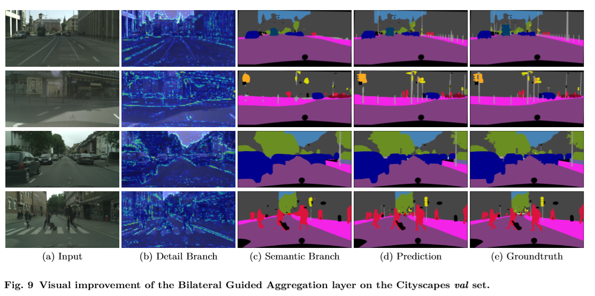

# BiSeNet V2: Bilateral Network with Guided Aggregation for Real-time Semantic Segmentation
### 论文信息
   - 作者机构：Changqian Yu, Changxin Gao,Jingbo Wang, et al. 旷视
   - 年份：2020 
   - 发表会议：CVPR (BiSeNet V1, 2018 ECCV)
   - 论文链接：https://arxiv.org/pdf/2004.02147.pdf
   - 开源实现
     - https://github.com/MaybeShewill-CV/bisenetv2-tensorflow
     - https://github.com/CoinCheung/BiSeNet

### 基本原理
- BiSeNet V2将空间细节和分类语义分开处理，以实现高精度和高效率的实时语义分割
- 包括四个主要结构
  - Detail Branch：主干网络中细节分支，捕获低层细节并生成高分辨率的特征表示
  - Semantic Branch：主干网络中的语义分支，获取高层次语义 
  - Aggregation Layer：引导聚合层，增强相互连接和融合细节和语义两种类型的特征表示。可以看作一个子网目的是学习如何融合Detail和Semantic。这与DFANet中将深层语义和浅层细节的输出简单组合的方式不同，而是让神经网络自己去学习如何融合这两方面的特征。
  - Booster：推理部分，设计了一些辅助分割头，以提高分割性能，没有任何额外的推理成本。

   

### 效果
- 实测

   

- 数据(NVIDIA 1080Ti GPU)

   

### 评价
- BiSeNet V2是一种高效的实时语义分割体系结构，是轻量级实时语义分割经典BiSeNet的进化版本。其双通道结构以及引导聚合层很好地保证了语义和细节的兼顾。由于引入了增强训练策略，进一步提高了分割性能。在实测效果上，精度和速度能够满足实时语义分割的要求，且满足高分辨率(2048*1024)输入。故而该方案应该可以运用到实时分离直播场景下的前后景当中，达到背景实时去除的效果。
