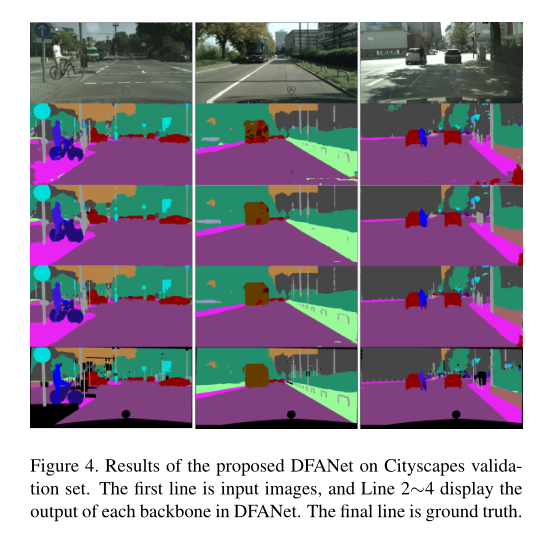
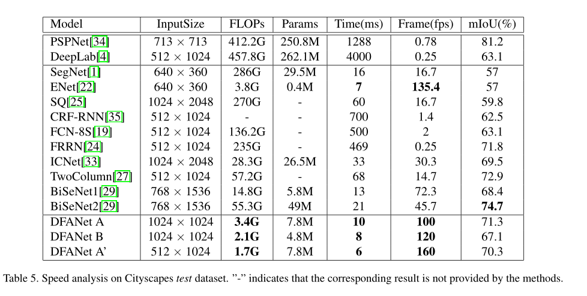

# DFANet:用于实时语义分割的深层特征聚合网络

## 论文信息

   - 论文名称：《DFANet：Deep Feature Aggregation for Real-Time Semantic Segmentation》
   - 作者机构：Hanchao Li, Pengfei Xiong, Haoqiang Fan, Jian Sun 旷视
   - 年份：2019
   - 发表会议：CVPR
   - 论文链接：https://arxiv.org/pdf/1904.02216.pdf
   - 开源实现：https://github.com/huaifeng1993/DFANet

## 基本原理

- 首先将从 backbone 中抽取得到的高层特征重复利用，对语义信息和结构细节进行tradeoff；其次，将网络的处理过程的不同阶段所获得的特征进行组合，来提高特征的表达能力
- 包含三个重要结构
  - lightweight backbones
  
  - sub-network aggregation:是将高层特征进行结合，将DFANet作为一个backbones的集合，也就是将上一个backbone的输出作为下一个backbone的输入。换句话说，sub-network 聚合可以被看成一个精细化的过程
  - sub-stage aggregation：融合多个网络间的stage-level的语义和空域信息，对同一深度下不同stage之间的特征进行融合。
  
   

### 效果
- 实测
  
   
   

- 数据( a single Titan X GPU card)
  
   

### 评价
- DFANet突出优势是解决了高分辨率下实时语义分割，在高帧率小计算量的情况下依然获得很高的分割精度，弥补了RefineNet对于高分辨率的处理不足，且同样具有轻量级的优点。对于直播场景的实时背景去除是一个不错的解决方案。
