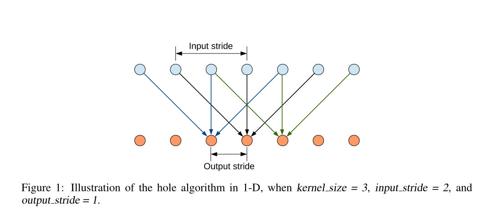
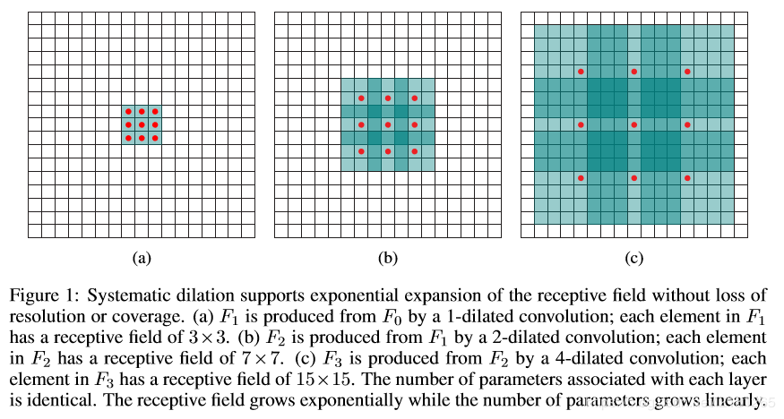
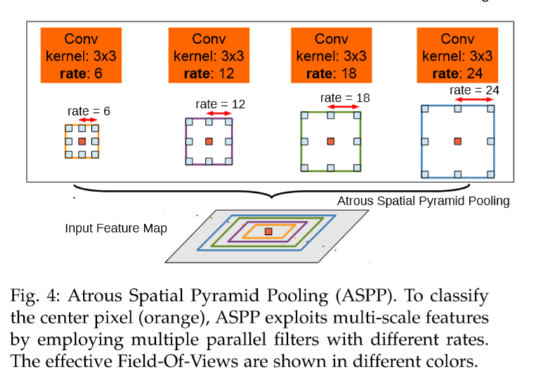
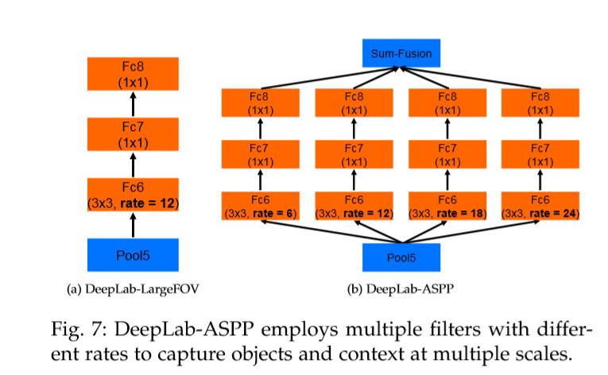
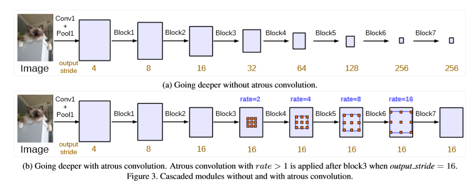
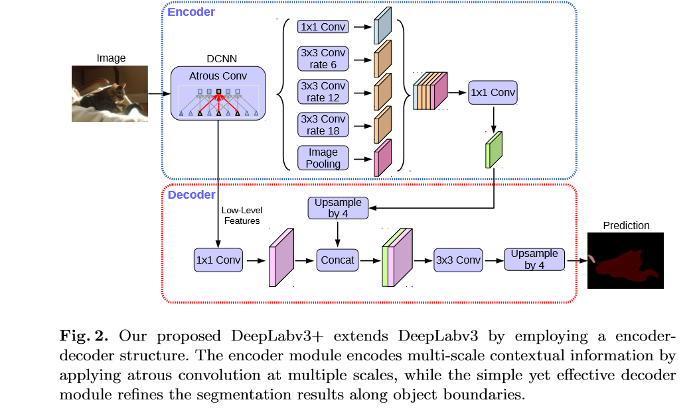
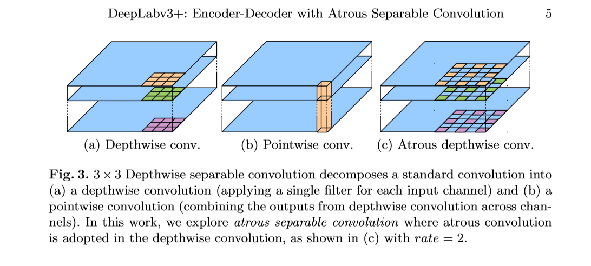
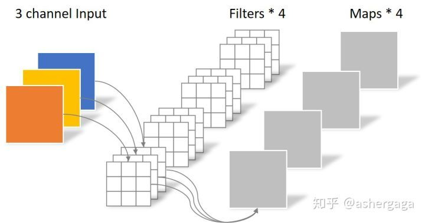
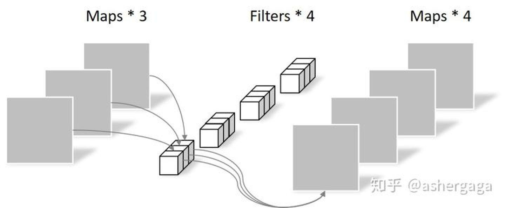

## Deeplab v1: Semantic Image Segmentation with Deep Convolutional Nets and Fully Connected CRFs

### 基本信息

- 年份：2015 ICLR
- 作者：Liang-ChiehChen, et al.
- 内容简介：结合DCNN CFR 做的语义分割

### 主要内容

- 语义分割两个障碍
  - DCNN的图像转化的平移不变性（invariance），是源于重复的池化和下采样的组合。平移不变性增强了对数据分层的抽象能力，但是对语义分割、姿态估计不友好，因为这些任务倾向于精确的定位而不是抽象的空间关系。
    - 通过使用全连通条件随机场(CRF)，提高了模型捕捉细节的能力,优化分割精度。条件随机场在语义分割中得到了广泛的应用，它将多路分类器计算的类分数与像素和边缘之间的局部交互所获取的低层信息相结合。
  - 空间下采样： 重复的最大池化和下采样带来分辨率下降的问题，会丢失细节。在这不断的下采样过程中,必然会损失掉很多空间信息,所以最后得到的小分辨率feature maps对于小目标来说,是不容检测出来的,尤其是边缘细节。
    - DeepLab只采用8倍下采样，维持高分辨率的特征图。同时，为了得到更大的感受野获得高层语义信息，采用空洞卷积atrous算法扩展感受野，获得更多上下文信息。

- 空洞卷积
  - 空洞卷积是在标准的卷积上注入空洞，以此增加receptive field，多了一个称为dilation rate即kernel间隔数量的超参数。空洞卷积能够放大滤波器的感受野，rate引入r-1个0，将感受野从k扩大到k+(k-1)(r-1)，而不增加参数和计算量。
    
    
    
    
  - 缺点
    -  kernel 并不连续，也就是并不是所有的 pixel 都用来计算了，因此这里将信息看做 checker-board 的方式会损失信息的连续性。这对 pixel-level dense prediction 的任务来说是致命的。
    - 光采用大 dilation rate 的信息或许只对一些大物体分割有效果，而对小物体来说可能则有弊无利了。如何同时处理不同大小的物体的关系，则是设计好 dilated convolution 网络的关键。

- CFR 条件随机场 

## Deeplab v2: Semantic Image Segmentation with Deep Convolutional Nets, Atrous Convolution, and Fully Connected CRFs

### 基本信息

- 年份： 2017
- 作者：Liang-Chieh Chen, et al.
- 内容简介
  - Atrous Convolution 代替原来上采样的方法，比之前得到更高像素的score map，在不增加参数数量或计算量的情况下，有效地扩大感受野，以获得更多的上下文信息
  - 提出ASPP(atrous spatial pyramid pooling) ：基于空间空洞金字塔池化的多尺度分割方法，即多尺度特征提取，在多个尺度上捕获对象和图像特征（使用不同rate的空洞卷积）,然后接到多路全连接层，
  - 基础层由VGG16改为ResNet。
  - 全连接的CRF，利用低层的细节信息对分类的局部特征(边缘)进行优化。

### 主要内容

- ASPP:受spatial pyramid pooling(SPP)启发，得到ASPP结构(Multiscale Image Representations using Atrous Spatial Pyramid Pooling)，SSP结构如下，它可以让网络输入原图而不必resize，反正都是输出固定的向量。
  
  
- ASPP结构图 类似于HDC（Hybrid Dilated Convolution）
    
    

- Deeplab-ASPP
  
    

### Deeplab v3: Rethinking Atrous Convolution for Semantic Image Segmentation
- 年份：2017
- 作者：Liang-Chieh Chen, et al.
- 内容简介
  - 改进了ASPP模块：由不同采样率的空洞卷积和BN层组成，尝试以级联或并行的方式布局模块。
  - 讨论了一个重要问题：使用大采样率的3×3的空洞卷积，因为图像边界响应无法捕捉远距离信息，会退化为1×1的卷积, 建议将图像级特征融合到ASPP模块中
  - 去掉了CRF

### 主要内容

- 多尺度目标的解决办法
  - Image Pyramid: 将输入图片放缩成不同比例，分别应用在DCNN上，将预测结果融合得到最终输出
  - Encoder-Decoder: 利用Encoder阶段的多尺度特征，运用到Decoder阶段上恢复空间分辨率(代表工作有FCN、SegNet、PSPNet等工作)将Xception和深度可分离卷积Depthwise separable convolution应用到ASPP和decoder中，encoder网络使用resnet101或 Xception。Atrous Separable Convolution指的是将深度可分离卷积的第一步改为dilation卷积。
  - Atrous Convolution
  - Spatial Pyramid Pooling: 空间金字塔池化具有不同采样率和多种视野的卷积核，能够以多尺度捕捉对象
  
    

- ASPP模块
  - 级联ResNet的block4，对比有无空洞卷积的效果
  
    

  - 改进ASPP，并联和GAP 全局平均池化
  
    

## deeplab v3+ 

### 主要架构
- DeepLabv3 as encoder
- Modified Aligned Xception as backbone(decoder)
- 精度很高

### 深度可分离卷积
- Atrous Separable Convolution指的是将深度可分离卷积的第一步改为dilation卷积。

- 普通卷积

- 深度卷积
  - 一组卷积核中的每一片都与输入特征的对应通道卷积，类似于两本书比厚度一样
  
- 点卷积
  - 就是普通卷积，只不过尺寸是1X1，不改变大小只改变通道数。
  

## U-Net SegNet PSPnet
