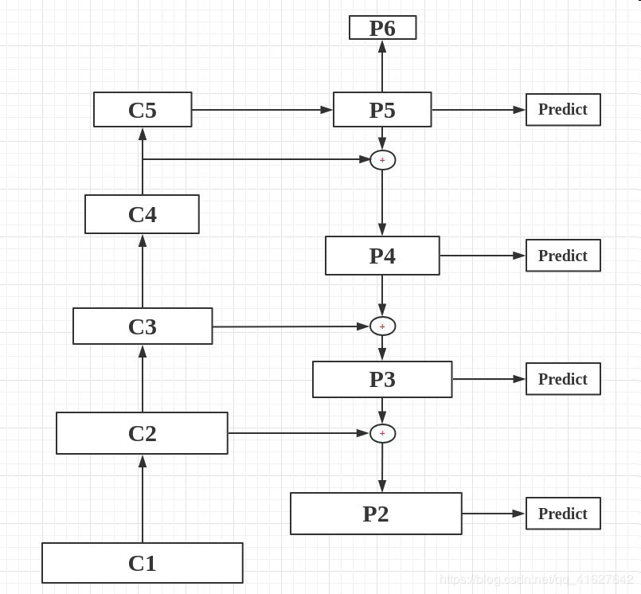
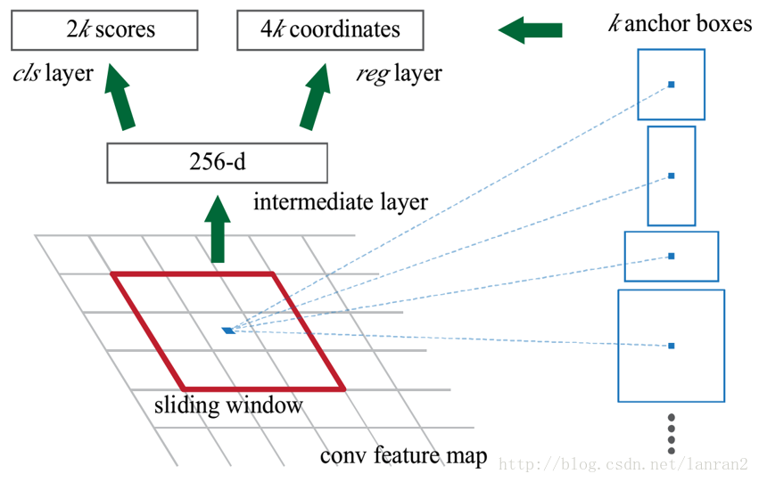
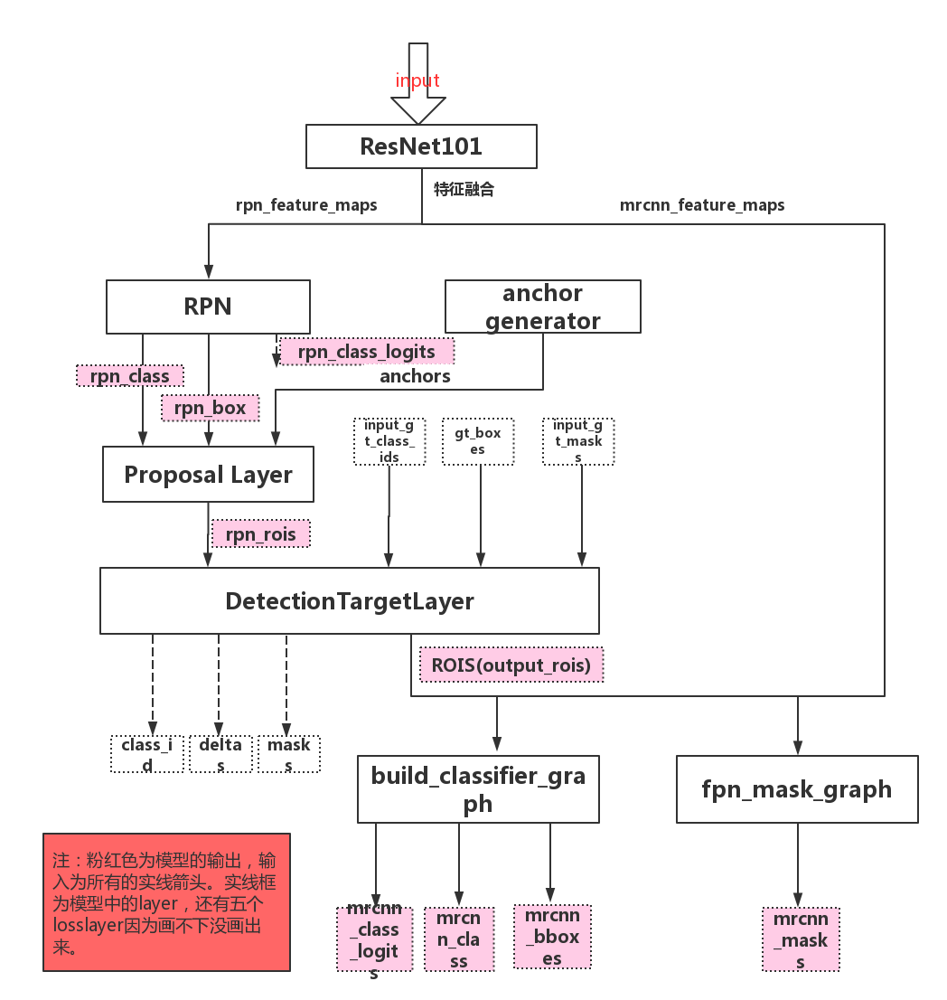

# mask rcnn

## FPN(Feature Pyramid Networks)
- R-CNN仅仅用最后一层进行特征提取，但是顶层特征容易忽略小物体
  - 图像金字塔方法，对图像进行各种放缩变换输入网络，速度慢
  - 不妨利用多阶段特征图融合，相当于既有了高层语义特征，又有了低层轮廓特征
- ResNet101
  - 五个阶段
  - 不改变特征图大小的层归为一个阶段
  - 每次抽取的特征是该阶段最后一层输出
  - 融合时，从高往低处走，高层特征先经过1X1卷积降维和底下一层特征图通道数相等，再经过双线性插值来上采样获得和底下一层特征图大小相等，然后将这两层特征图相加，依次类推

## RPN (region proposal net)

### 候选框
- 根据特征图生成所有候选框(anchors)
  - 对于特征图每一个像素点，以该点为中心，根据长宽比和大小生成多种候选框(遍历特征图每一个点，遍历每一个特征图)
  - 候选框的对角坐标确定候选框区域，存在从特征图候选框到原图候选框的映射，就是乘上放缩倍数

    

### RPN层作用
- 计算得到每一个候选框的是否是前景 cls layer
- 计算候选框的坐标，微调

    

### Proposal层作用
- 对候选框进行过滤，先按照前景得分排序取出前6000
- Non-maximum suppression 抑制
    

### DetectionTarjet层
- 过滤得到的2000个ROI，去除掉0充数pad进来的
- 一个框里包含多个物体，去除掉
- 判断正负样本，基于ROI和GT，IOU阈值0.5，大于为正样本，对每一个正样本：
  - 用IOU最大的那个GT作为其类别
  - 计算其与GT-BOX的偏移量，让网络去学习
  - 得到其最接近的GT-BOX对应的MASK
- 设置负样本数量是正样本的3倍，总数默认400
  - 负样本偏移量和MASK都用0来填充

  
## ROI Align

### ROI Pooling的问题以及ROI Align
- 对于每个ROI做了两次量化损失信息，misalignment。对小物体分割精度不高
- 使用ROI Align，不使用量化，候选区分为K*K个单元，每个单元的边界也不做量化，每个单元计算固定四个坐标位置，使用双线性插值方法计算出四个位置的值然后进行最大池化操作
- 输出 fixed size feature map

