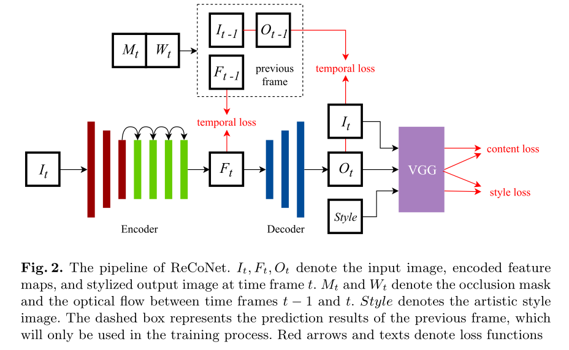

# 1. 风格迁移调研
<!-- TOC -->

- [1. 风格迁移调研](#1-风格迁移调研)
  - [1.1. 场景需求](#11-场景需求)
  - [1.2. 功能需求](#12-功能需求)
  - [1.3. 技术方法](#13-技术方法)
  - [1.4. 算法调研](#14-算法调研)
    - [1.4.1. A Neural Algorithm of Artistic Style](#141-a-neural-algorithm-of-artistic-style)
    - [1.4.2. Perceptual Losses for Real-Time Style Transfer and Super-Resolution](#142-perceptual-losses-for-real-time-style-transfer-and-super-resolution)
    - [1.4.7. Multi-style Generative Network for Real-time Transfer](#147-multi-style-generative-network-for-real-time-transfer)
    - [1.4.8. Universal Style Transfer via Feature Transforms](#148-universal-style-transfer-via-feature-transforms)
    - [1.4.9. Fast Patch-based Style Transfer of Arbitrary Style](#149-fast-patch-based-style-transfer-of-arbitrary-style)
    - [1.4.10. Meta Networks for Neural Style Transfer](#1410-meta-networks-for-neural-style-transfer)
    - [1.4.12. Arbitrary Style Transfer in Real-time with Adaptive Instance Normalization](#1412-arbitrary-style-transfer-in-real-time-with-adaptive-instance-normalization)
    - [Learning Linear Transformations for Fast Image and Video Style Transfer](#learning-linear-transformations-for-fast-image-and-video-style-transfer)
  - [评价：速度快，生成图像质量高，且对视频风格迁移兼容，在不适用光流的情况下，一定程度上减弱了背景扇动的缺陷，是不错的选择。](#ulli评价速度快生成图像质量高且对视频风格迁移兼容在不适用光流的情况下一定程度上减弱了背景扇动的缺陷是不错的选择liul)
    - [1.4.14. Coherent Online Video Style Transfer](#1414-coherent-online-video-style-transfer)
    - [1.4.15. ReCoNet: Real-time Coherent Video Style Transfer Network](#1415-reconet-real-time-coherent-video-style-transfer-network)
    - [1.4.17. Fast Video Multi-Style Transfer](#1417-fast-video-multi-style-transfer)
  - [1.6. 补充资料](#16-补充资料)
    - [1.6.1. FlowNet: Learning Optical Flow with Convolutional Networks](#161-flownet-learning-optical-flow-with-convolutional-networks)
    - [1.6.2. occusion mask相关](#162-occusion-mask相关)

<!-- /TOC -->
## 1.1. 场景需求
- 给定视频内容和艺术风格，将二者融合，输出风格转换后的视频

## 1.2. 功能需求
- 模型
  - 单模型单风格/单模型多风格
  - 单模型任意风格
- 适用范围
  - 图片
  - 视频
- 实时性
  - 实时处理
  - 离线处理

## 1.3. 技术方法
- 传统方法
- 从2015年开始，基于神经网络的风格迁移技术占据统治地位，端到端地生成风格迁移后的图片/视频

## 1.4. 算法调研
### 1.4.1. A Neural Algorithm of Artistic Style 
- 作者：Leon A. Gatys, Alexander S. Ecker, Matthias Bethge
- 年份：2015
- 会议：
- 主要思想：
  - 将内容表示和风格表示分开，用预训练好的VGG-16/VGG-19提取内容图片的内容特征C(指定层的特征图输出)和风格图片的风格特征S(指定层的特征图输出经过GRAM矩阵运算后的结果)
  - 将原始随机生成的噪声图片，指定的内容图片和风格图片这三张图片一起输入VGG中，得到原始图片的内容特征C', 风格特征S'，分别计算CC',SS'之间的欧式距离作为内容损失和风格损失，总损失函数为内容损失和风格损失的加权平均，反向迭代原始噪声图片，直到调节噪声图为目标图片。
  
  - $\min _{I}\left(\lambda_{c}\left\|\mathbf{C} \mathbf{P}\left(I ; w_{f}\right)-\mathbf{C} \mathbf{P}\left(I_{c} ; w_{f}\right)\right\|_{2}^{2}+\lambda_{s}\left\|\mathbf{S} \mathbf{P}\left(I ; w_{f}\right)-\mathbf{S} \mathbf{P}\left(I_{s} ; w_{f}\right)\right\|_{2}^{2}\right)$
    - ${I}$为初始噪声图片,${I_c}$为内容图片，${I_s}$为风格图片，${w_f}$为VGG网络固定参数，$\mathbf{CP}$为内容表示，$\mathbf{SP}$风格表示$\lambda_c \lambda_s$分别表示内容权重和风格权重。
- 数据集： 不需要训练数据集，只需要内容图片和风格图片
- 开源代码：https://github.com/titu1994/Neural-Style-Transfer
- 评价：神经风格迁移(NST)的开山之作，缺点是每次生成图片都要进行迭代，速度太慢，且生成效果不好

---

### 1.4.2. Perceptual Losses for Real-Time Style Transfer and Super-Resolution
- 作者：Justin Johnson, Alexandre Alahi, Li Fei-Fei
- 年份：2016
- 会议：ECCV
- 主要思想：
    - 在Gatys的基础上，在左边加上一个转换网络fw，目标是训练该fw使得对任意输入内容图片，快速地输出该内容图片融合固定地风格图片地结果，单模型单风格快速风格迁移(GTX Titan X GPU, 20FPS for 512X512)。
    - $\min _{w} \sum_{I_{c}}\left(\lambda_{c}\left\|\mathbf{C P}\left(I_{w} ; w_{f}\right)-\mathbf{C P}\left(I_{c} ; w_{f}\right)\right\|_{2}^{2}+\lambda_{s}\left\|\mathbf{S} \mathbf{P}\left(I_{w} ; w_{f}\right)-\mathbf{S} \mathbf{P}\left(I_{s} ; w_{f}\right)\right\|_{2}^{2}\right)$
      - $I_w$是生成图像， $I_{w}=\mathcal{N}\left(I_{c} ; w\right)$, $\mathcal{N}$是Transform Net
    - 网络结构
  
- 数据集：大量内容图片，如COCO数据集
- 开源代码
  - https://github.com/abhiskk/fast-neural-style
  - https://github.com/lengstrom/fast-style-transfer
- 评价：
  - 速度较快，图像转换质量高，缺点是风格需固定，每增加一个风格都要额外训练一个对应的模型。

---

### 1.4.7. Multi-style Generative Network for Real-time Transfer
- 作者：Hang Zhang, Kristin Dana.
- 年份：2017
- 会议：
- 主要思想
  - 仍然以VGG作为损失评估网络，训练一个生成网络G。G包括一个Siamese Network，用于提取输入风格图片S不同scale的特征统计信息，即不同scale下的Gram矩阵；一个转换网络T，接收内容图片C，C经过T编码后的特征图，通过CoMatch层与风格图片多个scale的特征统计信息进行匹配，得到生成图像。
  - CoMatch Layer作用在于基于给定的风格图片匹配其特征的二阶统计量。它引入了一个可学习的矩阵W，能够动态地trade-off 风格与内容的比例系数，调整编码器输出的特征图，然后特征图将会送入解码器重构并计算损失函数。并且W的参数从总损失函数学习。
    - CoMatch Layer $$\hat{\mathcal{Y}}^{i}=\Phi^{-1}\left[\Phi\left(\mathcal{F}^{i}\left(x_{c}\right)\right)^{T} W \mathcal{G}\left(\mathcal{F}^{i}\left(x_{s}\right)\right)\right]^{T}$$
    - Loss Function $$\begin{aligned} \hat{W}_{G} &=\underset{W_{G}}{\operatorname{argmin}} E_{x_{c}, x_{s}}\{\\ & \lambda_{c}\left\|\mathcal{F}^{c}\left(G\left(x_{c}, x_{s}\right)\right)-\mathcal{F}^{c}\left(x_{c}\right)\right\|_{F}^{2} \\ &+\lambda_{s} \sum_{i=1}^{K}\left\|\mathcal{G}\left(\mathcal{F}^{i}\left(G\left(x_{c}, x_{s}\right)\right)\right)-\mathcal{G}\left(\mathcal{F}^{i}\left(x_{s}\right)\right)\right\|_{F}^{2} \\ &\left.+\lambda_{T V} \ell_{T V}\left(G\left(x_{c}, x_{s}\right)\right)\right\} \end{aligned}$$
  
  - 另外，Siamese网络与转换网络的编码器部分共享权重，不需要额外训练。并且增加了新的上采样卷积，避免了反卷积所带来的棋盘效应。通过Resize style image，可以实时更改笔触粗细(Real-time brush-size control)。训练时，可以只训练100个风格，也可以训练到1000个风格，效果基本不变。
- 开源代码：https://github.com/zhanghang1989/PyTorch-Multi-Style-Transfer
- 数据集：COCO + 所需要的风格图片集合
- 评价：MSG-Net实现了单模型多风格转换，并且能够达到实时转换速度，生成图片的质量高。缺点是进行风格迁移时只能使用训练时指定的风格图片集合中的某一个，不能由用户自定义指定。

---

### 1.4.8. Universal Style Transfer via Feature Transforms
- 作者：Yijun Li, et al. 
- 年份：2017
- 会议：
- 主要思想：
  - 作者使用了WCT（Whiten-ColorTransform）将内容图的特征协方差与给定风格的特征协方差进行匹配。与之前的方法相比，该方法不需要针对某一种特征图进行训练，可以使用任意风格图对内容图进行风格转移。
  - 首先将预训练好的VGG作为编码器，针对relu1~relu5层设计和训练5个对应的解码器，其作用是对来自VGG卷积层结果进行图像重构。损失函数为图像重构L2损失和特征L2损失的加权和。 $L=\left\|I_{o}-I_{i}\right\|_{2}^{2}+\lambda\left\|\Phi\left(I_{o}\right)-\Phi\left(I_{i}\right)\right\|_{2}^{2}$
  - 整体流程是从高层(relu5_1)到低层(relu1_1)逐层进行风格对齐和图像重构。WCT层通过白化和着色操作，把内容图片由VGG提取出的特征的协方差矩阵与风格图片对齐，转换后的特征通过之前训练好的重构网络即可生成风格迁移后的图片。
  
- 数据集：COCO
- 开源代码：https://github.com/Yijunmaverick/UniversalStyleTransfer
- 评价：这篇文章的思路也是在特征层面进行风格和属性的融合，通过WCT操作进行内容图像到风格图像的协方差矩阵对齐，避开了对一个风格图片训练一个模型的缺点，实现了单模型任意风格的转换。缺点是根据实验结果，其生成图片的质量与其他方法有一定差距，且未提到图像生成速度。

### 1.4.9. Fast Patch-based Style Transfer of Arbitrary Style
- 作者：Tian Qi Chen, Mark Schmidt
- 年份：2016
- 会议: 
- 主要思想
  - 抽取内容图片C和风格图片S若干patches,使用预训练好的VGG-19作为特征提取网络，计算patches_i的指定层激活值$\phi_{i}(C)$ $\phi_{i}(S)$。对于每个内容图片的patch,根据 $$\phi_{i}^{s s}(C, S):=\underset{\phi_{j}(S), j=1, \ldots, n_{s}}{\operatorname{argmax}} \frac{\left\langle\phi_{i}(C), \phi_{j}(S)\right\rangle}{\left\|\phi_{i}(C)\right\| \cdot\left\|\phi_{j}(S)\right\|}$$ 找到一个 closest-matching style patch。将每一个$\phi_{i}(C)$ swap为$\phi_{i}^{s s}(C, S)$,然后将$\phi_{i}^{s s}(C, S)$传入inverse network中生成结果图像，实际上就是根据$\phi_{i}^{s s}(C, S)$进行图像重构。
  
  - 训练inverse net时，主要考虑到其重构图片在经过pipeline前半部分的编码输出要尽量接近于$\phi_{i}^{s s}(C, S)$，并且使用全变分正则化保证生成图片具有平滑性。$$\underset{f}{\operatorname{arginf}} \mathbb{E}_{H}\left[\|\Phi(f(H))-H\|_{F}^{2}+\lambda \ell_{T V}(f(H))\right]$$
- 数据集：内容图片数据集COCO 风格图片数据集WikiArt
- 开源代码：https://github.com/rtqichen/style-swap
- 评价
  - 提出了新的思路即内容图片和风格图片的patches匹配。从作者的实现结果和开源实现来看效果不错，并且能够实现单模型任意风格转换。但是，由于需要在生成网络之前再经过VGG进行特征提取和style-swap，计算完毕后还要将结果送入生成网络重构图片，速度上达不到实时。

### 1.4.10. Meta Networks for Neural Style Transfer
- 作者：Fa long Shen, Shuicheng Yan, Gang Zeng.
- 年份：2018
- 会议： CVPR
- 主要思想
  - 利用大量风格图片训练一个元网络MetaNet,该网络能够根据输入的风格图片对转换网络fw进行参数赋值，输入内容图像到fw中即可快速得到任意内容图片融合任意风格图片的结果(Titan X GPU, 19ms切换风格，转换网络仅7MB/449KB，号称可在移动设备满足实时性)。

  - $\min _{\theta} \sum_{I_{c}, I_{s}}\left(\lambda_{c}\left\|\mathbf{C} \mathbf{P}\left(I_{w_{\theta}} ; w_{f}\right)-\mathbf{C} \mathbf{P}\left(I_{c} ; w_{f}\right)\right\|_{2}^{2}+\lambda_{s}\left\|\mathbf{S} \mathbf{P}\left(I_{w_{\theta}} ; w_{f}\right)-\mathbf{S} \mathbf{P}\left(I_{s} ; w_{f}\right)\right\|_{2}^{2}\right)$
    - $w_\theta$ 是转换网络的权值，$\theta$是MetaN的权值
    - $w_{\theta}=\operatorname{MetaN}\left(I_{s} ; \theta\right)$

    
- 数据集：内容图片数据集COCO 风格图片数据集WikiArt
- 开源代码：https://github.com/FalongShen/styletransfer
- 评价
  - 单模型可处理任意风格，速度快，生成质量好

### 1.4.12. Arbitrary Style Transfer in Real-time with Adaptive Instance Normalization
- 作者：Xun Huang  Serge Belongie
- 年份：2017
- 会议：ICCV 
- 主要思想：
  - 作者通过实验发现Instance Normalization可以进行某种程度上的“风格归一化”,并提出一种自适应实例归一化层(AdaIN),将给定的内容图片和风格图片在特征提取网络所得到的高层特征图(分别记为x和y)进行AdaIN，即调整x的均值和方差，使其与y相匹配。
    - $\operatorname{AdaIN}(x, y)=\sigma(y)\left(\frac{x-\mu(x)}{\sigma(x)}\right)+\mu(y)$
  - 经过AdaIN层得到输出t，将t送入解码器g生成风格化图片。该生成图片会被接着送入损失评估网络VGG中评估内容损失和风格损失，得到总损失后反向传播训练Style Transfer Network,具体pipeline如下图
    - $t=\operatorname{AdaIN}(f(c), f(s))$
    - $T(c, s)=g(t)$
  
- 开源代码：https://github.com/xunhuang1995/AdaIN-style
- 数据集: 内容图片数据集COCO 风格图片数据集WikiArt

- 评价：该方法通过AdaIN解决了Fast Patch-based Style Transfer of Arbitrary Style中Style-Swap操作计算开销大的问题，实现了任意风格实时转换。有完整的开源实现和测试样例，效果比较好。但是在Multi-style Generative Network for Real-time Transfer文章中指出，单纯地使用mean和variance会导致风格迁移的效果稍差，不如使用GRAM矩阵所得到的结果更有吸引力。

### Learning Linear Transformations for Fast Image and Video Style Transfer
- 作者：Xueting Li, Sifei Liu, Jan Kautz, and Ming-Hsuan Yang
- 年份：2019
- 会议：CVPR
- 主要思想
  - 提出学习一个转换矩阵transform matrix T，通过该矩阵对内容特征进行线性变换以匹配风格特征。
  - 该T由转换模块transformation得到，整个网络也就这个模块需要学习，其他模块是已经预训练好的，充当编码器解码器或者损失评估网络。transformation模块输入的是内容特征与风格特征，分二路进行卷积层和全连接层计算最后融合，得到矩阵T。
  - T通过变换内容特征得到结果送入解码器中进行图片重构，再送入损失评估网络进行传统的内容损失和风格损失计算，反向传播迭代Transformation模块的参数。
  

- 数据集：内容图片数据集COCO 风格图片数据集WikiArt
- 评价：速度快，生成图像质量高，且对视频风格迁移兼容，在不适用光流的情况下，一定程度上减弱了背景扇动的缺陷，是不错的选择。
--- 

### 1.4.14. Coherent Online Video Style Transfer
- 作者：Dongdong Chen, Jing Liao, Lu Y uan2, et al.
- 年份：2017
- 会议：ICCV
- 主要思想
  - 通过two-frames 连贯性限制，克服了image style transfer 逐帧转换风格导致视频闪烁的问题。具体做法是，将网络设计为两个子模块，Style Sub-network和Flow Sub-network(分别简称S和F)。S网络是预训练好的风格转换网络，文章中采用Justin Johnson的Transform Net,并将其分为编码器解码器两部分。输入为t-1和t时刻相邻的两帧，前半部分分别得到t-1和t时刻的特征图，对于t-1时刻的特征图$F_{t-1}$，将其与F网络(光流估计网络，文中是在synthetic Flying Chairs数据集上训练好的FlowNet，需要进行fine-tuning以适应当前任务)输出的光流特征$W_t$ warp为$F_t^{'}$,将$F_t^{'}$和$F_t$之差送入MASK模块预测出可追踪的点或区域，这些点或区域仍使用前一帧的特征，否则使用当前帧的特征。输出结果送入S网络的解码器中得到当前帧生成图像。具体pipeline如下所示：
  
  - 核心是由短期一致性的propagation实现了整体序列的长期一致性，大大增加了视频的平滑性。
    

- 数据集:作者自己收集了8个动作电影片段以及youtube上的视频约28,000帧作为训练集，并使用FlowNet2的计算结果作为ground-truth
- 开源代码：暂无
- 评价：该方法有效地解决了逐帧风格迁移的闪烁问题，大大提升了视频风格迁移的图像质量。在之前的视频风格迁移的基础上大幅提升了速度，在GPU Titan X上能达到15FPS。虽然不能在普通设备上实现实时处理，但是对于离线处理是可以接受的选择。缺点是单风格单模型，但是可以通过更换S网络以达到单模型多风格。

### 1.4.15. ReCoNet: Real-time Coherent Video Style Transfer Network
- 作者：Chang Gao, et al.
- 年份：2018
- 会议：ACCV
- 主要思想：
  - 核心在于损失函数的设计。作者同时考虑了Justin Jhonson论文中的perceptual loss和相邻帧之间的temporal loss, 既保证生成图像的质量，又能保证风格转换后的视频帧的平滑性。其temporal loss又考虑到两方面，一是提出luminance warping constraint，考虑到了可追踪像素的亮度变化(光流估计中亮度不变假设在实际视频中并不是一定成立)，提高风格转换的稳定性并抑制temporal inconsistency；二是提出特征图层面的 temporal loss，抑制相同物体在编码器中的高层特征的误差，提高了可追踪点风格转换的稳定性。
  - 与Coherent Online Video Style Transfer中在inference阶段使用光流不同，ReCoNet不需要在inference阶段使用光流，仅仅是在训练阶段使用了光流的ground-truth，因而大大加快的了推理速度，该模型号称能在GTX 1080Ti 单GPU下达到200FPS.
    
  - 损失函数
    - $\mathcal{L}_{t e m p, o}(t-1, t)=\sum_{c} \frac{1}{D} M_{t}\left\|\left(O_{t}-W_{t}\left(O_{t-1}\right)\right)_{c}-\left(I_{t}-W_{t}\left(I_{t-1}\right)\right)_{Y}\right\|^{2}$
      - c ∈ [R, G, B] is each of the RGB channels of the image, Y the relative
luminance channel,D =
H ×W
    - $\mathcal{L}_{t e m p, f}(t-1, t)=\frac{1}{D} M_{t}\left\|F_{t}-W_{t}\left(F_{t-1}\right)\right\|^{2}$
  
    - $\begin{array}{r}
\mathcal{L}(t-1, t)=\sum_{i \in\{t-1, t\}}\left(\alpha \mathcal{L}_{\text {content}}(i)+\beta \mathcal{L}_{\text {style}}(i)+\gamma \mathcal{L}_{t v}(i)\right) 
+\lambda_{f} \mathcal{L}_{\text {temp}, f}(t-1, t)+\lambda_{o} \mathcal{L}_{\text {temp}, o}(t-1, t)
\end{array}$
- 数据集：Monkaa and FlyingThings3D in the Scene Flow datasets(training), MPI Sintel(test)
- 开源代码:https://github.com/safwankdb/ReCoNet-PyTorch
- 评价：该方案综合了视频风格转换的帧间平滑性和推理的实时性，且效果较好，有完整的开源实现以及测试样例。缺点是单风格单模型。

### 1.4.17. Fast Video Multi-Style Transfer
- 作者: Wei Gao1, Yijun Li, Yihang Yin,Ming-Hsuan Yang
- 年份：2020
- 会议：WACV
- 主要思想
  - 在一个网络模型中去学习多种不同的风格。在卷积层后添加multi-instance normalization layer，使用MIN-Layer将特征转换到新的风格特征空间，可由指定index控制。
  
  - 插入两个ConvLSTM模块到Encoder-Decoder中，使得风格化结果更具有时间连贯性。
  - 设计另外一个光流估计的分支FlowNetS，类似于上述的Coherent Online Video Style Transfer中的Flow Sub-network，使得t-1时刻和t时刻的帧更具有长短期连贯性。
  
  - 实时性
  
- 数据集：COCO + 指定的风格图片集合
- 开源代码：https://github.com/gaow0007/Fast-Multi-Video-Style-Transfer
- 评价：该文章满足单模型多风格的视频风格转换，且速度快。

## 1.6. 补充资料
### 1.6.1. FlowNet: Learning Optical Flow with Convolutional Networks
- 作用：用CNN预测光流的经典论文
- 作者：Philipp Fischer, et al.
- 年份: 2015
- 会议: ICCV
- 主要思想
  - 首次将CNN运用到光流估计上。输入为t和t+1两个时刻的帧，通过FlowNet，计算每个像素的光流，即t+1时刻相对于t时刻该像素点的为一向量(x,y)。所以总体计算出的光流是和原图像大小相等的双通道图像。
  - 提出了两种网络结构FlowNetSimple和FlowNetCorr，这里主要分析第二种。FlowNetCorr对t和t+1两个时刻的帧送入两个分支分开处理，得到各自的特征图，然后使用correlation layer找到这两个特征图之间的联系并合并成一条路。计算两个特征图之间的联系使用如下公式。实际上相当于对特征图f1和特征图f2的每个patch两两做卷积，但这样复杂度比较高，于是限制每个patch只与它周围D个位置patch做联系运算。
  $$c\left(\mathbf{x}_{1}, \mathbf{x}_{2}\right)=\sum_{\mathbf{o} \in[-k, k] \times[-k, k]}\left\langle\mathbf{f}_{1}\left(\mathbf{x}_{1}+\mathbf{o}\right), \mathbf{f}_{2}\left(\mathbf{x}_{2}+\mathbf{o}\right)\right\rangle $$ 
  
  
  - 为了得到大量的数据集，作者自己设计了Flying Chairs。由于人工标注每个像素点光流的GT基本不可能，故作者使用了一种巧妙的方法(类似于先斩后奏)：首先生成一些椅子图片，融合到背景当中去，为了产生运动信息，产生融合图片的时候会随机产生一个位移变量，与背景和椅子的位移相关，再通过这个位移变量产生第二个图片和光流。
  

### 1.6.2. occusion mask相关
- 待完成

  